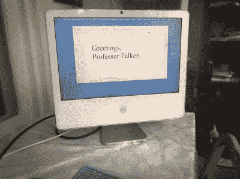

# IMac 一体机的新生活

> 原文：<https://hackaday.com/2020/11/27/an-imac-all-in-ones-new-life/>

台式电脑有一种时尚的外形，被称为“一体式”，它将电脑安装在显示器上。虽然将所有计算放在一个整洁的包中的便利有一些好处，但它也带来了不幸的负面影响。总有一天，里面的电脑会比新的机器更旧更过时。虽然新操作系统对给旧机器注入活力大有帮助，但[Thomas]决定走一条更少人走的路，将旧的 iMac 一体机改造成独立显示器。

问题中的 iMac 是 20 英寸 iMac G5 iSight (A1145 ),配有 LG-Philips LM201W01-STB2 液晶面板。回顾过去，[Thomas]建议从您最喜欢的拍卖行订购一套 LCD 驱动控制器套件。但是对于这个特殊的修改，他决定更多的手动操作，我们很高兴他这么做了。

 幸运的是【托马斯】的面板支持 TMDS(DVI 和 HDMI 都兼容)。所以下一步是找出信号线和合适的电压。在 iMac PCB 丝网印刷上的错误标签电源线(12v 而不是 3.3v)引起一些麻烦后，他找到了所有的电线，并开始形成一个计划。第一步是一个电路，在继电器的帮助下欺骗逆变器打开。添加了带分线板的母 HDMI 插头，并通过旧的 firewire 端口伸出。在托马斯女儿的显微镜的帮助下，显示器带状电缆中的细线被分离并焊接到显示器上。由于 HDMI 依赖于阻抗匹配对，因此对电阻进行了检查。最后，一个老式的触觉拨动开关提供了一种方式来打开和关闭显示器。

我们喜欢看到旧的硬件被重新用于新的东西。这个项目很好地补充了我们今年早些时候看到的通过英特尔 NUC 移植而重生的 iMac G4，因为它们都试图保留外形，同时允许新的计算机驱动显示器。