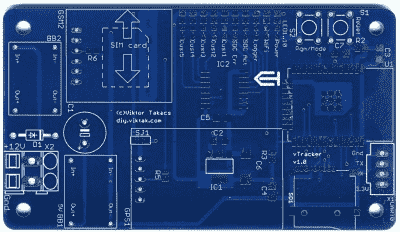

# 开放式硬件 GPS 跟踪器根据您的条件工作

> 原文：<https://hackaday.com/2020/11/28/open-hardware-gps-tracker-works-on-your-terms/>

如今，如果你想为你的车装一个 GPS 追踪器，有很多选择。不幸的是，它们伴随着消费技术中越来越常见的那种包袱:订阅费、第三方窥探，以及对你是商品而非顾客的潜在怀疑。所以[维克多·塔卡克斯]决定亲自动手，为注重隐私的黑客们设计一个开放式 GPS 追踪器。

由于[Viktor]不想重新发明轮子，他的设计利用了几个现成的模块。追踪器的核心是 ESP32，它给了他大量的计算能力，同时仍将能耗保持在合理的水平。还有一个 NEO-6M GPS 接收器，它在与 ESP32 相同的 3.3 V 电平下工作，允许微控制器在没有电平转换器的情况下读取 NMEA 句子。他决定使用低成本的 SIM800L GSM 调制解调器，但由于它只能在 2G 网络上工作，因此在电路板设计中已经做了规定，如果您需要，可以将其替换为更现代的模块。

 为了编写代码将所有这些结合在一起，[Viktor]使用了近 12 个开源库来创建一个功能完整的固件，该固件使用 MQTT 在他的个人服务器上创建位置数据的数据库。从那里，数据被插入到家庭助理和可视化与 Grafana。这足以提供核心功能，但他说，在不久的将来，更多的定制软件组件以及对系统安全含义的深入研究将会出现。

[在](https://hackaday.com/2017/05/19/a-simple-diy-gps-tracker/)之前，我们已经见过定制的 GPS 追踪器，一般来说，[并不需要花费太多的时间来构建自己的解决方案](https://hackaday.com/2017/05/19/a-simple-diy-gps-tracker/)。但我们认为[Viktor]对这个项目的润色将它带到了一个新的水平，并将其列为我们多年来看到的一些最令人印象深刻的[定制跟踪解决方案之一](https://hackaday.com/2016/11/19/barely-there-gsm-gps-tracker/)。