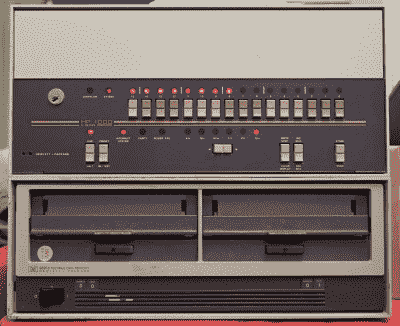
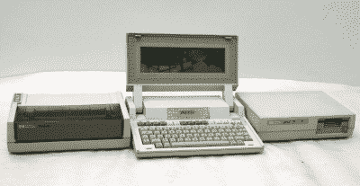
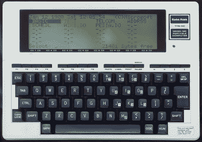
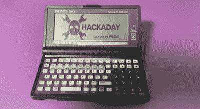
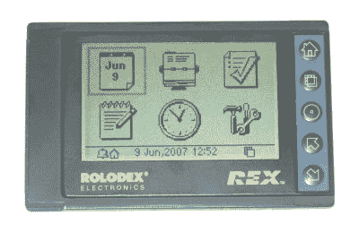
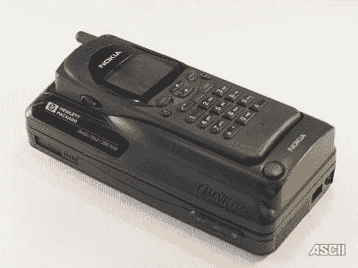

# 第一台真正的掌上电脑

> 原文：<https://hackaday.com/2020/12/21/the-first-real-palmtop/>

## 

回到新冠肺炎之前，我正穿过机场走向登机口，突然我想起了一份我想在飞机上看却忘记带的文件。别担心，我在中央大厅停了一会儿，把手伸进口袋，开始从网上下载文件。在飞机上舒适地坐好后，我放松下来，开始阅读。后来，我在一个我正在开发的共享软件程序上用 C 做了一点编程。

今天，这将是一个普通的回忆，如果不是无聊的话，除了一件事:这发生在 20 世纪 90 年代，我从口袋里拿出的是一台功能齐全的 MS-DOS 电脑:

介绍第一台真正的掌上电脑 HP-200 LX T1。直到 2000 年代中期，我每天都用其中的一个，在我的抽屉里还有一个可以使用的。让我们回到过去，看看这台强大的袖珍计算机是如何开始它的生活的。

## 一些历史

今天，在我们的手掌中携带大约几十万 MIPS、海量数据存储、炫目的彩色显示器和多种形式的有线和无线连接是理所当然的。(这东西甚至有电话。)但显然，并不是一直如此。

惠普公司最初是一家质量测试仪器制造商，这一传统延续至今，尽管公司和品牌名称发生了两次变化:1999 年成为 T2 安捷伦科技公司，2013 年成为 T4 是德科技公司。但是惠普在 20 世纪 60 年代也发展了一个计算机部门，生产了几个系列的计算机，例如 [HP-2100](https://en.wikipedia.org/wiki/HP_2100) ，这自然补充了他们的实验室测试设备。

几乎从一开始，惠普就因在计算产品的尺寸上突破极限而闻名。一次偶然的引入导致了惠普第一台台式计算器的开发，它并不比当时的打字机大。

Tom Osborne 是一名沮丧的工程师，他的计算器设计已经被包括惠普在内的 30 多家公司拒绝，一位前同事让他联系惠普的某个人。汤姆和惠普团队见了面，他们立即让他帮忙制造一台台式电脑，目标是能装进比尔·休利特办公桌的打字机抽屉里。被称为计算器是因为它太小了，没有人会相信它是一台计算机， [HP-9100](https://en.wikipedia.org/wiki/Hewlett-Packard_9100A) 在一点点深夜[秘密桌面木工](https://www.hpmemoryproject.org/timeline/john_minck/inside_hp_04.htm)之后满足了尺寸要求。总而言之，该产品取得了超出所有预期的巨大成功。

9100 推出后，比尔·休利特提出，下一代机器的成本应该是原来的十分之一，体积应该是原来的十分之一，速度应该是原来的十倍；最终建议应该放在他的衬衫口袋里。迎接这一新的挑战绝非偶然，只有在引入可靠的 MOS LSI 集成电路之后才有可能。事实上，在 1972 年发布 HP-35 又过了四年。另一个小小的成功是，它成为整整一代科学家和工程师使用的 RPN 计算器的先驱——许多至今仍在使用。

1977 年，随着 [HP-01](https://en.wikipedia.org/wiki/HP-01) 腕式计算器和手表的推出，惠普将小型化推向了另一个高度。有趣的是，这是第一个非 RPN 的惠普计算器。

惠普的电脑业务也不只是闲着没事干。从 HP-80 到 HP-85，一系列越来越小的计算机在 20 世纪 80 年代问世。著名的小型型号包括 [HP-71](https://en.wikipedia.org/wiki/HP-71B) 和 [HP-75](https://en.wikipedia.org/wiki/HP-75) 。

惠普在 1984 年推出了 [HP-110](https://en.wikipedia.org/wiki/HP_110) 便携式电脑，内置 ROM 的 MS-DOS 和 Lotus 123。在不断开发更小、功能更丰富的计算机的背景下，惠普迈出下一大步也就不足为奇了，它为我在机场大厅从大衣口袋里掏出一台计算机铺平了道路。

## 其他小型计算机

在这段时间里，其他计算机和计算器公司并没有闲着。回顾那个时代的袖珍型电脑，有许多不同功能的不同产品。Radio Shack 有几台运行 Basic 的袖珍计算机:1980 年的 PC1 和 1981 年的 T2 PC2 和 T3，都是日本夏普公司的重新命名的计算机。他们在这样一个小包装里装入了惊人的能量。其实我大学刚毕业的时候用了几年 PC2，充分利用四色笔式绘图仪打印天线图案用于工作。

Radio Shack 的 TRS-80 Model 100 系列便携式笔记本电脑基于日本京瓷公司的一种型号，于 1983 年推出，非常受需要在旅途中写作的记者和人们的欢迎。虽然这些或多或少是通用计算机，但其他公司正在开发一种新型的袖珍计算机，这种计算机最终被称为 PDA，或袖珍数字助理。雅达利 1989 年的[作品集](https://en.wikipedia.org/wiki/Atari_Portfolio)和 1986 年推出的[心灵感应组织者](https://en.wikipedia.org/wiki/Psion_Organiser)就是很好的例子。

## 掌上电脑诞生了

考虑到当时的市场状况，惠普开始考虑设计掌上电脑/ PDA 也就不足为奇了。这个概念在 1988 年演变成一个名为 Chetah 的研究项目，然后在 1989 年初成为一个正式的研究项目。它最初是基于像一本书一样垂直打开的 HP-19 计算器。几经反复，项目名称改为 Jaguar，初步规格确定，包装改为蛤壳式。但最终该项目没有得到管理层的批准，并于 1989 年 8 月暂停。但不会太久…

The Palmtop in 2020: Long Live the HP-200LX

在惠普的另一次偶然会面中，剑桥的 Lotus 开发公司与他们联系，提议再次合作，开发一台小型 Lotus 1-2-3 机器。随后举行了一系列会议，两家公司同意在一个联合项目上合作。这个项目注定成为第一台掌上电脑 [HP-95LX](https://en.wikipedia.org/wiki/HP_95LX) 。该团队代表了技能和技术的完美结合，最终掌上电脑设计的开发开始了。

最终的规格产生了一台运行 Lotus 1-2-3 的 MS-DOS 计算机和一整套来自 rom 的 PDA 工具。95LX 于 1991 年推出，紧接着 100LX 和 200LX 分别于 1993 年和 1994 年推出。到这个时候，200LX 拥有完整的 80 x 25 列 CGA 显示器，PCMCIA(人们不能记住计算机行业的缩写)卡插槽，串行和红外端口，以及带数字键的完整键盘。这是一台真正的掌上电脑，能够成为一台 PDA，一台全功能的电脑，或者两者兼而有之。它可以用两节标准 AA 电池运行数周。惠普的又一次全垒打。

## 是什么让它如此特别？

200LX 由于其尺寸和便携性，为计算机化开辟了全新的利基领域。因此很难找出它成功和受欢迎的一个原因。但是，根据我使用掌上电脑大约十年和几次环球航行的经验，掌上电脑的一些方面仍然引起了我的共鸣。

### 钥匙

惠普计算器以其完美的外观和手感而闻名，掌上电脑家族也不例外。评判任何键盘都是一件非常主观的事情，尤其是袖珍键盘。除非你的手非常小，否则没有办法在任何掌上电脑键盘上舒适地触摸打字。大多数人会使用拇指方法在上面打字，因此 HP 键工作得非常好。

### 膨胀

拥有 PCMCIA 插槽意味着掌上电脑可以使用各种各样的附件。使用闪存卡非常普遍，后来出现了带适配器的小型闪存卡，提供数百兆字节的存储空间(这对于 DOS 系统来说相当不错)。电话调制解调器、传真卡、以太网适配器，甚至还有移动电话 GSM 调制解调器。如果掌上电脑对您来说太大，您可以将 PDA 数据同步到 REX3 PCMCIA 袖珍 PDA。这是一个共享软件项目，我在飞机上写的 C 代码。

### 应用程序

除了可以访问几乎所有的 DOS 程序之外，一个完整的家庭手工业在 200LX 左右兴起，提供各种适合掌上电脑的程序。这些包括互联网接入、电子邮件、FTP、usenet 阅读器等等。我经常用我的掌上电脑开发嵌入式软件，并且有几个 C 编译器、一个汇编器，甚至还有一个 Fortran 编译器。有用于任务切换的软件转盘，大量的游戏——你能想到的，它可能都适用于掌上电脑。

### 劈

尽管设计得很好，但社区很快发现还可以改进。两种最常见的攻击是使微处理器超频(x2！)并增加内部 RAM。有一个正在进行的努力，安装背光和一些单位是如此修改。

### 社区

围绕这些机器形成了一个非常活跃的社区，最初是在 Compuserve 和 AOL 上。迁移到一个至今仍在运行的邮件列表中。各种各样的软件库如雨后春笋般涌现，一种叫做 [*的印刷期刊，掌上纸*](http://www.palmtoppaper.com) 成为许多用户的主要信息来源。几家公司制造了专门为 200LX 设计的硬件产品。

### 连通性

配备调制解调器或以太网卡，你可以从世界任何地方访问互联网。我这样做了好几年，使用你在纸质电话簿上能找到的本地拨号号码来登录我的 ISP 并接收电子邮件。我在 200LX 上通过使用声音调制解调器的付费电话、亚洲和欧洲的酒店，当然还有机场大厅连接了互联网。

## 接班人和垮台

这种掌上电脑家族有相当多的变化，HP Omnigo，HP-1000CX 和 HP-700LX，后者是一个普通的 200LX，带有一个支架，可以放置诺基亚手机。但惠普最终转向拥抱 WinCE，这一选择可能在 PDA 用户中很受欢迎，但被社区中的大多数人视为一大倒退。这些是 [HP-300LX](https://en.wikipedia.org/wiki/HP_300LX) 家族的型号，后来是 [HP-620LX](https://en.wikipedia.org/wiki/HP_620LX) 家族的型号。

都说天下没有不散的宴席，惠普家族的掌上电脑也不例外。到 1999 年，惠普宣布他们将停止所有掌上电脑的生产。许多用户继续持有掌上电脑好几年，但大多数人最终还是不情愿地离开了。硬件虽然强大，但也有一些弱点，因为它的设计寿命根本达不到 15 年或 20 年。

虽然掌上电脑提供的连接在 20 世纪 90 年代领先于它的时代，但在本世纪却远远不够。已经有一些更新更好的掌上电脑项目，有些比其他的更成功，但是到目前为止，所有的都没有达到最佳状态。

HP-200LX 是一款突破性的产品，它出现在技术时间线上的正确点上。回到 20 世纪 90 年代，在你的口袋里可以有一台完整的计算机是不可想象的，但惠普/ Lotus 团队确实做到了这一点。除了是一台功能齐全的 DOS 计算机外，它们还包括一套令人印象深刻的 PIM 工具，更不用说 Lotus 123、Quicken、PCMCIA 卡可扩展性和前所未有的连接性了。

我希望你喜欢这次掌上电脑的记忆之旅，如果你曾经使用过其中的一个，请在评论中告诉我们。