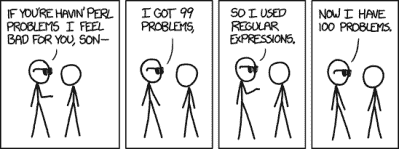

# 本周安全:IOS Wifi 咒语，幽灵，和坏的正则表达式

> 原文：<https://hackaday.com/2020/12/04/this-week-in-security-ios-wifi-incantations-ghosts-and-bad-regex/>

我希望上周每个人都过了一个愉快的感恩节。我的家庭通过欢迎第四个成员来庆祝。我女儿出生于 11 月 25 日星期三早上。因此解释了我上周为什么不写普通的黑客专栏。别担心，我们今天会赶上进度，报道那些值得关注的新闻。

### iOS 零点击 Wifi 攻击

谷歌零计划的伊恩·比尔为我们带来了他的封锁诱导劳动的成果，一次壮观的 iOS 攻击。这次攻击的目标是处理 AWDL 的内核代码，这是一种用于设备之间的自组织网状网络的苹果 WiFi 协议。利用 AWDL 最显著的特点是隔空投送，苹果的设备到设备文件共享系统。因为 AWDL 是一种专有协议，WiFi 硬件不能对数据包进行任何加速处理。几年前，有一次[针对博通固件](https://googleprojectzero.blogspot.com/2017/04/over-air-exploiting-broadcoms-wi-fi_4.html)的攻击，需要第二个漏洞从 WiFi 芯片跳到设备 CPU。这里，因为协议都是用苹果的代码实现的，所以不需要这样的枢纽。

正如你可能推断的那样，发现了一个漏洞。AWDL 使用类型-长度-值(TLV)消息来发送管理数据。对于安全研究人员来说，TLV 特别有意思，因为每种数据类型代表一种不同的攻击代码路径。其中一种数据类型是 MAC 地址列表，最多 10 个。处理它的代码根据这个最大值分配一个 60 字节的缓冲区。问题是，当传入的 TLV 超过 60 字节时，没有代码路径来丢弃这种类型的 TLV。余数正好超过分配的缓冲区的末尾。

有更多的乐趣，得到一个完整的利用，但细节有点太多，以至于不能在这里完全潜水。有趣的是注意到[Ian]遇到了一个特殊的问题:他对目标代码的戳触发了意外的内核恐慌。他发现了两个独立的漏洞，都不同于他试图利用的 vuln。

最后，这种利用需要目标设备启用 AWDL，而许多设备不会。但是你可以使用蓝牙低能耗广告来欺骗目标设备，使其相信空投来自一个可信的联系人。一旦设备使 AWDL 能够验证请求，攻击就可以继续。[Ian]早在 2019 年就向苹果报告了他的发现，这个漏洞在 2020 年 3 月得到了修补。

Via [Ars Technica](https://arstechnica.com/gadgets/2020/12/iphone-zero-click-wi-fi-exploit-is-one-of-the-most-breathtaking-hacks-ever/)

 如果一个包装整齐的 iOS 越狱更符合你的速度， [Odyssey](https://theodyssey.dev/) 最近发布，这是一个面向现代 iOS 设备的漂亮的开源越狱应用。为了更好的越狱，越狱你的 HomePod 怎么样？Checkra1n 的最新版本[让它部分成为可能。](https://checkra.in/)

### Fortinet 设备被收购

猜猜当发现并修复了一个严重的漏洞，而系统管理员没有推出补丁时会发生什么？如果你猜是大规模剥削，那你就猜对了。CVE-2018-13379 是 Fortinet VPN 网关中的一个目录遍历漏洞，最早发现于 2018 年。就在最近，[大量明文凭证出现在互联网上](https://www.bleepingcomputer.com/news/security/passwords-exposed-for-almost-50-000-vulnerable-fortinet-vpns/)——来自令人垂涎的 49000 多台设备的账户。整个转储可以在互联网的阴暗部分找到。

### Webex 幽灵

还记得围绕不安全缩放会议的短暂恐慌，以及不请自来的恶作剧者连接到这些会议吗？“zoombombing”这个词被创造出来的那一刻已经够长了。嗯，坚持住，因为 [Webex 刚刚给我们带来了“幽灵用户”](https://securityintelligence.com/posts/ibm-works-with-cisco-exorcise-ghosts-webex-meetings/)。这项研究是由 IBM 的安全情报小组进行的。他们发现可以在加入 Webex 会议时操纵加入握手，并且在不出现在听众列表中的情况下访问会议。这里的危险是“幽灵”可能会偷听一次机密会议。这提醒我们，在我们勇敢的新世界里，还有一系列新的挑战。IBM 私下报告了他们的发现，思科已经修补了漏洞。

### 嵌入式代码也容易受到攻击

在嵌入式设备、实时控制器和工业应用中，隐藏着一整个世界的专有软件栈。实时自动化公司(RTA)出售的以太网/IP (ENIP)网络堆栈就是其中之一。在最近的一篇文章中， [Claroty 详细描述了该软件中一个相当严重的漏洞](https://www.claroty.com/2020/11/17/blog-research-rta-enip-stack-vulnerability/)。ENIP 的功能之一是接受转发开放请求，这是通用工业协议的一部分。这些传入请求的验证代码并不像它应该的那样健壮，并且太大的请求会导致在分配的缓冲区之外的内存写入。

该漏洞非常严重，可能允许设备在没有用户交互的情况下通过网络受损。最糟糕的是，这些代码被锁在数百万台设备上，这些设备可能永远不会获得安全更新。这种漏洞是针对某处基础设施的下一次 Stuxnet 式攻击的完美目标。很难估计所有这些网络堆栈都隐藏在哪里，但 Claroty 发现了一些直接连接到互联网的易受攻击的设备，随时可以被利用。RTA 已经得到通知，并修复了他们的代码，但要在每个易受攻击的设备上应用该修复将需要数年时间。

### 用于安全的正则表达式？

[XKCD CC BY-NC 2.5](https://xkcd.com/1171/)

如果您发现自己在为一个安全性很重要的应用程序编写代码，并且求助于正则表达式来验证某些东西，那么停下来，想想是什么样的人生选择让您走到了这一步。正则表达式出错的方式太多了，或者一个意外的输入可能以一种你没有预料到的方式匹配。典型的例子是国家预防机制包`private-ip`。

约翰·杰克逊，又名[JohnJHacking] [在一个服务器应用程序](https://johnjhacking.com/blog/cve-2020-28360/)中发现了一个服务器端请求伪造(SSRF)缺陷，并开始挖掘寻找原因。SSRF 是一种相当简单的攻击方式，其中请求包含伪造的数据，试图欺骗服务器连接到不同的 IP。实际上，攻击者可以请求一些他们可以控制的数据，并让服务器将这些数据发送到任意位置。一旦攻击者拥有了 SSRF，就有很多潜在的攻击可以使用原语，通常包括向仅供内部使用的服务发送消息。

`private-ip`中的实际漏洞很容易被忽略。该软件包旨在过滤掉任何对私有 IP 地址的请求，例如，它会阻止任何对本地主机的 SSRFs。首先，`0.0.0.0`是一个特殊的 IP 地址。它的行为与`127.0.0.1`非常相似，但在技术上意味着本地机器上的所有监听 IP。Private-ip 成功地检测到对`0.0.0.0`的请求，但是攻击者可以向`0000.0000.0000.0000`发出 SSRF 请求。操作系统将这些解释为相同的东西，但是 regex 代码遗漏了带有额外 0 的 IP 地址。Private-ip 发布了 2.0.0，进行了一轮修复，并提供了更合理的 ip 匹配系统。