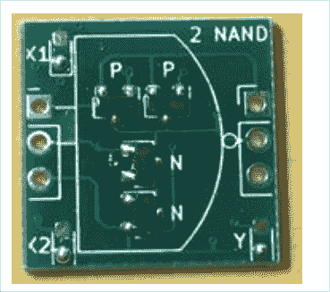

# 难以置信的离散 MOSFET 漫游者有最大的闪烁

> 原文：<https://hackaday.com/2020/12/04/incredible-discrete-mosfet-rover-has-maximum-blink/>

把 1738 个 MOSFETs 粘在一起会得到什么？如果你的答案是“4 位 CPU”，那你就完全正确。作为 Marutsu 的“CPU1738”产品，它似乎是针对计算机理论的初学者，带有解释 CPU 如何由组合成逻辑门的单个 MOSFETs 构成的构建指令。

A CPU1738 NAND PCB.

虽然其 SMD 格式明显比纯通孔器件更紧凑，但在较大 PCB 上使用无数小 PCB 会使封装相当笨重。一块接一块的板组成了中央处理器，组装继续增加传感器、马达和轮子。最后，一个机器人出现了，尽管看起来有点摇摇晃晃。

休息之后看看链接的视频，不过在开始之前，请注意仅 CPU 模块的价格就高达 50，000 日元(约 500 美元)。另一方面，除了 1738 个 MOSFETs 外，还有 1070 个 led，因此您可以在 blinkies 中获得您所支付的费用。

 [https://www.youtube.com/embed/yfelmQOKYK4?version=3&rel=1&showsearch=0&showinfo=1&iv_load_policy=1&fs=1&hl=en-US&autohide=2&wmode=transparent](https://www.youtube.com/embed/yfelmQOKYK4?version=3&rel=1&showsearch=0&showinfo=1&iv_load_policy=1&fs=1&hl=en-US&autohide=2&wmode=transparent)

