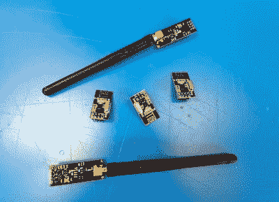

# Nerfnet 通过 NRF24L01 无线电建立 TCP/IP 隧道

> 原文：<https://hackaday.com/2020/12/04/nerfnet-tunnels-tcp-ip-over-nrf24l01-radios/>

您很有可能已经使用过 nRF24L01。这些小模块是通过 2.4 GHz 无线电链路以可观的速率传输数据的一种简单而廉价的方式，使它们非常适合远程控制项目。但是在看到其他人用这些收音机进行传输数字音频的实验后，[Andrew Rossignol]开始想知道一些软件欺骗是否可以更进一步。

结果就是 *nerfnet* ，一个 [Linux 程序，允许你通过一对 nRF24L01 模块](http://www.theresistornetwork.com/2020/11/nerfnet-wireless-networking-over.html)隧道传输 TCP/IP。链接以虚拟界面的形式出现，这意味着就其他程序而言，一切都是透明的。任何使用 TCP/IP 在 Linux 上通信的东西都可以利用这种低成本的链接，尽管速度是我们大多数人几十年来都没有遇到过的。

 虽然并不像你想象的那么糟糕。延迟约为 50 毫秒，经过一些调整后，[Andrew]已经能够从链路中挤出近 300 Kbps 的速度。这对于终端工作来说绰绰有余，一些轻微的音频和视频流也不是不可能的。

就范围而言，他能够在户外 60 米(200 英尺)的距离内保持相当可靠的连接。这听起来可能不多，但同样，你必须考虑这些收音机的成本。如果你想用 SSH 连接后院的树莓气象站，只需几块钱就能搞定。

如果你对它的具体细节感兴趣的话,[Andrew]在博客中详细解释了这个软件。但如果你只是想玩玩这个想法，你只需要用短 SPI 线将一些 nRF24L01 模块连接到一对 Raspberry Pis 以减少任何干扰，并按照说明操作。[理想情况下，无线电应该有外部天线](https://hackaday.com/2015/08/15/hacking-a-nrf24l01-radio-for-longer-range/)，但这不是严格要求。

过去，我们已经看到这些模块[作为即兴蓝牙低能量发射器](https://hackaday.com/2013/09/21/sending-data-over-bluetooth-low-energy-with-a-cheap-nrf24l01-module/)投入使用，但没有像这样的。虽然这种技术提供的延迟和带宽在现代人看来可能已经过时，但它可能是传感器、智能设备或家庭自动化项目的完美专用通信通道。

 [https://www.youtube.com/embed/WDXQwzDsWGw?version=3&rel=1&showsearch=0&showinfo=1&iv_load_policy=1&fs=1&hl=en-US&autohide=2&wmode=transparent](https://www.youtube.com/embed/WDXQwzDsWGw?version=3&rel=1&showsearch=0&showinfo=1&iv_load_policy=1&fs=1&hl=en-US&autohide=2&wmode=transparent)

 [https://www.youtube.com/embed/9N1uRcvZzq4?version=3&rel=1&showsearch=0&showinfo=1&iv_load_policy=1&fs=1&hl=en-US&autohide=2&wmode=transparent](https://www.youtube.com/embed/9N1uRcvZzq4?version=3&rel=1&showsearch=0&showinfo=1&iv_load_policy=1&fs=1&hl=en-US&autohide=2&wmode=transparent)

