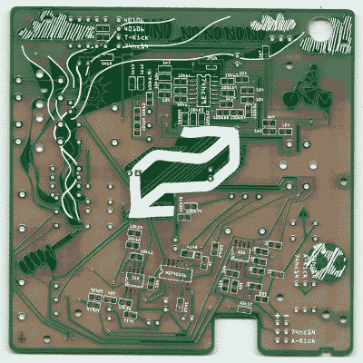

# 多氯联苯日记

> 原文：<https://hackaday.com/2020/12/09/a-pcb-diary/>

[Gijs Gieskes]创造了另一个引人注目的 PCB 奇迹，这一次是由几块电路板组装成一本书的[日记，与](https://gieskes.nl/instruments/?file=gijs-in-shertogenbosch) [PC/104](https://en.wikipedia.org/wiki/PC/104) 系统没有什么不同。但有了[Gijs]的系统，你可以很容易地打开堆叠来访问单板，而无需拆卸整个系统。我们很少在 PCB 组件上看到黄铜钢琴铰链，但是[Gijs]的 PCB 设计一点也不传统。提示:如果你想用更普通的硬件重现这种技术，你可以从不同的供应商那里找到铰链 PCB 支架。

Bicycle, soccer ball, smoke on the “No no no no no…” PCB

显然它不仅仅是一件被动的艺术品，每块电路板都有几个电路，其中一些(所有？)是以没有清楚描述的方式发挥作用的，这似乎是有意的。根据他的[构建日志](https://gieskes.nl/instruments/files/gijs-in-shertogenbosch/gijs-in-shertogenbosch/manual/)，当你以各种方式混合搭配板间排线时，会发生不同的事情。说明书告诉我们“试着看看会发生什么”。没有贴原理图，但手册中有电路的部分描述，两层板上的器件都有很好的标签。虽然在抽查了一些电路板照片后，我们猜测有不少痕迹，也许有些部分是徒劳的。

该项目声称是 2018 年和 2019 年的日记，但我们将把它作为读者解读[Gijs]嵌入这部迷人作品的信息的练习。我们已经写了几年来他的几个项目，如这个[疯狂弯曲卡西欧 SK-1](http://gieskes.nl/circuitbending/?file=casioSK) 从 2005 年开始。在将这种“书本”式的电路板堆叠仅仅视为艺术家专用之前，先来看看我们在 1 月份报道过的这个[拆卸联盟号时钟](https://hackaday.com/2020/01/29/soviet-soyuz-clock-teardown/)的过程。