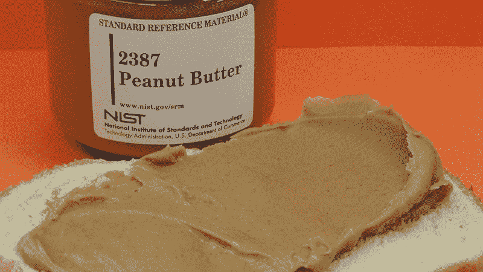
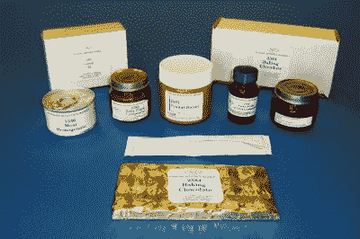
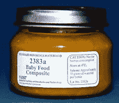

# 令人垂涎的 NIST 标准食品公司

> 原文：<https://hackaday.com/2020/12/23/the-mouth-watering-world-of-nist-standard-foods/>

美国国家标准与技术研究所成立于 1901 年 3 月 3 日，前身为美国国家标准局，1988 年更名。该组织受政府委托，负责确保美国各地度量衡的统一，并在需要某种总体标准的地方帮助工业、学术界和其他用户。

NIST 的主要工作之一是生产和销售标准参考物质。这些涵盖了各种各样的应用，从钢铁样品到混凝土和地质材料，如粘土。然而，也有可食用的 SRMS。是的，你可以给自己买一罐 NIST 标准花生酱，尽管你可能会发现它的价格比不上当地超市的品种。让我们深入了解这些“标准”食品存在的原因，并看看我们最喜欢的国家标准研究所的货架上有什么。

## 了解你的尺寸

NIST 生产大约 1300 种不同的标准参考物质，其中 [45 种属于食品和饮料类别](https://www-s.nist.gov/srmors/viewTable.cfm?tableid=71)。他们最出名的是他们的花生酱，当[的卡洛琳·伯德特博士测试这种材料样本的照片在网上疯传后，这种花生酱受到了关注。](https://www.nist.gov/blogs/taking-measure/going-nuts-over-nists-standard-reference-peanut-butter)可用标准的范围很广，尽管很大程度上令人不快，例如肉类匀浆和婴儿/成人营养粉。

A selection of various NIST Standard Reference Materials from the Food and Beverage category.

想象一个政府机构创造一种“标准”花生酱来统治所有人是很有趣的，这种花生酱不会比人们所期望的更好也不会更差。然而，这些标准并不打算成为制造商如何加工食品的指南。相反，这些材料旨在用作校准标准。

制造商需要验证他们食品的营养成分，也需要验证它们是安全的，没有危险的污染物。这需要使用各种复杂的测试。为了验证这些测试的结果是有效的，有必要手头有一个已知的标准材料进行检查。例如，如果您对 NIST 的标准苹果汁进行测试，并且测得的砷含量与记录值相符，那么您可以相对确定，当您测量自己公司的产品时，您得到的数据是有效的。

Some of the standards are more familiar than others. Baby Food Composite is fairly straightforward; Typical Diet is a material with broader testing applications.

虽然 NIST 标准在技术上可以被认为是可食用的，但它们并不打算被摄入体内，而且价格比你在当地商店支付的价格高出几个数量级。一包三包的标准花生酱在运输前要花 881 美元，而五块烘焙巧克力也要花同样的钱。可以说，NIST 也不是因为分发假日促销代码而出名的。如果我们*有*只准备 SRM 的野餐，我们会依靠牛奶&蛋粉和面粉样本来烤一条漂亮的标准面包，上面放牡蛎组织(25 克 672 美元)，牛肝，或者可能是那些想要素食的人的菠菜浆。

总的来说，这些参考材料在确保我们每天消费的食品和饮料的质量方面发挥着重要作用。结合其标签设计的正式，凄凉的美感，它们也是你冰箱的绝佳道具，尽管成本很高。NIST 的工作让制造商的生活更轻松，并帮助为消费者生产更好的产品。因此，神秘的标准参考物质在食品和饮料工业中起着非常重要的作用。