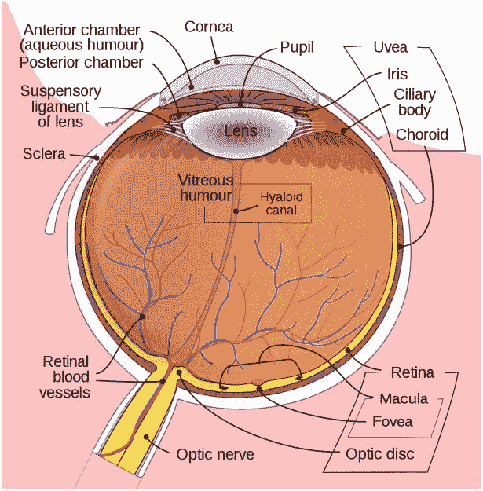
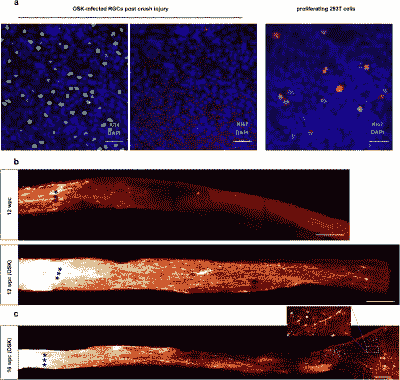
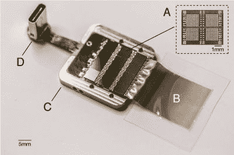
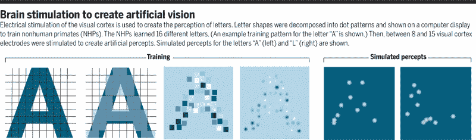
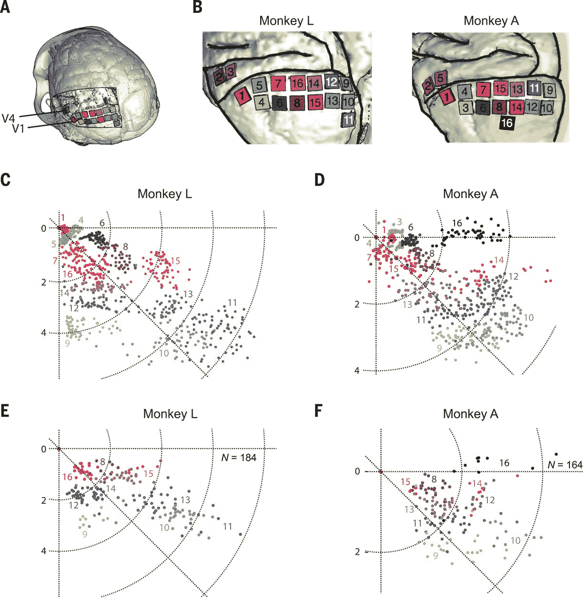
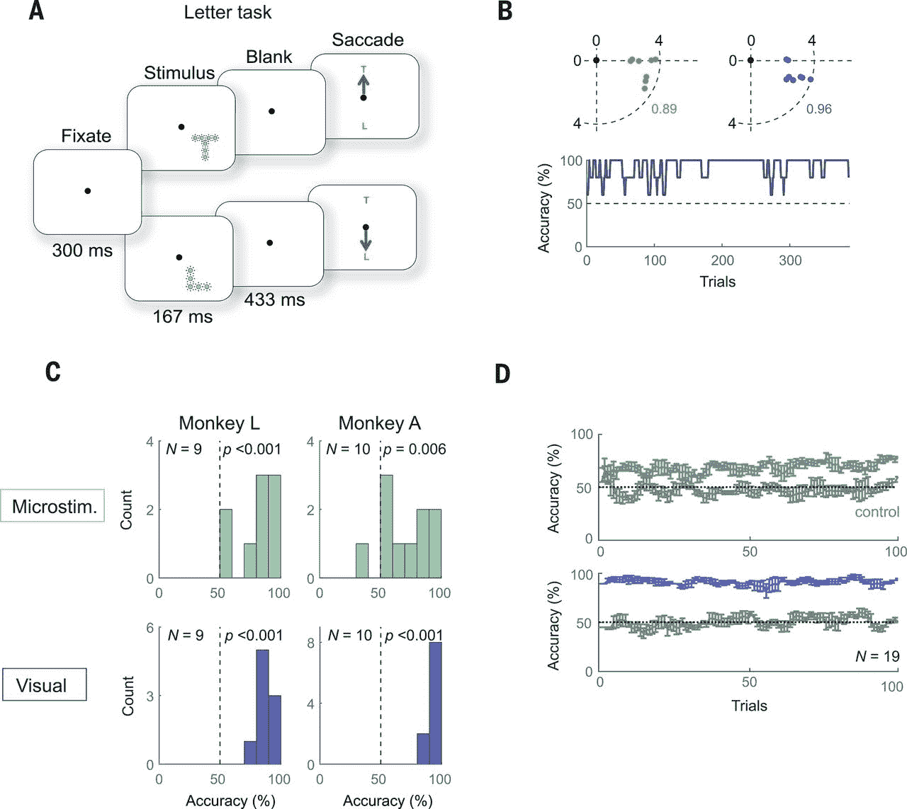

# 寻求启示:寻求恢复人类的视力

> 原文：<https://hackaday.com/2020/12/29/seeking-enlightenment-the-quest-to-restore-vision-in-humans/>

视觉障碍一直是人类历史上的一个主要问题，但随着社会演变成一个以视觉敏锐度为中心的世界，这一问题变得更加紧迫。无论是在繁忙的城市中导航，还是与充斥现代生活的无数屏幕互动，应对视力下降或失明都是一项挑战。对于无数人来说，使用盲文和屏幕阅读器等无障碍技术是与周围世界互动的必要条件。

对于屈光性视力障碍，我们目前有一系列解决方案，从眼镜和隐形眼镜到更永久的选择，如 LASIK 和类似的通过烧掉部分角膜来解决屈光问题的方法。当眼睛的晶状体本身受损时(例如患有[白内障](https://en.wikipedia.org/wiki/Cataract)，可以用人工晶状体替换。

但是，如果视网膜或视神经受到了某种程度的损伤，该怎么办呢？对于有这种(神经)损伤的人来说，几十年来，通过生物或技术手段恢复视力一直是一个诱人且看似未来的概念。最近，有许多研究探索了这两种方法，并取得了令人鼓舞的结果。

## 设置场景

Schematic diagram of the human eye.

在发达国家，导致失明的[主要原因是年龄相关性黄斑变性(](https://www.ncbi.nlm.nih.gov/pmc/articles/PMC1420283/) [AMD](https://en.wikipedia.org/wiki/Macular_degeneration) )、[糖尿病视网膜病变](https://en.wikipedia.org/wiki/Diabetic_retinopathy)和[青光眼](https://en.wikipedia.org/wiki/Glaucoma)。值得注意的是，与发展中国家相比，白内障和屈光问题的治疗大大减少了全盲病例的总数，留下了难以治疗的视力障碍类型。

在上述三种致盲原因中，视网膜由于各种原因而受损，破坏视网膜的一部分(例如，大部分是具有黄斑变性的黄斑)或整个视网膜，通常是视力丧失的缓慢进展，直到没有功能性视网膜结构存在。在这些情况下，以及在例如视网膜从眼睛后部脱离的情况下(视网膜脱离，例如由于钝性创伤)，视神经和大脑的处理中心保持完整和功能性。

由于大多数类型的视力丧失，包括因童年失明而导致的视力丧失，都以未受损的视觉皮层为特征，因此，恢复视力的大量注意力都集中在大脑的这一部分。许多研究集中于开发替代包括视网膜和视神经在内的眼睛功能的假体。最近，通过使组织自身再生来恢复受损视网膜和视神经的功能的可能性也得到检验。

## 遗传时间机器

OSK-induced axon regeneration visualized in optic nerve (mouse).

人类细胞本质上是不朽的，这是一个保守得不好的秘密。不幸的是，一旦细胞在向特定类型的组织(例如:肌肉或肝脏组织，或脊髓或视网膜的一部分)发展的过程中达到某一点，那些使它们不朽并能够无限再生的比特就被关闭了。Yuancheng Lu 等人最近通过表观遗传重编程( [bioRxiv 预印本](https://www.nature.com/articles/d41586-020-03119-1)版本)研究了[逆转衰老和损伤诱导的视力丧失](https://www.nature.com/articles/s41586-020-2975-4)。

在小鼠模型中，他们表明，通过腺相关病毒(AAV)载体(剥离腺病毒)在眼睛细胞中重新启动三种基因( *Oct4* 、 *Sox2* 和 *Klf4: OSK* )的表达，这些基因的[异位表达](https://en.wikipedia.org/wiki/Ectopic_expression)导致受损轴突再生，再生受损视神经，并从青光眼导致的受损视网膜中恢复。此外，在 OSK 表达 4 周后，细胞的年龄(由 [DNA 甲基化](https://en.wikipedia.org/wiki/DNA_methylation)水平指示)已经被重置为它们的年轻状态。

根据以前的实验数据，OSK 和 c-Myc(OSKM)被认为与细胞再生组织的能力有关。在这个特定的实验中使用 OSK 而不是 OSKM 的原因是因为异位的 *c-Myc* 表达已被证明会导致组织[发育异常](https://en.wikipedia.org/wiki/Dysplasia):基本上是异常的细胞发育，具有可预测的阴性结果。然而，尽管这项研究中的小鼠恢复了大量失去的视力，但重要的是要记住，所有这些实验都是为了填补我们仍然缺乏了解的空白。

这一切的关键是我们对两种机制的理解:细胞的再生能力和构成衰老过程的表观遗传“时钟”。DNA 甲基化似乎在两者中都起着重要作用，它在后者中的作用导致了生物化学过程中的逐渐变化和动摇。甲基可以与 DNA 分子结合，从而改变基因的表达。在卵子被精子受精后，这些甲基化模式的重置是哺乳动物生殖系统的一个标准特征([重编程](https://en.wikipedia.org/wiki/Reprogramming))。如果没有这种机制，产生的胚胎将与父母具有相同的遗传年龄，这是克隆羊[多莉](https://en.wikipedia.org/wiki/Dolly_(sheep))所担心的。

显然，这种基因疗法的目标是消除衰老和损伤的影响，而不是将每个细胞都变成干细胞。然而，如果受损的组织，如神经和器官，可以使用 OSK 或类似方法重置回更年轻的状态，这可能意味着一个人不仅可以再生受损的视神经和视网膜，还可以逆转衰老的影响，包括黄斑变性等。

## 控制论的时代

The Neuralink prototype implant.

可悲的是，在这一点上，通过表观遗传编程再生组织作为人类的常规甚至实验性治疗还有很长的路要走。然而，使用植入物和人机界面来恢复失去的感觉更进一步，到了像 [Argus II](https://en.wikipedia.org/wiki/Argus_retinal_prosthesis) 这样的[视网膜植入物](https://en.wikipedia.org/wiki/Retinal_implant)已经被批准用于治疗黄斑变性和其他疾病，这些疾病会使视网膜的传输层和可能的处理层保持完整。

然而，当视网膜严重受损，视神经也可能受损时，人们很快就会进入大脑直接刺激的实验区。这里利用了视觉皮层的视网膜映射特性:将视网膜信号路由到视觉皮层上实质上形成了 2D 图。这使得确定触发哪一部分来“照亮”一个人视觉的目标部分的工作变得非常容易。主要的困难在于弄清楚“如何”。

正如我在去年关于 Neuralink 的文章中提到的，用电极控制大脑的一个主要问题是，大脑中的神经元从所有定义来看都是微小的。这意味着，我们在这里所能做的最好的事情就是将探针大致插入正确的区域，并希望我们用电脉冲至少击中一些正确的神经元，以产生预期的效果。发人深省的结论是，视网膜植入物的“高科技”是数百像素，预期的视觉皮层植入物大概也在这个范围内。更不用说人们可以从粒状、黑白图像的乐观等效物中预期的低视觉保真度。

由于使用当今技术的任何大脑植入都可以同时刺激成千上万的神经元，因此人们可以希望在视觉皮层中产生的最好结果是产生[光幻视](https://en.wikipedia.org/wiki/Phosphene):在视野中“看到”亮点的体验，这不是由于光线刺激视网膜造成的。另一种导致光幻视的方式是通过机械刺激，例如当(轻微地)推眼睛或头部受到撞击时(“眼冒金星”)。

最近由陈等人发表在《自然》杂志上的一篇题为“[猴视觉皮层中通过高通道数神经假体进行形状感知](https://www.researchgate.net/publication/346652657_Shape_perception_via_a_high-channel-count_neuroprosthesis_in_monkey_visual_cortex)的文章详细介绍了一项实验，其中将 1024 通道假体植入非人灵长类动物(，本例中为猕猴)的视觉皮层。从人类受试者的类似实验中，我们知道这些感知到的点的大小从针尖到几厘米不等，感知到的颜色也可能不同，这大概取决于视觉皮层中的哪些神经元受到的刺激更强。

Summary of the shape training of the monkeys, along with a simulation of the perceived shape. (Credit: Nature)

这项实验的独特之处在于使用了皮层内电极([犹他阵列](https://en.wikipedia.org/wiki/Microelectrode_array))，而以前的实验通常使用视觉皮层表面的导体。这允许较低的电流在视觉皮层的目标区域(V1)中诱发期望的反应，其效果在较高的皮层区域(V2)中测量:

Implantation sites (V1, V2) of the Utay arrays and the receptive fields. (Credit: Chen et al.)

实验的目的是确定猴子是否能识别出呈现给它们的一组光幻视的形状。如果他们事后指出正确的形状，他们会得到奖励。对运动的测定也是如此:在这里，猴子的眼球运动被监控，以观察光幻视被感知到的运动方向。

Study results in the letter recognition task. (Credit: Chen et al.)

像这样的研究的一个主要限制是，它涉及人类研究人员解释猴子的行为，猴子解释来自所述研究人员的输入。正如陈等人所指出的，准确性的偶尔下降很可能是由于猴子方面缺乏动力，尤其是在记录会话的最后。

尽管这项研究的结果相对有希望——在记录过程中通常有高于概率的结果——但将这种研究转移到人类受试者身上以将其转化为医疗产品将是非常复杂的。这不仅是因为需要覆盖整个视觉皮层表面(每个半球的平均面积为 25 至 30 厘米²)，也是因为需要进一步提高阵列的分辨率，并开发一种无线版本，其电极可以保持在原位几十年而不会对周围组织造成损伤。

## 众所周知的隧道尽头

从不同的研究中看到这些结果，沿着不同的道路最终实现相同的目标，似乎是谨慎乐观的原因。和所有科学研究一样，不能保证一种特定的方法会在几年内变成可行的疗法。有些永远不会走出实验室，但可能会产生新的想法和新的方法。

就光幻视而言，人们从 20 世纪 20 年代就知道了它们，并在上世纪下半叶进行了实验，但(安全地)制造大脑植入物的技术花了更长的时间。类似地，表观遗传学的概念以其目前的定义，以及其重新编程已经存在了一段时间，但在过去的几年里取得了重大进展。

无论如何，由于全球无数科学家的不懈努力，我们似乎真的可以在不久的将来实现失明成为历史的目标。