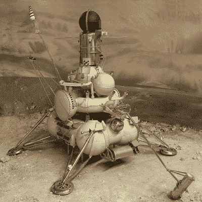
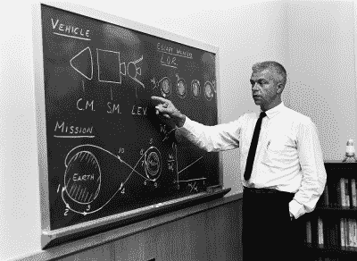
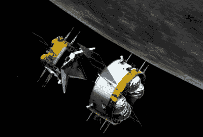

# 中国的登月任务不仅仅是岩石

> 原文：<https://hackaday.com/2020/12/14/chinas-moon-mission-was-about-more-than-rocks/>

如果一切按计划进行，中国将很快成为继美国和苏联之后第三个成功返回月球物质样本的国家。他们的嫦娥五号任务，旨在从月球表面收集 2 公斤(4.4 磅)的土壤和岩石，到目前为止进展顺利。假设返回的宇宙飞船成功进入地球大气层并于 12 月 16 日安全着陆，中国将正式加入一个非常排外的月球探险者俱乐部。

当然，航天飞行极其困难，重返大气层尤其具有挑战性。未来几天什么都有可能发生，所以庆祝嫦娥五号任务圆满成功还为时过早。但是，即使地面控制人员在飞行器返回地球时与它失去联系，或者它在大气层中烧毁，中国也将从这次任务中获得丰富的宝贵经验，这些经验将在未来几年指导其月球计划。

事实上，人们可以说这一直是任务的真正目标。虽然将几磅月球岩石带回地球可以获得大量的科学知识和不可忽视的民族自豪感，但众所周知，中国对我们最近的天体邻居有更大的渴望。从 2007 年发射嫦娥 1 号开始，中国的月球探测计划已经经历了几个操作阶段，每个阶段都比上一个阶段更具技术挑战性。嫦娥 5 号代表了该计划的第三阶段，在国家宣布他们将在 21 世纪 30 年代进行载人着陆之前，只需建立机器人研究站。

这有助于解释为什么，即使对于从月球返回的样本来说，嫦娥 5 号也是一项极其复杂的任务。对所涉及的硬件和技术的仔细观察表明，任务剖面比严格必要的要困难得多。合乎逻辑的结论是，中国故意绕远路，这样他们就可以用它来为仍然摆在面前的更具挑战性的任务进行演练。

## 露娜的遗产

Model of *Luna 16* at the Museum of Cosmonautics

虽然大多数人将月球岩石与阿波罗计划联系在一起，但苏联在 20 世纪 70 年代也进行了一系列成功的机器人样本返回任务。三次月球任务只带回了一小部分材料，而美国宇航局用他们更大、更雄心勃勃的载人飞行器带回了一小部分材料，但他们证明了，即使有那个时代相对原始的技术，月球样本返回也可以以低得多的成本完成，而且不会危及人类生命。

显而易见，复制 20 世纪 70 年代的月球任务仍然是从月球返回样本的最快和最便宜的方式。按照今天的标准，那些早期着陆器上使用的传感器、照相机和通讯设备绝对是过时的。现代材料和电池技术也将使飞船比 50 年前轻得多，尽管 5727 公斤(12626 磅)的月球 16 号发射质量仍在中国长征 5 号助推器的有效载荷能力范围内。

称之为容易肯定有点牵强。毕竟，仅靠现代技术和材料不足以阻止以色列的贝雷片 T2 着陆器撞上月球表面。但中国已经在月球上放置了几个机器人飞行器，所以给嫦娥 5 号着陆器增加一个受月球启发的返回级将是实现他们目标的最便捷的方式。相反，他们做了一些非常不同的事情。

## 阿波罗的回声

当提到嫦娥 5 号时，我们并不是真的在谈论单个航天器，而是几个不同运载工具的“堆栈”，每个运载工具都有特定的作用。一旦飞船进入绕月轨道，着陆器分离并独立降落到月球表面。土壤和岩石样本随后被装入一个安装在顶部的小型登月舱。这艘小型飞船从月球起飞，留下着陆器，并与留在轨道上的服务舱对接。样本被转移到轨道舱，然后轨道舱与登月舱分离，并使用其发动机离开月球轨道，开始旅程的返程。最终，只有一个小太空舱能够成功返回并降落在地球上。

LOR proponent John Houbolt in 1962

如果这听起来很熟悉，那是因为这与载人阿波罗任务中使用的任务架构相同。官方称为月球轨道会合(LOR)，这一概念被美国国家航空航天局(NASA)选中，因为它允许使用比其他情况下所需的小得多的助推器。一艘能够飞向月球、着陆、然后返回地球的宇宙飞船会非常重；很大程度上是因为返回地球所必需的推进剂在往返月球表面的旅途中只不过是一堆重量。

使用“嵌套玩偶”LOR 方法，任务的每个后续阶段都由一个更小更轻的飞行器来完成。缺点是操作起来要复杂得多，需要两个航天器在月球轨道上会合和对接。对于美国国家航空航天局来说，这意味着在阿波罗登月之前还需要进行数年的额外研究和开发。这直接导致了双子座计划，这是一系列用于开发导航和对接技术的任务，最终将用于阿波罗的月球会合。

目前我们对中国人类探索月球的计划知之甚少，但他们将使用与美国宇航局在阿波罗计划期间展示的相同的经过测试的 LOR 架构是合理的，并且在 Artemis 计划期间将继续使用[。通过在机器人嫦娥任务中测试自动交会对接技术，中国有可能避免花费他们自己的载人双子座式项目所需的时间和金钱。](https://hackaday.com/2020/05/05/nasas-plan-for-sustained-lunar-exploration/)

## 熟能生巧

阿波罗 10 号的机组人员有幸在月球轨道上执行了首次交会对接，作为阿波罗 11 号任务期间最终着陆的“彩排”的一部分，但嫦娥 5 号标志着机器人首次完成这样的壮举。虽然遥控飞行器以前已经停靠在地球静止轨道上，但在围绕另一个天体的轨道上执行如此精细的操作的独特挑战使这成为一项相当大的技术成就。

The Chang’e 5 orbiter and ascent vehicle meet in orbit.

这就是为什么中国确保先进行一些练习。嫦娥 5-T1 任务于 2015 年发射，以展示最终从月球返回所需的一些技术。这包括测试样品舱安全重返地球大气层的能力，并进行几次模拟对接演习。

尽管该飞行器只有一个虚拟伙伴进行练习，但这个实验可以被视为类似于后来的双子座任务，[在低地球轨道上，宇航员将他们的航天器与无人驾驶的 Agena 目标飞行器](https://hackaday.com/2018/07/26/radar-in-space-the-gemini-rendezvous-radar/)对接。当真正的时刻到来时，嫦娥 5 号登月舱的会合和捕获在 12 月 5 日进行得非常完美。在嫦娥 6 号前往月球南极的任务中，还有另一个收集自主月球对接数据的机会，目前预计这将在 2024 年发生。

现在说这些机器人练习将在 21 世纪 30 年代对他们的载人同行产生多大影响还为时过早，但有一点是肯定的:中国现在对月球交会对接的了解比美国在阿波罗计划之前多得多。