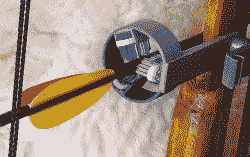

# 光滑的 DIY 复合弓使用螺旋弹簧，牙刷头

> 原文：<https://hackaday.com/2020/12/12/slick-diy-compound-bow-uses-coiled-springs-toothbrush-heads/>

复合弓(不同于反曲弓，它们在机械上更简单)使用带有滑轮和弹簧张力的杠杆系统来给予使用者机械优势。我们不确定如何称呼[Zünder 的]弓设计。他分享了他对 DIY 弓的非传统看法，这种弓使用了螺旋弹簧以及其他一些独特的功能。

Toothbrush heads and 3D printing make an enclosed, bristle-supported arrow rest.

关于[Zünder]的设计，我们真正挖掘的是理解它的工作原理是多么容易。当他演示使用弓时，杠杆、滑轮和弹簧张力一起工作的方式非常清楚。3D 打印的箭筒和箭托是很好的补充，我们特别喜欢使用三个牙刷头来为有切口的箭头提供支撑。刷毛环足够坚固，可以轻松支撑箭杆，并且不会干扰箭的发射。

[Zünder]有一个照片库，里面有一些额外的照片和特写镜头，你可以在下面嵌入的视频中观看他演示他的弓。

 [https://www.youtube.com/embed/En5SFsRBGqU?version=3&rel=1&showsearch=0&showinfo=1&iv_load_policy=1&fs=1&hl=en-US&autohide=2&wmode=transparent](https://www.youtube.com/embed/En5SFsRBGqU?version=3&rel=1&showsearch=0&showinfo=1&iv_load_policy=1&fs=1&hl=en-US&autohide=2&wmode=transparent)

谈到射箭，我们已经看到了一些非常聪明的 DIY 作品，比如[用 PVC 管制作复合弓](https://hackaday.com/2017/08/23/make-your-own-compound-bow-from-pvc-pipe/)和[这个迷人的基于自行车车轮的设计](https://hackaday.com/2014/06/11/bicycle-wheel-bow-has-plenty-of-kick/)，它几乎完全由回收和再利用的材料制成。