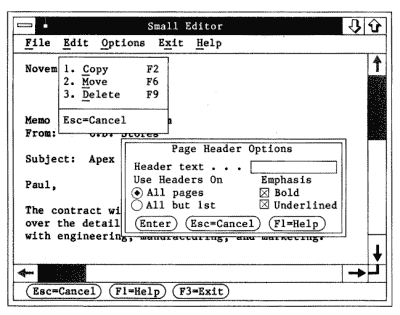

# 剪切、复制和粘贴的起源

> 原文：<https://hackaday.com/2021/01/20/the-origin-of-cut-copy-and-paste/>

我总是着迷于有人设计了你使用的几乎所有东西，不管它是多么微不足道。你打字的键盘，你打开的电灯开关，甚至水龙头的把手。它们不会自发地长在树上，所以一些人必须建造它，而且当他们开始建造它时，脑海中可能至少有一个模糊的设计。

有些事情无处不在，以至于很难记起是有人首先虚构出来的。我的一个朋友前几天问我，为什么我们几乎普遍使用 Control+X 和 Control+V 来操作剪贴板。当然，Control+C 对于 copy 来说是有意义的，但奇怪的是，在一个每个人都喜欢重新发明轮子的行业中，它实际上是普遍的。我不确定答案，但我认为这与 IBM 或 Sun 的一些用户界面标准有关。事实证明，它比那要古老得多。

## 回到 CTRL-C 只意味着 Break 的时候

但是，如果您还记得的话，Control+C 并不总是 copy 的同义词。在 TOPS-10、CP/M、MSDOS 和其他几个系统中，Control+C 是众所周知的中断命令。这可能是因为 C 代表“取消”，也可能是因为“结束文本”的 ASCII 码是 Control+C。所以我知道在相对较近的历史中，控制键接管了世界。

话又说回来，剪贴板本身并没有那么古老，它也需要发明。来自斯坦福的彭蒂·卡内瓦正在使用删除缓冲区来保存文本供以后使用，这项技术引起了拉里·特斯勒的注意。拉里为施乐 PARC 公司工作——或多或少发明了图形用户界面的人。在比尔·莫格里奇的《设计交互》一书中，提到团队已经在为银公司的桌面出版应用程序进行元素的剪切和粘贴，他们知道卡内瓦的工作。将剪切和粘贴的概念扩展到文本是一个很自然的想法。

## 早期 PARC

最初系统的唯一问题是“删除”这个词听起来太永久了。早期的 PARC 软件把删除的东西扔进垃圾桶，把剪切的东西扔进垃圾桶。说到困惑。新的剪切和粘贴隐喻也比卡内瓦的系统使用更少的键。

现在看来这似乎是显而易见的，但是移动文本的正确方式在当时是非常有争议的。虽然一些设计师喜欢我们现在使用的剪切/复制/粘贴方法，但其他人想要移动/复制/删除/移调。这更类似于像 WordStar 这样的老系统的工作方式。这些命令对屏幕上的文本块进行操作，没有中间步骤。即使是将光标放在字母之间的想法，光标的形状在当时也不明显。

施乐 Alto 走在了时代的前面，它提供了一个图形化的文本编辑器。这个 1975 年的文字处理器确实允许我们所知道的剪切和粘贴。但是，这些命令使用了 Escape 键。据我所知，我们今天想到的实际控制命令起源于苹果人机界面标准。

## 苹果标准

Bruce Tognazzini，又名 Tog，是苹果早期的一名有影响力的员工，为 1984 年的 Macintosh 编写了许多原始标准。然而，有许多人参与其中，你可以在下面的视频中看到拉里·特斯勒和其他人讨论苹果图形用户界面的早期历史以及 PARC 对它的影响。

 [https://www.youtube.com/embed/OW-atKrg0T4?version=3&rel=1&showsearch=0&showinfo=1&iv_load_policy=1&fs=1&hl=en-US&autohide=2&wmode=transparent](https://www.youtube.com/embed/OW-atKrg0T4?version=3&rel=1&showsearch=0&showinfo=1&iv_load_policy=1&fs=1&hl=en-US&autohide=2&wmode=transparent)

根据视频，该团队知道人们会经常使用剪切、粘贴、复制和撤消，他们希望有一种标准的方法来跨应用程序完成这些操作。官方的说法是，C 代表复制，X 看起来像划掉或一把剪刀，V 看起来像插入标记。Z 恰好是该簇中的下一个字符——我们很可能用 Control+B 作为撤销。

## CUA

[IBM CUA from 1988](https://archive.org/details/ibmsj2703E/) via the Internet Archive

很难记住，但苹果并不总是设定市场方向。IBM 的通用用户访问(CUA)标准于 1987 年问世，为了不与作为分隔符的 Control+C 冲突，它为剪切、复制和粘贴定义了不同的字符。这是在苹果文档和早期版本的 Windows 使用这些键三年之后。然而，Control+C，V，X 三位一体是如此普遍，以至于 Windows 最终允许这两套字符。今天，像 emacs 这样的程序支持 CUA 模式，它允许控制+C，V，X，尽管这些并不是最初的 CUA 标准。

在 1993 年，也就是苹果文件发布的九年后，Unix 也经历了类似的努力，将通用桌面环境标准化为通用开放软件环境的一部分。到那时，大多数程序已经采用了我们所认为的正常击键。

## 我们的设计

今天，剪贴板的工作方式和你使用的按键似乎是再自然不过的了。与这种趋势背道而驰的程序——我看到的是 Eagle——让你选择一个命令，比如 copy，然后进行选择，会受到很多抨击。

尽管如此，我还是对很多次一个不经意的决定变成一件大事感到震惊。电子朝哪个方向流动？鼠标应该有多少个按钮？值得称赞的是，苹果团队似乎明白，即使是很小的决定也可能成为一件大事，他们在事情上花了很多心思。

本周你会做出什么因果决定，会产生深远的影响？我们大多数人都没有机会设置地球上每个人使用的按键。但是有多少次你写了一个快速的 shell 脚本，变成了使用多年的东西，或者编了一个快速的电缆，成为了实验室设置的永久部分？在你进行下一次因果分析之前，你需要考虑一些事情。