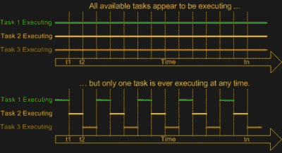
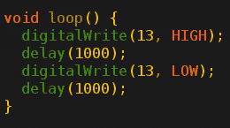

# 实时操作系统基础知识:在需要时选择合适的 RTOS

> 原文：<https://hackaday.com/2021/02/24/real-time-os-basics-picking-the-right-rtos-when-you-need-one/>

对于嵌入式项目，什么时候需要使用实时操作系统(RTOS)？它带来了什么，成本是多少？幸运的是，有严格的技术定义，这也可以帮助人们弄清楚 RTOS 是否是项目的正确选择。

名称中的“实时”部分涵盖了 RTOS 的基本前提:保证某些类型的操作将在预定义的、确定的时间跨度内完成。在“实时”中，我们发现了不同的类别:硬实时、硬实时和软实时，对于错过最后期限的惩罚越来越轻。作为一个硬实时场景的例子，想象一个系统，其中嵌入式控制器必须在特定的时间跨度内响应传入的传感器数据。如果错过这样一个最后期限的后果将打破系统的下游组件，比喻或字面上，最后期限是硬的。

相比之下，软实时将是这样一种操作，如果控制器在这个时间范围内做出响应就很好，但如果需要更长时间，也完全没问题。一些操作系统能够实现硬实时，而另一些则不能。这主要是他们基本设计的一个因素，尤其是调度器。

在本文中，我们将看看各种各样的操作系统，看看它们在这些定义中的位置，以及何时在项目中使用它们。

## 规模的问题

不同的嵌入式操作系统处理不同类型的系统，并具有不同的特性集。最简单的流行 RTOS 可能是 [FreeRTOS](https://en.wikipedia.org/wiki/FreeRTOS) ，它提供了一个调度器和多线程原语，包括线程、互斥、信号量和线程安全堆分配方法。根据项目的需要，您可以从许多动态分配方法中选择，也可以只允许静态分配。

在天平的另一端，我们发现诸如 VxWorks、QNX 和 Linux 等应用了实时调度程序补丁的 RTOSes。这些通常是 POSIX 认证或兼容的操作系统，它们提供了为与常规桌面平台高度兼容的平台开发的便利，同时由于它们的调度模型，提供了某种程度的实时性能保证。

同样，如果调度器在切换任务时保证了一定程度的确定性，那么 RTOS 就是唯一的 RTOS。

## 实时:定义“立即”

即使在操作系统之外，处理器的实时性能也会有很大差异。当考虑微控制器和处理一个中断所需的周期数时，这一点变得尤为明显。例如，对于流行的 Cortex-M MCU，中断延迟[给定为](https://en.wikipedia.org/wiki/ARM_Cortex-M#Instruction_sets)从 12 个周期(M3、M4、M7)到 23+ (M1)不等，这是最好的情况。除以处理器速度，你会得到大约四分之一微秒。

相比之下，当我们查看 [Microchip 的 8051](https://www.microchip.com/design-centers/8-bit/8051-microcontrollers) 系列 MCU 时，我们可以在第 2.16.3 节(“响应时间”)的“Atmel 8051 微控制器硬件手册”中看到，根据中断配置，中断延迟可以是 3 到 8 个周期。在 x86 平台上，由于 x86 IRQs 的[有点复杂的性质](https://alex.dzyoba.com/blog/os-interrupts/)，故事又变得更加复杂了。同样，几分之一微秒。

这种延迟对 RTOS 可以实现的最佳实时性能有绝对的限制，尽管由于运行调度程序的开销，RTOS 无法接近这一限制。这就是为什么，对于绝对一流的实时性能，确定性的单轮询循环方法和快速中断处理程序例程是迄今为止最确定的。

如果中断或其他上下文切换会消耗周期，那么更快地运行底层处理器显然也可以减少延迟，但也会带来其他代价，尤其是更高的功耗和更高的冷却要求。

## 添加一些很酷的线程

正如 FreeRTOS 所展示的，添加操作系统的主要目的是添加多任务(和多线程)支持。这意味着一个调度器模块可以使用某种调度机制将处理器时间分割成“片”,不同的任务或线程可以在其中活动。虽然最简单的多任务调度器是一种[合作式的调度器](https://en.wikipedia.org/wiki/Preemption_(computing))，其中每个线程都自愿让出，让其他线程做它们的事情，但这有一个明显的缺点，即每个线程都有能力破坏其他线程的一切。

 大多数实时操作系统转而使用一个[抢占式](https://en.wikipedia.org/wiki/Preemption_(computing))调度器。这意味着应用程序线程无法控制何时运行或运行多长时间。相反，一个中断例程触发调度程序选择下一个线程来执行，注意区分哪些任务是可抢占的，哪些是不可抢占的。例如，所谓的内核例程可能被标记为不可抢占的，因为中断它们可能会导致系统不稳定或损坏。

尽管 Windows 和 Linux 在它们通常的配置中都使用抢占式调度器，但是这些调度器被认为不适合实时性能，因为它们被调整为优先处理前台任务。面向用户的任务，如图形用户界面，将保持平稳运行，即使后台任务可能面临 CPU 周期的短缺。这就是为什么桌面操作系统上的一些实时任务如此繁琐，需要各种变通方法。

x86 版本的 [QNX](https://en.wikipedia.org/wiki/QNX) RTOS 很好地展示了实时聚焦抢占式调度器的不同之处。虽然这在 x86 桌面系统上运行良好，但当执行后台任务时，GUI 将开始挂起并变得缓慢，因为调度程序不会对前台任务(GUI)进行特殊处理。Linux 内核实时补丁的目标还改变了调度程序的默认行为，将中断的处理放在第一位，而不是区分各个任务，除非通过显式设置线程优先级来配置这样做。

## 是不是 RTOS，这是个问题

在这一点上，应该清楚“实时”的含义，并且您可能对项目是否会受益于 RTOS、普通操作系统或中断驱动的“超级循环”方法有所了解。这里没有放之四海而皆准的答案，但一般来说，人们会在所需的实时性能与可用时间和预算之间寻求平衡。或者在一个业余爱好项目的情况下，一个人如何能费心去优化它。

首先要考虑的是项目中是否有硬性的截止日期。假设有几个传感器连接到一块电路板上，需要以相同的时间间隔进行轮询，并将结果写入 SD 卡。如果超过几十个周期的读数之间的任何类型的抖动都会使结果变得无用，那么就有那么多周期的硬实时要求。

 我们知道底层硬件(MCU、SoC 等。)具有固定或最坏情况下的中断延迟。这决定了最好的情况。在中断驱动单循环方法的情况下，我们可能很容易满足这些要求，因为我们可以总结最差情况下的中断延迟、中断例程(ISR)的周期成本以及处理数据并将其写入 SD 卡的最差情况时间。这将是高度确定的。

在我们的传感器和 SD 卡示例中，由于调度器的开销，RTOS 版本与单循环版本相比可能会增加开销。但是想象一下，向 SD 卡写入数据需要花费大量时间，并且您还想处理不经常出现的用户输入。

对于 RTOS，因为样本需要尽可能地靠近，所以您会希望使这项任务不可抢占，并给它一个硬性的调度截止日期。写入 SD 卡和任何用户输入的任务，优先级较低。如果用户输入了很多，RTOS 可能会在处理字符串的过程中切换回数据收集，例如，设定一个时间期限。你这个程序员就不用操心了。

简而言之:RTOS 提供确定性调度，而中断驱动的单循环除了确保超级循环足够频繁地循环之外，还完全消除了调度的需要。

## 物质享受

当拉开帷幕时，很明显，对于处理器硬件来说,“线程”和线程同步机制(如互斥体和信号量)等概念仅仅是使用硬件功能实现的软件概念。在内心深处，我们都知道，当调度程序执行多任务任务时，单核 MCU 并不真正同时运行所有任务。

然而，当我们出于性能原因需要尽可能靠近硬件时，RTOS——即使是像 FreeRTOS 这样的极简主义者——允许我们在一个平台上使用这些软件概念。在这里，我们在性能和便利性之间取得了平衡，当涉及到与系统的其余部分进行交互时，FreeRTOS 让我们使用自己的设备。其他的实时操作系统，像 [NuttX](https://en.wikipedia.org/wiki/NuttX) ，QNX 和 VxWorks 提供了一个成熟的 [POSIX](https://en.wikipedia.org/wiki/POSIX) 兼容环境，至少支持标准 Linux 代码的一个子集。

虽然很容易把 FreeRTOS 想象成一个可以放在 MCU 上的 RTOS，但它在大型 SOC 上也能很好地运行。类似地， [ChibiOS/RT](https://en.wikipedia.org/wiki/ChibiOS/RT) 可以在任何东西上运行，从 8 位 AVR MCU 到强大的 x86 系统。这里的关键是在项目需求和可以称之为物质享受的东西之间找到正确的平衡，使目标系统的开发更容易。

对于还添加了硬件抽象层的实时操作系统(例如 ChibiOS、QNX、RT Linux 等)。)，HAL 部分使不同目标系统之间的移植变得更容易，这也可以被认为是对其有利的一个论点。然而，最终是选择单循环、简单的 RTOS、复杂的 RTOS 还是“仅仅是一个操作系统”是一个最终取决于项目背景的决定。