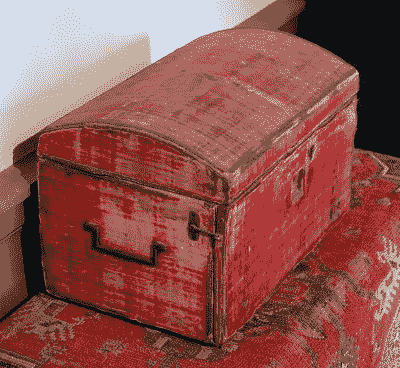
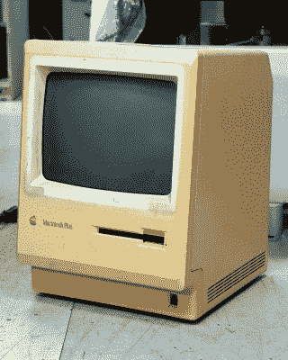

# 新漆还是古色古香，这是古董问题

> 原文：<https://hackaday.com/2021/07/30/fresh-paint-or-patina-of-ages-thats-the-antique-question/>

古董家具的世界和黑客的世界很少重合，也许对我们大多数人来说，最新技术的诱惑力超过 Chipendale 橱柜。但是有时候两个世界都有相似的情况，所以花点时间考虑一些事情是值得的。

This late-17th-century dressing box would not be of such value or interest were a restoration to strip it of its patina. [Daderot, CC0](https://commons.wikimedia.org/wiki/File:Dressing_box,_England,_1690-1710,_oak,_iron,_wool_velvet,_with_carpet,_Turkey,_1690-1700,_wool,_cotton_-_Concord_Museum_-_Concord,_MA_-_DSC05687.JPG).

古董家具在被今天的收藏家拥有之前已经存活了数百年。一路上，它会遇到颠簸、擦伤、磨损，甚至偶尔需要修理。有价值的作品不断出现，在布满灰尘的阁楼、牛棚、地下室和各种可能被滥用的地方被发现，这些地方可能会让后来花大价钱购买它们的人感到震惊。因此，在家具修复领域有一个完整的工艺工人行业，他们的专业在于将一件家具的残骸变成陈列室的珍贵古董。

如果你还没猜到的话，我们社区中的相似物可以在逆向计算机的世界中找到。它们是我们珍视的古董，它们在被孩子们虐待后来到我们身边，然后被丢在某个地方的一个垃圾盒子里受折磨。他们的电容器正在泄漏，他们的外壳可能破裂或变脏，他们通常拥有旧 ABS 模塑件的标志性外观，即他们特有的发黄。这是由于塑料中含有的阻燃剂在紫外光下降解时，会逐渐释放出少量的溴，这在一些逆向计算爱好者中引起了相当大的恐慌。为了减轻这种情况，人们付出了相当大的努力，其中最受欢迎的技术包括所谓的 Retr0bright 配方，该配方使用过氧化氢来漂白颜色。

## 在追寻重现童年的过程中，我们会失去什么吗？

Is this any less a Macintosh because it shows its age? htomari, [CC BY-SA 2.0](https://commons.wikimedia.org/wiki/File:Apple_Macintosh_Plus_(24678854850).jpg).

在古董家具领域，各个层次都有经营者，从推销上月在中国制造的仿制家具的骗子，到高端真品的专业经销商。古董修复有与之匹配的地层，在质量方面，他们确实达到了最高的标准。

考虑一下，如果一件价值连城的古董需要修复，目的是什么？当然有可能把它恢复到几百年前离开橱柜制造者车间时的状态，但这是他们的目的吗？相反，他们把它恢复到一个非常好的状态，但留下了一层岁月的铜绿。架子中部微微向下弯曲，抛光处有轻微的痕迹，脚上有一些多年来留下的磨损痕迹。过度修复让它看起来太新是不对的，因为这样它就不再像它本来的样子了。

这些年来，我花了很多时间在复古计算机和复古计算爱好者身边，与古董家具做比较很有趣。为什么我们不允许我们的古董骄傲地戴上几十年来获得的铜锈，为什么我们宁愿假装这是 1988 年，他们刚刚从盒子里出来？这是因为我们真的在重现我们自己的童年(或者那些我们希望拥有的童年)，而不是将这些设备本身作为遗物来欣赏吗？

随着越来越多的经典案例和主板的现代复制品的生产，在我看来，我们正在模糊原件和复制品之间的界限，就像仿制家具制造商对真正的古董所做的那样。我们会及时设法通过年代的铜绿将我们的经典机器与伪装者区分开来吗？也许这将留给下一代逆向计算收集者来完成。

表头:标记 Fosh， [CC 乘 2.0](https://commons.wikimedia.org/wiki/File:Antique_shop.jpg) 。