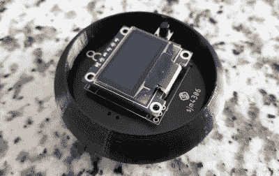

# 魔术 8 球得到现代改造

> 原文：<https://hackaday.com/2020/12/23/magic-8-ball-gets-a-modern-makeover/>

早在 2012 年，当[sjm4306]在 Hackaday 上弹出经典的“神奇 8 球”时，他很惊讶。如果他知道这个项目将被铭刻在这些神圣的页面上，他可能会稍微整理一下。现在，凭借近十年的额外电子经验，他回来了，并准备展示项目的新的改进版本。

The 3D printed case helps sell the look.

从概念上讲，与最初的版本相比没有太大的变化。按下一个按钮，得到一个随机响应。但总的来说，该项目更加完善，这不仅仅是因为它转移到了一个定制的 PCB 上。

最初的版本使用带有充电控制器和实验 RTC 的 PIC16F886，但这一次[sjm4306]已经将所有功能整合到 ATmega328P 中，并通过一个简单的 CR2032 硬币电池为整个系统供电。正如你在休息后的视频中看到的，组装是尽可能快速和直接的。

和原型机一样，机上没有加速度计。如果你想看到来自神秘伙伴的新信息，你必须按住按钮“摇动”球。一个计时器计算按钮被按下的时间，这反过来又为选择响应的伪随机数发生器提供种子。由于每个人按下按钮的时间自然会略有不同，这样可以避免重复。

我们不常看到[创作者重温他们昔日的项目](https://hackaday.com/2012/05/11/digital-magic-8-ball/)，但我们当然愿意。把这看作是对任何想要炫耀他们如何改进技术的黑客的公开邀请；Hackaday 永远欢迎重来。

 [https://www.youtube.com/embed/jaAn08bs_lQ?version=3&rel=1&showsearch=0&showinfo=1&iv_load_policy=1&fs=1&hl=en-US&autohide=2&wmode=transparent](https://www.youtube.com/embed/jaAn08bs_lQ?version=3&rel=1&showsearch=0&showinfo=1&iv_load_policy=1&fs=1&hl=en-US&autohide=2&wmode=transparent)

