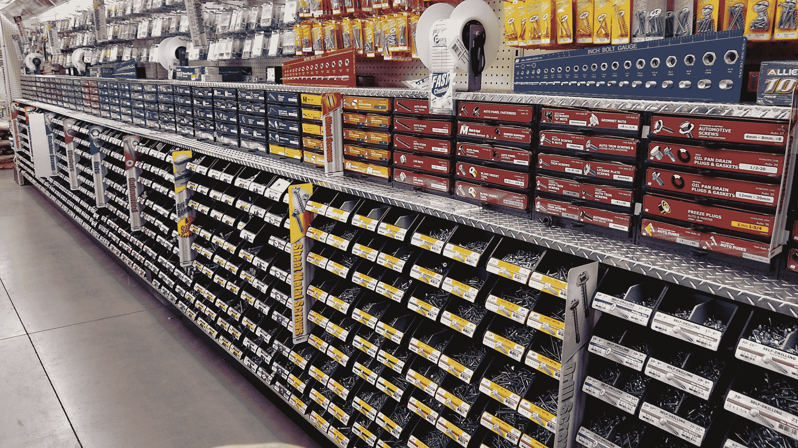

# 问 Hackaday:你的紧固件箱里有什么？

> 原文：<https://hackaday.com/2021/01/11/ask-hackaday-whats-in-your-fastener-bin/>

一个星期六的下午。工作周结束了，家务也结束了，离圣诞节还有一周时间，我们有足够的回旋余地来否认还有大量的工作要做。这似乎是逃进商店，完成一个快速项目的最佳时机，这个项目至少从三月份就被搁置了。我不擅长拖延。

这是一个简单的项目——在一个塑料外壳上加一块铝板，作为我小屋的天线入口。简单得很——切出一个长方形的铝，切割并钻几个孔，然后就到此为止。几乎我所有的项目都是这样开始的，几乎每次我都忘记了几乎所有的构建都在同一点上出了问题:当我意识到我没有所需的紧固件时。这就是这个构建所发生的事情，它一直进行得很顺利——没有大的失误，没有流血。所以我去了五金店，寻找合适的紧固件来完成这项工作。

寻找硬件一直是我效率下降的原因。尽管我住的地方离至少六家商店只有一箭之遥，每家商店都有大量的硬件可供选择，而且大多数周末和晚上都开门营业，但从构建模式转变为采购模式所导致的动力损失在历史上对我的项目来说是致命的。我敢肯定，我不是唯一遇到这个问题的人，所以问题是:黑客可以做些什么来避免不得不寻找正确的紧固件？

## 问题是

逛逛几乎任何一家五金店，都很容易找到这个问题的根源。在商店的某个地方将会有一个过道，里面排列着箱子和抽屉，里面放着各种各样可以想象得到的紧固件。从用于固定木质结构的方头螺钉和马车螺栓，到可以在家里用 3D 打印机打印出来的小包 M3 螺钉，应有尽有。除此之外，还有不同的螺距和样式、直径和长度范围、各种材料和表面处理、各种驱动类型，以及不同螺母、垫圈、锁紧垫圈和其他装饰的混淆效果，你几乎有无限多种组合。

I’ll take one of each, please.

另一个问题是，用紧固件替代真的没有那么多余地。每种紧固件都有一个非常具体的工程目的，在某些情况下，对现有的东西进行更改可能会有风险。我已经通过艰难的方式了解到这一点，这一事实本身就是为什么我在最近的一个项目上浪费了大量时间来给一辆货车安装太阳能电池板。这辆货车将携带六块太阳能电池板，安装在可折叠的支架上，便于旅行；使用错误的紧固件可能会导致风暴撕裂面板，或者更糟的是，导致拖车在高速公路上被拖行时有东西脱落。为了避免这样的命运，多去几次商店把紧固件弄对是非常值得的。

还有一个因素对某些人的影响可能比其他人更大，那就是审美。有时候你手上的扣件看起来不太好。我记得在劳氏寻找螺帽螺丝，我的妻子帮忙寻找。当她宣布找到它们时，我只能说，“我需要内六角螺钉，但那些是圆头的。你疯了吗？”有时候它只是看起来像某种方式。

## 解决方案

所有这些都是说，紧固件选择的范围远远超过了一般黑客手头合理拥有的手段，尽管这并没有阻止我尝试这种蛮力方法来解决问题。几年前，我有机会从一家即将倒闭的五金店直接购买整个紧固件展示。整个东西——箱子、抽屉，甚至装零件的一卷塑料袋，还有那些永远无法在袋子上写下库存编号的小东西上的圆珠笔——都可能是我的，但要付出代价。这是一个诱人的提议，但由于我既没有钱也没有地方存放这样的东西，我拒绝了。

如果我真的把它捡起来，会解决问题吗？可能会有一段时间，但我怀疑我会有很多我不需要的东西，而没有足够的好东西。更糟糕的是，我的需求发生了重大变化。那时候我经常和木头打交道，只是偶尔做一些金属加工项目。这两种媒体对紧固件的需求没有太多的交叉，因此从大量木工工作中转移可能会滞留大量的紧固件。

我想我最接近看到解决这个问题的方法是在我工作了 23 年的地方的模型店。这是一个支持科学研究的完整的机器车间，从头开始建造它的家伙真的很讨厌没有硬件而被抓住。他有两个 Lista 橱柜，每个橱柜都有十几个抽屉，每个抽屉都有一堆小塑料箱，里面装着螺丝、螺母和螺栓。在公制橱柜中，紧固件的范围从 M1 到 M12，长度可能高达 50 毫米。他限制材料为不锈钢和黑色氧化物，头型为套筒头或圆头。另一个机柜包含等效的英寸紧固件，每个机柜包含螺母和垫圈。这是有限的，但也是全面的，让他完成了大约 80%的日常工作，而不必跑出去或下订单。

## 轮到你了

虽然我们大多数人都负担不起这样的解决方案，但我认为像我的机械师朋友一样追求帕累托分布可能是解决这个问题的一个好目标。如果我手头上有完成 80%的项目所需的紧固件，而不需要补给，我会很激动。

接下来的问题是，什么样的紧固件组合能最好地实现这一点？一旦我决定了一个组合，找到它们的最好方法是什么？像 McMaster-Carr、Fastenal 和 Grainger 这样的 MRO(维护、维修和运营)供应商随处可见，但其价格更多面向企业客户而非个人。然而，在这个解决方案中，他们还有一席之地吗？如何储存和组织像这样的紧固件收藏，并确保它在零件使用时保持库存？我们希望听到任何处理过这个问题的人的意见，无论是在工业环境中还是在家庭商店中。请在下面的评论中告诉我们你的想法。