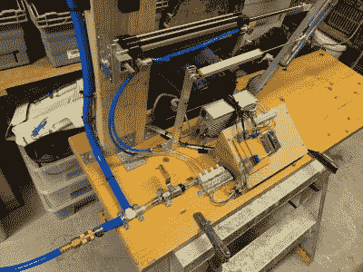

# 由大 MIDI 文件引导的 76 位长号

> 原文：<https://hackaday.com/2020/12/27/76-bit-trombones-led-by-the-big-midi-file/>

受到因《温特加坦》而出名的马丁·莫林的创作天才的启发，[iSax]着手[创造一个机器人 MIDI 控制的长号](https://hackaday.io/project/176463-robotic-trombone-the-robotrombo-music-machine)。人类需要数年时间来发展演奏长号所需的控制和技术，因为吹口发出的音调是空气压力、嘴唇张力、气流、口腔共鸣和其他复杂压力来源的微妙组合。

【iSax】给[一个机器](https://www.youtube.com/watch?v=AsayKIv1rsQ&feature=emb_title&ab_channel=iSaxLaboratories)的彻底演练，它由两个独立的气源提供动力，一个用于幻灯片的位置，另一个用于产生声音。一个电位计提供滑块位置的反馈，一个伺服系统控制进入硅共振腔的流速。可以通过施加压力的步进电机来调节该室，稍微改变该室的频率和压力。带有 Firmata 的 Arduino 允许从任何主机轻松控制该设备。Hackday.io 项目页面上有一篇 PDF 格式的详细文章。

正如你所想象的，模拟人的嘴是一项艰巨的任务，变量的数量意味着[iSax]最终只能得到模糊的长号一样的东西。虽然最终它没有成为[iSax]所希望的令人震惊的音乐机器，但它确实是一个有趣的工程壮举，我们可以欣赏和钦佩。自动化铜管乐器的进展似乎很缓慢，因为我们在这个机器人小号上看到了类似的结果。也许有一天我们会有机器人铜管乐器组，但不是今天。

 [https://www.youtube.com/embed/wM1vOAz0_Gc?version=3&rel=1&showsearch=0&showinfo=1&iv_load_policy=1&fs=1&hl=en-US&autohide=2&wmode=transparent](https://www.youtube.com/embed/wM1vOAz0_Gc?version=3&rel=1&showsearch=0&showinfo=1&iv_load_policy=1&fs=1&hl=en-US&autohide=2&wmode=transparent)

感谢[iSax]发送这封邮件！