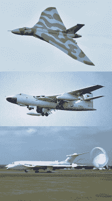
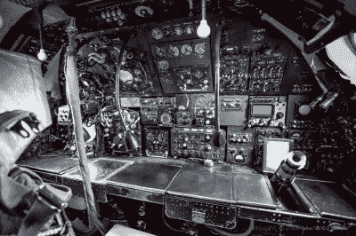
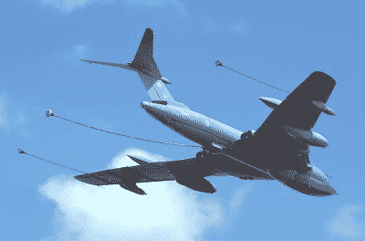

# V 型轰炸机弹射座椅争议

> 原文：<https://hackaday.com/2021/01/11/the-v-bomber-ejector-seat-controversy/>

很久以前，从飞机上跳伞包括打开屋顶或门，带着降落伞跳出去，希望你能保持足够的高度，以便在着陆前减速。随着飞行速度的提高和飞机设计的改变，这种逃脱变得几乎不可能。

弹射座椅是这个问题的解决方案，第一批型号在 20 世纪 40 年代末投入使用。大约在这个时候，英国开始发展新的轰炸机群，旨在在未来几十年内提供核威慑威胁。维克斯·瓦兰特号、汉德利·佩奇·维克托号和阿弗罗·瓦肯号都被选中组成该部队，分别于 1955 年至 1957 年服役。每架轰炸机都为坐在飞机前部的飞行员和副驾驶配备了弹射座椅。其余三名坐在机身后部的机组人员在飞机的后部配备了一个逃生出口，在紧急情况下可以通过这个出口跳伞。

## 重大的决定

The Avro Vulcan, Victor Valiant, and Handley Page Victor made up Britain’s V-bomber fleet, serving as the country’s strategic nuclear strike force.

这个决定在 V 型轰炸机的设计阶段并没有引起争议，因为在建造原型机之前，最初的可喷射乘员舱计划就被放弃了。然而，这个问题在“火神”号服役后几乎立即成为焦点。1956 年 10 月 1 日，Avro Vulcan B.1 XA897 从澳大利亚和新西兰旅行归来，准备降落在希思罗机场。当天，暴雨意味着能见度很低，飞行员唐纳德·霍华德决定尝试地面控制方法进入跑道。

在被告知飞机进入的高度高于要求的下滑道后，霍华德修正过度，火神撞上了地面，扯断了起落架。当飞机还在空中时，霍华德发现控制装置没有反应，他下令弃机，并成功弹射出去。副驾驶空警哈里·布罗德赫斯特(Harry Broadhurst)也尝试了控制，几秒钟后也跟了上去。由于事故发生的高度较低，且涉及到各种力量，其余的机组人员与飞机一起坠落，并在撞击中死亡。

对该事件的官方调查将部分责任归咎于飞行员没有提前中止着陆，以及地面控制员没有及时通知机组人员他们降得太低。值得注意的是，在向下议院提交报告时，空军大臣奈杰尔·伯奇(Nigel Birch)发表了一份关于选择飞行员和副驾驶弹射出飞机的声明。

> 如果我不清楚地说明，得出结论说他们有责任弹射出去，那对飞行员和副驾驶都是不公平的。我确信，在最初的撞击之后，不可能有控制飞机的希望。在这种情况下，机长有责任发出弃机命令，而机上所有人员如果能够做到的话，也有责任服从命令。飞行员和副驾驶在下达命令时都意识到，由于高度低，其他乘客没有逃生的机会，他们认为自己的机会微乎其微。

## 进一步的悲剧

这个问题很快成为《每日快报》的一个热点，该报开始公开质疑为什么五分之三的船员没有获得同等的逃生途径。随着更多事故的发生，这一问题非但没有消失，反而继续成为焦点。1956 年，一架维克斯勇敢号飞机因电气故障失去控制，飞行员试图保持飞机在空中足够长的时间，以便机组人员逃生。副驾驶安全弹出，而导航员成功逃生，但由于飞机太低，降落伞无法打开而死亡。当飞机撞击后爆炸时，飞行员没有弹射出来，和其他机组人员一起离开了人世。1958 年见证了另一架火神坠毁，所有人都丧生，1959 年见证了一架胜利号坠毁，所有人丧生。

The rear flight deck of an Avro Vulcan bomber. Escape from the plane in emergency conditions was found to be almost impossible for the crew members in the back of the aircraft.

英国是马丁·贝克有限公司的所在地，该公司由詹姆斯·马丁和瓦伦丁·贝克上尉创建，最初制造飞机。贝克在一次测试事故中丧生后，马丁将公司的精力转移到飞机安全设备上。在长期游说 V 型轰炸机队的制造商为所有机组成员提供弹射座椅后，马丁花了四年时间才获得了一个测试样本。在说服英国皇家空军从飞机后部弹射是可行的之后，1960 年 7 月 1 日安排了一次现场试验。在 1000 英尺的高度，平民测试员 W T Hay 在聚集的皇家空军官员面前安全地从维克斯勇士 WP199 弹射出来。不幸的是，尽管取得了成功，空军部拒绝对 V 型轰炸机机队进行改造，理由是成本问题和需要保持足够数量的飞机执行前线任务。

然而，这些问题并没有消失。20 世纪 60 年代早期，发展了能够打击高空 V 型轰炸机的地对空导弹，如果机组人员要躲避攻击，实际上就需要切换到低空轰炸。这增加了事故或紧急情况发生的可能性，因为高度太低，后面的机组人员无法安全跳伞。事故也不断发生，1962 年一架维克托坠毁，夺去了另外两名军人的生命，1964 年一架瓦肯坠毁，导致三名后方机组人员全部死亡。虽然勇敢号因结构疲劳问题于 1965 年退出，但火神号和维克托号继续服役。

## 概念与现实的斗争

马丁-贝克公司的进一步设计工作产生了一个系统，允许所有三名后座乘员通过一个仅够一个座位大小的孔弹射出去。这是通过一个聪明的机制实现的，首先发射中心座位，然后向内倾斜外部座位，通过同一个孔发射。然而，它最终化为乌有，只对后舱进行了一次小小的升级。安装了可以原地旋转的座椅，使船员面向逃生舱，并配有一个充气垫，可以将船员提升到站立位置以便离开。该解决方案是在皇家飞机研究所的测试后实施的，该测试确定即使在飞行中可能经历的轻微 G 载荷下，从后舱逃生实际上也是不可能的。

The last serving examples of the V-bomber fleet were a series of Victors converted for tanker duty, which flew regular missions during the Gulf War.

最终，尽管做了大量艰苦的工作并展示了解决方案，历届政府拒绝为所有机组人员升级弹射座椅。在不同的时间引用成本，复杂性，或物流问题，硬件的批发改造被留在太硬的篮子里。V-轰炸机在 1970 年计划报废后很久才结束服役，1982 年 Vulcan 从其常规攻击任务中退役，而 Victor 在 1993 年离开航线前结束了在海湾战争中作为加油机的服役。

人们可以想象，驾驶这些飞机的许多机组人员可能会赞赏最初的设计者多一点深谋远虑，或者甚至在工程问题已经由私营企业解决的情况下投资改造。从根本上说，如果根本没有弹射座椅，争议就不会这么严重；决定只提供给前机组人员是造成这种恐慌的原因。因此，许多飞行员和副驾驶面临着痛苦的抉择，是弹射出去，还是战斗到底以拯救战友。不管这些年来这些决定背后的原因是什么，对于那些不幸没有从飞行路线上回来的人来说，这仍然是一个冰冷的安慰。