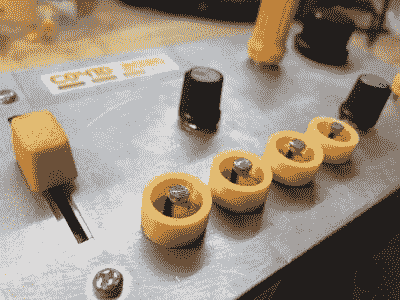

# Co41D 2020 MIDI 特雷门琴听起来很恶心

> 原文：<https://hackaday.com/2020/12/28/co41d-2020-midi-theremin-sounds-pretty-sick/>

随着疫情的肆虐，人们也越来越想把空闲的时间花在修补上。[knaylor1]花了第二次英国禁闭时间制作了一个可爱的受特雷门琴启发的噪音机器，零件数量少，看起来非常有趣。

 它是这样工作的:要么在光电管上照射一些光，把它们盖住，要么在两者之间找到一些中间点。不管你做什么，你都会得到很酷的声音。

光电管的行为类似于设置在分压器中的电位计。Arduino UNO 从光电池读取数据，进行一些 MIDI 数学运算，并将串行数据发送到一个名为无毛 MIDI 的程序，该程序又将数据发送到 Ableton live。

[knaylor1]在此基础上使用了一个名为 TAL Noisemaker 的插件来产生美妙的酸屋音调，你可以在休息后的视频中听到。

如果你以前从未玩过光敏电阻，那就帮你自己一个忙，花一点圣诞现金买一包这种东西。你甚至不需要一个 Arduino 来制造噪音，你可以在一个 [Atari Punk 控制台](https://hackaday.com/2015/09/17/the-ubiquitous-atari-punk-console/)中使用它们作为锅，或者用一个像 [CD40106](https://hackaday.com/2018/10/24/av-synth-is-psychedelic-analog-mayhem/) 这样的十六进制反相振荡器芯片来制造微弱的方波。[我们自己的【埃利奥特·威廉姆斯】曾经花了整整一个专栏来制作 chiptunes](https://hackaday.com/tag/logic-noise/) 。

 [https://www.youtube.com/embed/i1ROuBg0cZg?version=3&rel=1&showsearch=0&showinfo=1&iv_load_policy=1&fs=1&hl=en-US&autohide=2&wmode=transparent](https://www.youtube.com/embed/i1ROuBg0cZg?version=3&rel=1&showsearch=0&showinfo=1&iv_load_policy=1&fs=1&hl=en-US&autohide=2&wmode=transparent)

