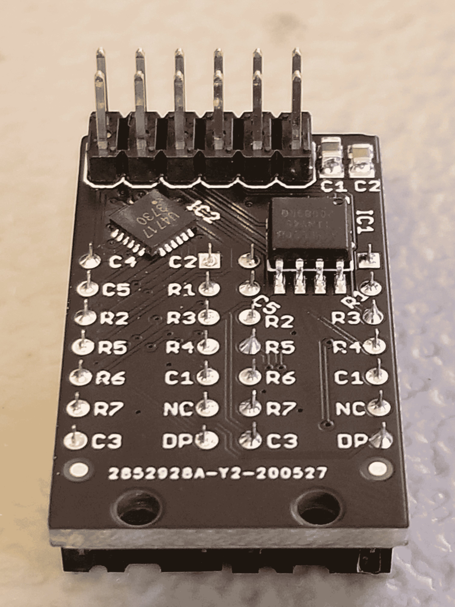

# 微型 LED 矩阵更适合朋友使用

> 原文：<https://hackaday.com/2020/12/23/a-tiny-led-matrix-is-better-with-friends/>

当我们最后一次听到[ lixielabs ]的消息时，他正在用蚀刻过的丙烯酸树脂和发光二极管制作数码管替代品。他向前迈进了几十年，为我们带来了[小精灵](https://hackaday.io/project/174137-pixie-chainable-dual-57-micro-led-displays)，一个可链接的、可寻址的背包，用于微型 LED 矩阵显示器。

每个 Pixie 模块都设计为承载两个华丽的小型[Lite-On LTP-305g/HR](https://octopart.com/ltp-305g-lite-on-549160?r=sp)5×7 LED 点阵显示器，我们怀疑这是许多购物车中的冲动购买。除了显示器之外，还有一个小型矩阵控制器和一个 ATTINY45，用于显示友好的电气接口。每个模块设计为边对边安装，菊花链连接到 12 个或更多模块(每个模块有两个显示器),实现您需要的任何尺寸的灵活显示。但是为了寻址整个阵列，只需要两个控制引脚(数据和时钟)。

[lixielabs]做了大量的工作，尽可能方便地使用这些图钉。他小心翼翼地指出了一个好的 SDK 的重要性，并为常见的微控制器提供了方便的 Arduino 库，为 Raspberry Pi 提供了参考实现，应该很容易移植以支持新的平台。与该库支持一起提供的是以[数据表](https://connornishijima.github.io/Pixie/extras/datasheet.html)(配有[尺寸](https://connornishijima.github.io/Pixie/extras/datasheet.html?page=8)和[原理图](https://connornishijima.github.io/Pixie/extras/datasheet.html?page=7))形式的一流文档！)和库存充足的 [GitHub repo](https://github.com/connornishijima/Pixie) 示例等。

为了感受他们的图形能力，休息后看看 6 Pixie 充当 VU 计的视频。当黑客在为每个项目重新发明 LED 点阵控制时感到沮丧，并决定一劳永逸地解决它时，你会看到小精灵。设计是干净的，有据可查的，非常实用。我们很期待接下来会发生什么！

> ESP32 与 I2S 麦克风运行 FFT 与 1024 个细胞，每个倍频程重叠，使 12 音符色谱图，正在由 Pixies 现场渲染！[https://t.co/0nWQfX0W6W](https://t.co/0nWQfX0W6W)pic.twitter.com/UZgh5ymWAwT2
> 
> —谢利实验室(@ lixielabs)[2020 年 9 月 22 日](https://twitter.com/lixielabs/status/1308543494970015744?ref_src=twsrc%5Etfw)