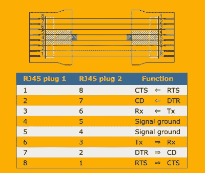
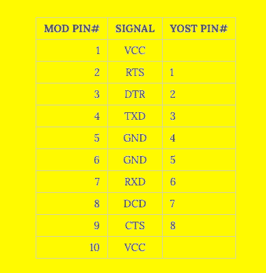
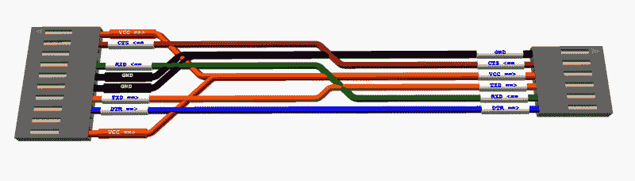

# 改良约斯特塔梅什引脚过剩

> 原文：<https://hackaday.com/2020/12/25/modified-yost-tames-pinout-plethora/>

每个黑客都有各种各样的 USB 到 TTL 串行适配器在他们的实验室里，我们都很恼火，因为每个适配器都有不同的引脚。您为 Sparkfun 风格(GND、CTS、VCC、TXD、RXD、DTR)设计了 PCB 或试验板，但当您开始故障排除时，您只能找到 CH340 板(GND、+5V、TXD、RXD、DTR、+3.3V)。你得把所有东西都跳线起来，这就变得一团糟了。在 RS-232 电平信号时代，它也没有好到哪里去。虽然引脚排列是一致的，但还有其他令人头疼的问题。连接需要一个空调制解调器适配器吗？如果你运气不好，你可能需要一个 DB-25 转 DE-9 的适配器，而真正不幸的人可能需要一个或多个性别转换器。肯定有更好的方法。

事实证明，有一种更好的方法，尽管它似乎没有像人们预期的那样流行。早在 1987 年[戴夫·约斯特]在柏克莱大学时就正式制定了一个使用 RJ45 插头和插孔的互联方案。信号以镜像方式排列，因此每根电缆都是交叉电缆——如果您确实需要直通连接，只需将两根电缆背靠背插入即可。

尽管他处理的是 RS-232 串行，但这并不妨碍我们将这种方案用于逻辑电平信号。例如，考虑以下 1×10 接头引脚排列，其中最初的 8 引脚扩展到 10 引脚，以提供电源:

Yost Original Pinout

Example of Modified Yost Pinout

这是一个极端的例子，显然可以根据握手的次数(如果有的话)或所需的功率来缩小。这种引出线让你只需翻转连接器就可以在 DCE 和 DTE 之间切换。如果杜邦式接头在应用中太容易脱落，你可以使用 RJ 连接器。这仍然没有解决 USB-TTL 适配器的巴别塔引脚排列问题。但是，在你的项目中标准化这样的串行引脚排列，制作电缆或组装 TTL 适配器会使串行调试不那么痛苦。

Yost to Sparkfun Adaptor Cable

当他在 1987 年发布这个计划时，[戴夫]武断地说:

“也许在 2000 年之前的某一天，这个世界将会有一种新的、简单的、高速的、流量控制的、标准类型的连接，用于目前使用 RS-232 的点对点应用，并有一个适配器可用于与旧的 RS-232 设备对话。”

请在下面的评论中告诉我们你的想法。