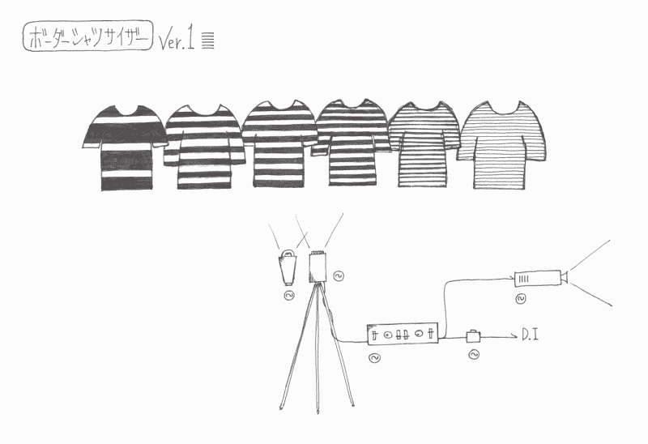
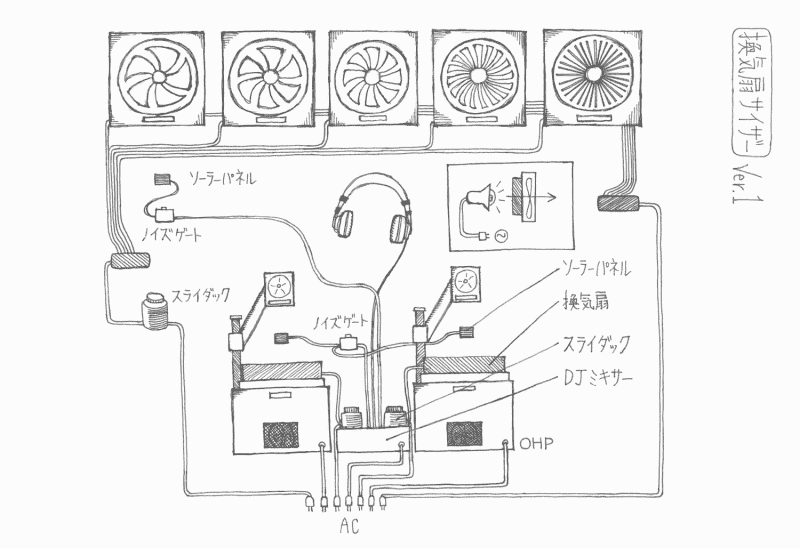

# 当电器黑客袭击音乐现场时

> 原文：<https://hackaday.com/2021/01/23/when-appliance-hackers-hit-the-music-scene/>

艺术-音乐-技术集体[“电子幻想曲！”(俗称 Nicos)](https://www.electronicosfantasticos.com/) 是日本艺术家/音乐家【Ei Wada】的脑中产物。他们将旧的、退役的和过时的电器作为新的“电磁乐器”重新使用，这不仅创造了演奏音乐的新方法，还将听众作为音乐家，逐渐形成了一个互动的管弦乐队。他们通过创造性地使用电视和风扇等电器的原始功能，以有趣的方式破解它们来产生声音。该项目始于 2015 年初，导致了一个合作团队——Nicos or chest-Lab——在那年年底左右成立。此后，他们出现在音乐会上，包括 2019 年全球最大的媒体艺术节“电子艺术节”(Ars Electronica)上的表演。

对于我们这些黑客来说，有趣的部分可以在他们的作品的[库中找到，描述了这些乐器粗略但诱人的细节。这里有一些更有趣的，但一定要去他们的网站上看看更多令人惊叹的乐器和许多有趣的视频。](https://www.electronicosfantasticos.com/works/)

[**CRT-TV Gamelan**](https://www.electronicosfantasticos.com/works/crt-tv-gamlan/)——一种由旧 CRT 显示器制成的打击乐器。投影在屏幕上的彩色条纹会引起静电的变化，这种变化被玩家的手吸收，然后传播到连接在他们脚上的电子线圈。这个信号然后被连接到吉他放大器。

[**电风扇竖琴**](https://www.electronicosfantasticos.com/works/electric-fan-harp/)——他们取出扇叶，换上一个含有打孔的“编码盘”。然后他们从旋转的圆盘下照射一个灯泡，中断的光被玩家手持的光学接收器接收。控制风扇速度和接收器拾音器的位置，他们可以哄风扇产生音乐——基于这样的想法“如果电吉他之神吉米·亨德里克斯把电风扇当乐器演奏会怎么样？”

**——这个很简单，但能产生惊人的效果，尤其是当你和另一个条码音乐家搭档的时候。条形码阅读器的输出几乎可以直接转换成声音——只需在打印好的条形码纸上挥动魔杖。当它指向条纹衬衫时，效果惊人的好。看看这个小发明非常有趣的视频。这导致了 [**Barcodress**](https://www.electronicosfantasticos.com/works/barcodress/) 的诞生——一种创造互动音乐和舞蹈表演的编码服装。**

**

The Striped Shirtsizer

**——这是一个伟大的黑客和一个扭曲的合成器。摄像机拾取视频信号，然后直接输入放大器的“音频”输入端。在项目页面的视频中，[Ei Wada]解释了当他错误地将“黄色”视频输出连接器插入他的吉他放大器的音频输入时，他是如何意外地发现这种效果的。在一个户外场所，一群穿着条纹衬衫的人变成了一场互动的音乐家-观众表演。**

**

The Kankisenthizer

**[Kankisenthizer 又名排气风扇](https://www.electronicosfantasticos.com/works/Kankisenthizer/)**——这个由一系列工业排气风扇组成——尽管也可以使用更小的仪器冷却风扇。一边是强光灯，另一边是小型太阳能电池。太阳能电池接收到的光波动被传送到吉他放大器。该阵列由具有不同数量叶片的风扇组成。这一点，加上改变风扇速度，结果在一些惊人的声音效果。

还有很多，尽管复制这些仪器的“说明”没有被很好地记录下来，但对任何有兴趣的人来说，已经足够开始实验了。

 [https://www.youtube.com/embed/A0VYsiMtrNE?version=3&rel=1&showsearch=0&showinfo=1&iv_load_policy=1&fs=1&hl=en-US&autohide=2&wmode=transparent](https://www.youtube.com/embed/A0VYsiMtrNE?version=3&rel=1&showsearch=0&showinfo=1&iv_load_policy=1&fs=1&hl=en-US&autohide=2&wmode=transparent)

感谢您的精彩提示，[danielbpm]。****