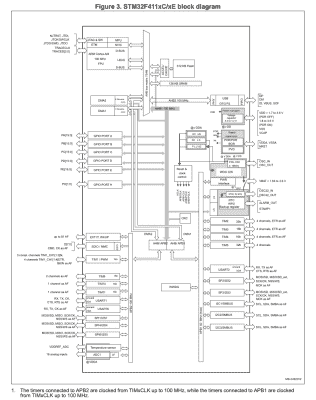
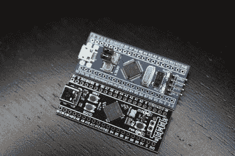
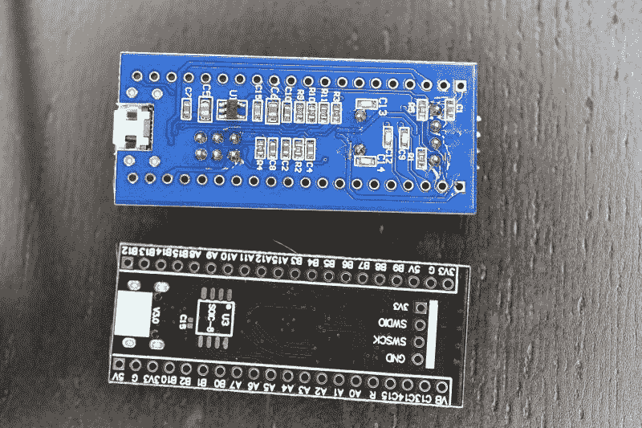

# 蓝色药丸与黑色药丸:从 STM32F103 过渡到 STM32F411

> 原文：<https://hackaday.com/2021/01/20/blue-pill-vs-black-pill-transitioning-from-stm32f103-to-stm32f411/>

多年来，所谓的“蓝色药丸”STM32 MCU 开发板一直是业余爱好者社区的主要产品。发现它的起源是一个明显的[枫木迷你](https://stm32duinoforum.com/forum/wiki_subdomain/index_title_Maple_Mini.html)克隆，由于它的两排 0.1”引脚插座，这个小电路板很容易在试验板项目中使用。最棒的是，它只需要几美元，即使你只能通过全球速卖通和易趣上的卖家购买。

从去年开始，带有黑色阻焊膜和 STM32F4 Access(入门级)系列 MCU(包括 F401 和 F411 [)的电路板开始出现](https://www.cnx-software.com/2019/12/24/stm32-black-pill-board-features-stm32f4-cortex-m4-mcu-optional-spi-flash/)。这些昵称为“黑色药丸”或“黑色药丸 2”的板子。F103 板也有一段时间存在黑色阻焊，所以很混乱。F4xx 黑色药丸与基于 F103 的蓝色药丸的来源相同，价格相似，但具有更新、更强大的 MCU。这就提出了一个问题，在这一点上转换到这些新的主板是否有意义。

我们的答案是肯定的，但并不完全清楚。较新的硬件更适合大多数用途，真正缺乏的只有 F103 的双 ADC。但是硬件不是唯一的考虑因素；根据个人偏好的框架，支持可能缺乏或不完整。所以让我们来看看需要什么来切换。

## 硬件

F4 MCU 的规格明显优于 F103，具有更高的时钟速度、更多的闪存和更多的 SRAM。我们总共有三个 MCU 来比较新旧主板:

*   F103: 72 MHz，64/128 kB 闪存，20 kB SRAM。( [STM32F103C8T6](https://www.st.com/en/microcontrollers-microprocessors/stm32f103c8.html) )
*   F401: 84 MHz，256 kB 闪存，64 kB SRAM。( [STM32F401CCU6](https://www.st.com/en/microcontrollers-microprocessors/stm32f401cc.html) )
*   F411: 100 MHz，512 kB 闪存，128 kB SRAM。( [STM32F411CEU6](https://www.st.com/en/microcontrollers-microprocessors/stm32f411ce.html) )

F103 中的 [Cortex-M 内核](https://en.wikipedia.org/wiki/ARM_Cortex-M)是 M3，而 F4xx 有一个 M4 内核。对于 MCU 的 CPU 侧，这实际上意味着除了更高的时钟速度，我们还获得了 ARMv7E-M ISA，而不是 M3 的 ARMv7-M。这增加了完整的[饱和算术](https://en.wikipedia.org/wiki/Saturation_arithmetic)指令、DSP 指令和可选的单精度浮点指令。F401 和 F411 都有一个单点浮点单元，因此比 F103 更适合浮点运算。

当我们查看来自 ST: *的应用笔记 4904 ( [AN4904](https://www.st.com/resource/en/application_note/dm00325582-migration-of-microcontroller-applications-from-stm32f1-series-to-stm32f4-access-lines-stmicroelectronics.pdf) )关于微控制器应用从 STM32F1 系列向 STM32F4 访问线路的迁移*时，可以发现更详细的差异。本文总结了两个 MCU 系列之间在从一个迁移到另一个时值得注意的所有差异，无论是物理引脚布局、外设还是引导加载程序。

这里最大的变化可能是内存布局，以及某些类型的外围设备的数量。请随意与我们一起比较框图。

STM32F103 internal block diagram.

stm32F411 internal block diagram.

F103 和 F4xx 之间的一个显著变化是 GPIO 外设从高级外设总线(APB)移到了 AHB 上。AHB 是高性能总线，用于高带宽、低延迟操作。它通过 AHB 总线矩阵直接连接到 Cortex-M 内核。另一方面，APB 是一种更简单的总线，没有突发操作。从 Cortex-M 内核访问 APB 上的外设要求指令通过 AHB-APB 桥传递到 APB。

这意味着 F4xx MCUs 上的 GPIO 操作更快，尤其是高频操作。此外，F4xx MCUs 上的 I/O 引脚多路复用更改为只允许为单个 GPIO 引脚定义一个备用功能(AF)。这相当于 GPIO 外设中 AF 寄存器的集成。

在 **RTC** 外设中也可以看到巨大的变化，在 STM32F1 系列中，它是一个简单的 32 位计数器，带有可编程预分频器和报警寄存器。在 STM32F4xx 上，RTC 外设实现了一个完整的日历，包括亚秒、秒、分钟、小时、日、月和年。它还具有可由任何日历字段触发的闹铃，以及事件时间戳功能和数字校准电路。

虽然 **DMA** 、 **FLASH** 接口和**中断**也有一些变化，但这些变化相当小，仅在进行裸机编程时才有意义。F4xx 芯片的一个真正问题是，F401 和 F411 有一个 12 位 ADC，而不是两个具有 16 个共享通道的 12 位 ADC。相比之下，F4xx 的 ADC 速度略快(2.4 Msps，而 F103 为 2 Msps)，最低电源电压要求也较低，为 1.7 V 至 1.8 V。

## 药丸

Comparison of Blue and Black pill boards. Clone STM32F103 at top and STM32F411 on the bottom.

这两种电路板之间的差异非常明显，甚至超出了阻焊层的颜色。我在这里比较的板是 STM32F411 版本，顺便提一下，当我在德国亚马逊网站上搜索这些板时，它似乎是最受欢迎的版本。

USB 连接器从 micro USB-B 改为 USB-C，MCU 封装是 48 引脚 [UFQFPN](https://en.wikipedia.org/wiki/Flat_no-leads_package) 而不是 48 引脚 LQFP，我们多了一个用户按钮，HSE 和 LSE 振荡器也小了很多。引导模式引脚消失了，但我们得到了一个引导模式按钮。我们在 PC13 上保留了相同的用户控制 led，但电路板两侧的引脚不是 100%兼容。最后，一个“接地”引脚被一个 5 V 引脚取代。(!)

将电路板翻转过来，F103 电路板具有一堆无源器件和一个 IC，而 F411 电路板除了一个 SPI ROM 封装的脚垫之外很干净，例如，它适合一个[w25q 32 JVs siq](https://www.winbond.com/resource-files/w25q32jv%20spi%20revc%2008302016.pdf)32 Mbit SPI Flash ROM。这可以用来添加配置 ROM 或类似的东西。

Underside of the F103 Blue Pill and F411 Black Pill boards.

除了这些差异，电路板的编程和调试保持不变。如果安装了合适的引导加载程序，可以使用串行编程、真正的 STM32 MCUs、通过四引脚分接头的单线调试(SWD)或 USB 端口。电路板的[原理图也可用，它将电路板称为“MiniF4”。该原理图还显示，无需拔出数字万用表，用户按钮就可以连接到 PA0，无需上拉或下拉电阻。](https://github.com/mcauser/WEACT_F411CEU6/blob/master/docs/STM32F411CEU6_schematics.pdf)

## 软件

STM32F4 系列 MCU 完全受 ST 的 [CMSIS F4 设备文件](https://github.com/STMicroelectronics/cmsis_device_f4)及其硬件抽象层(HAL)框架支持。有些人可能更喜欢使用 ST 的 [STM32CubeMX](https://www.st.com/en/development-tools/stm32cubemx.html) 软件来自动生成硬件配置和设置代码。

[STM32Duino](https://github.com/stm32duino/Arduino_Core_STM32) 还显示了 F401 和 F411 板都将得到[的支持](https://github.com/stm32duino/Arduino_Core_STM32#supported-boards)。那些更倾向于与无毒蛇打交道的人应该松一口气，因为他们知道这些板有多种 MicroPython 定义，如 [F401](https://github.com/YXZhu/micropython/tree/master/ports/stm32/boards/WeAct_F401CC) 和 [F411](https://github.com/YXZhu/micropython/tree/master/ports/stm32/boards/WeAct_F411CE) ，以及 F411 版本的这个 [MicroPython 板定义](https://github.com/mcauser/WEACT_F411CEU6)。这意味着，至少就 Arduino 和 MicroPython 而言，F103 板的现有代码应该在 F401 和 F411 板上以最小的变化运行，记住 GPIO 和 AF 引脚的潜在变化。

在我自己的 [Nodate](https://github.com/MayaPosch/Nodate) STM32 项目中，我也为 F411 板版本添加了一个[板定义](https://github.com/MayaPosch/Nodate/blob/master/arch/stm32/boards/black_pill_f411)。事实是，这些“药丸”板是 STM32 MCUs 的基本分线板，几乎不需要支持。除了板上的 MCU 之外，PC13 上只有一个 LED，PA0 上有一个开关，如果一个人的框架是抽象出这些细节的类型。

## 结论

总有一天，一个人必须继续前进。考虑到 STM32F103 是 ST 的第一代基于 Arm Cortex-M 的 MCU 的一部分，应该已经暗示了 Cortex-M3 的时代可能已经到来。正如我在最近关于 STM32F103 克隆芯片的文章中提到的，F103“蓝色药丸”板的供应最近充斥着假货、克隆品和真正 STM32F103 的厚颜无耻的仿制品。这使得甚至很难得到这样的板。除非有人准备验证和接受这些 F103 克隆 MCU 中的某些(公认相当好)。

与此同时，这些基于 F401/F411 的“黑色药丸”板迄今为止似乎没有任何克隆或假冒问题，单位成本与旧的 F103“蓝色药丸”大致相同，除非你绝对需要第二个 ADC 单元，否则这是一个更好的交易。软件支持也不应该构成障碍，甚至像用户 LED 使用完全相同的 pin 这样的细节。

请务必记住 F4xx 板的引脚排列略有不同(即新的 5 V 引脚)，并对照 F401 或 F411 参考手册仔细检查，以确保针对新板重新编译后，项目中使用的外设仍在相同的引脚上。对于新的项目，使用这些新的主板似乎是显而易见的，这就是为什么我很确定我会囤积它们。

未来几年，你的廉价 STM32 开发板库存会是什么样的？你会转而使用 F4 的 MCU，还是继续使用 F103 主板，仅仅是因为你在一次拍卖中买了 75 块，但还没有用完？你有什么特殊的用例让 F103 更适合你的项目吗？请在评论中告诉我们。