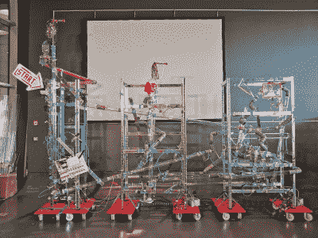

# 你用手机控制的管状童话

> 原文：<https://hackaday.com/2021/01/06/a-tubular-fairy-tale-you-control-with-your-phone/>

乍一看，这似乎是一个由玩具制成的 Rube Goldberg 机器。真相并不遥远——这是一个由观众和他们的手机驱动的遥控电子故事机。[Niklas Roy]和一个志愿者团队在两周内为 [Phaenomenale](https://phaenomenale.com/) 建造了它，这是一个围绕艺术和数字文化的节日，每两年举行一次。

A view of the tubes without the toys.

一个红色的球通过一个透明的丙烯酸管网络，使用 3D 打印的文丘里空气推进器，重力和玩具来帮助它旅行。观众可以通过本地网站用手机改变球的路径，网站上有该装置的大幅图片。该球使用中断光束检测沿其路径触发动画，并根据其交互的玩具每次编织不同的故事。

它是这样工作的:Raspberry Pi 4 负责在轨道开始时释放球，并控制轨道开关。Pi 还拥有一台智能手机服务器和 25 台 Arduino Nanos，它们控制着电子动画的 led 和伺服系统。作为一个额外的电子动画，有一个巨大的白板，可以在显示孩子们的画和团队的计划和示意图之间旋转和切换。休息后进行一次简短但近距离的参观。

这个令人敬畏的艺术项目是一项巨大的合作努力，涉及到德国沃尔夫斯堡的人们——社区中的家庭捐赠了他们用过和废弃的玩具，一群小学生被请来为玩具创作故事，几个高中生和其他合作者用电子动画实现了这些绘画。

玩具也能传授宝贵的经验。以这个对身体积极的吃寿司的芭比娃娃为例，或者是 T2 这个恐怖的玩具屋，旨在将消防安全灌输到孩子们的大脑中。

 [https://www.youtube.com/embed/Q8ShWP1Borc?version=3&rel=1&showsearch=0&showinfo=1&iv_load_policy=1&fs=1&hl=en-US&autohide=2&wmode=transparent](https://www.youtube.com/embed/Q8ShWP1Borc?version=3&rel=1&showsearch=0&showinfo=1&iv_load_policy=1&fs=1&hl=en-US&autohide=2&wmode=transparent)

