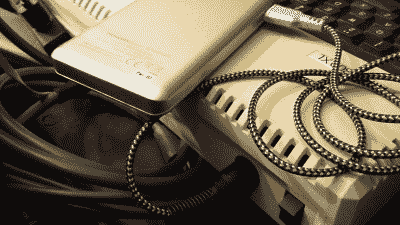

# 受外星人启发的 Cyberdeck 包复古雅达利 800XL

> 原文：<https://hackaday.com/2020/12/30/alien-inspired-cyberdeck-packs-vintage-atari-800xl/>

在鹈鹕风格的盒子里贴一个树莓派，并将其称为 cyberdeck，这几天已经成为一种迷因，虽然我们肯定不会看不起这样的项目，但我们认识到它们可能有点重复。但我们认为这个很独特，足以获得通行证。当然[eizen6]在一个坚固的防水外壳内安装了一个 Pi，但它只是作为展览真正明星的展示品:[一台老式雅达利 800XL 计算机](https://github.com/eizen6/6502portable)。

该建筑的整体外观，从背面的模板 *Nostromo* 到显示器上方的自毁警告贴纸，都是对*外星人*的借鉴。部分原因是这部电影和 Atari 800 都是在 1979 年发行的，还因为[eizen6]说这种特殊的美学就是电脑应该有的样子。视觉风格也意味着该项目拥抱旧的方式，尽管现代技术的点缀。

A custom cable lets the 800XL run on USB power.

为此，复古爱好者将会很高兴听到雅达利似乎完全没有修改,[eizen6]甚至将这台近 40 岁的电脑放在泡沫中，而不是永久地安装在机箱上。用于电源、视频和数据的各种电缆都已经用适当的连接器端接，所以如果 8 位机器需要返回给更多的人使用，一切都可以很容易地拔掉。

在外壳的上半部分，[eizen6]安装了 Raspberry Pi 3B+，一个 7 英寸的触摸屏，一个 USB 集线器和一个 SIO2SD，允许从 SD 卡加载 Atari 磁盘映像。使用 USB 捕获设备，视频从雅达利可以显示在 Pi 的显示器上与一个简单的 VLC 命令。将 USB 键盘插入集线器后，如果需要的话，可以将 Pi 用于更高级的用途。同样值得注意的是，由于一根定制电缆，Atari 正在使用 USB 电源。通过第二个专用于运行 Pi 及其 LCD 显示器的 USB 电源库，这个复古的 cyberdeck 完全可以移动。

我们已经看到很多现代版本试图重现复古电脑的外观和感觉，但是很少有[真正整合了正版。虽然审美可能不是每个人都喜欢的，但我们都可以欣赏这种构建中对原始硬件的尊重。](https://hackaday.com/2006/12/16/ben-hecks-atari-800-laptop/)