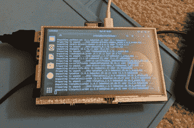

# FPV Gear 的低成本头戴式显示器

> 原文：<https://hackaday.com/2021/01/04/low-cost-head-mounted-display-from-fpv-gear/>

我们在最近的许多 cyberdeck 版本中看到的一个常见抱怨是，它们没有提供任何比平板电脑大小的 IPS 面板更先进的显示技术。有一种观点认为，要成为吉布森意义上的真正甲板，它必须有某种虚拟现实界面，或者至少有一个头盔显示器。不幸的是，这种技术非常昂贵，而且通常对黑客不太友好。

但假设你可以满足于一个有点低技术含量的替代方案，乔丹·布兰德斯一直在摆弄的简单头戴显示器肯定是一个可行的选择。通过在一副为第一人称视角(FPV)飞行设计的护目镜前面安装一个 5 英寸 800×480 TFT LCD，你可以以大约 30 美元的价格组装一个可行的装备。再加上一些耳机，你就能获得相当身临其境的体验，而且花费不多。

 自然显示器会显示你给它的任何 HDMI 信号，但在他的情况下，[乔丹]已经在它的背面安装了一个树莓派，使它成为一个完整的可穿戴计算机。有了蓝牙旅行键盘，他甚至能够用这个设置完成一些合法的工作。如果他最终将这个与今年早些时候他正在研究的[超声波键盘](https://hackaday.io/project/171548-ultrasonic-keyboard)结合起来，他将非常接近真正进入网络空间。

黑客们多年来一直在追逐廉价的头戴式显示器。早在 2007 年，这种价格你能买到的最好的东西是 300×240 的黑白单片眼镜。得到[好东西仍然比我们想要的](https://hackaday.com/2020/11/03/as-facebook-tightens-their-grip-on-vr-jailbreaking-looks-more-likely/)要难，但至少我们正朝着正确的方向前进。

 [https://www.youtube.com/embed/DBRsj1HArSY?version=3&rel=1&showsearch=0&showinfo=1&iv_load_policy=1&fs=1&hl=en-US&autohide=2&wmode=transparent](https://www.youtube.com/embed/DBRsj1HArSY?version=3&rel=1&showsearch=0&showinfo=1&iv_load_policy=1&fs=1&hl=en-US&autohide=2&wmode=transparent)

