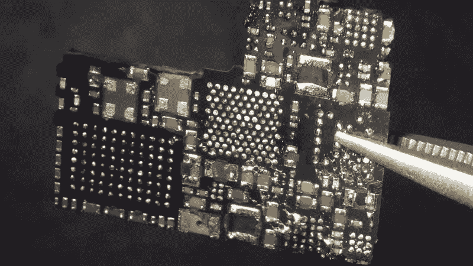

# 亚马逊光环的拆除极其彻底

> 原文：<https://hackaday.com/2020/12/31/amazon-halo-teardown-is-supremely-thorough/>

我们很少看到拆得这么详细。[txyzifo]想知道引擎盖下是什么硬件，[做了一个惊人的亚马逊 Halo 拆解](https://hackaday.io/project/176599-amazon-halo-teardown)。

大约在 2020 年年中的某个时候，亚马逊推出了 Halo，进入了健康和健身追踪器领域。Halo 是一款 100 美元的设备，如果你想要额外的功能，可以添加 4 美元的每月订阅服务，亚马逊称之为“实验室”，其中许多是第三方服务。该设备没有任何显示，也没有任何需要显示的指标(心率、步数、卡路里等。)显示在光环手机应用上。光环的重点更多的是健康，而不是健身。它有助于监控你的活动和睡眠状态，跟踪身体脂肪，并报告你的情绪状态。

我们不会深究这款设备的利弊，只是提到两个可能会让大多数人感到不舒服的功能。该设备有一对麦克风，可以听到你声音的“音调”，并报告你的情绪状态。另一个是它通过配套应用程序使用你的手机，给你拍照，最好是穿着内衣的照片。你的正面、背面和侧面照片被上传到亚马逊服务器，转换成 3D 模型，然后下载回你的手机。亚马逊提到，一旦你的 3D 模型传输回手机，这些照片就不会从他们的服务器上保留和删除。亚马逊的 ML 算法然后计算你的体脂百分比。更令人担忧的是，该应用程序提供了一个滑块，你可以移动它来看看你的身体脂肪百分比是高还是低。

幸运的是，对于我们这些硬件黑客来说，[txyzinfo]想要解开亚马逊倾注在这个设计中的所有秘密。即使你对这个设备不感兴趣，他所使用的技术也是很有教育意义的，将会成为你技能的有益补充。该设备没有任何外部紧固件，后盖用胶水固定在一起。[txyzifo]首先在后盖周围涂抹一种溶剂来软化胶水，然后用他的 [spudger](https://en.wikipedia.org/wiki/Spudger) 撬开它。后盖似乎有一个带接触式终端的天线，但没有连接器。主体容纳其余的电子设备，可以通过拧下四个角螺钉轻松拆卸。他结合使用溶剂来软化各点的胶水，并剪断塑料标签，成功地将刚挠结合的 PCB 组件从其塑料-金属蛤壳中分离出来。

他使用热风机干净地分离附着在刚性 PCB 上的柔性 PCB 部件。移除所有柔性部件后，他只剩下设备的主要部分——刚性 PCB，大部分部件封装在金属屏蔽下，金属屏蔽内填充了一种看似柔软的灰色化合物。在这一点上，我们不确定灌封化合物是为了散热，还是只是为了混淆逆向工程。他的下一个动作给了我们一个令人紧张的严重案例，他将 PCB 夹在铣床上，磨掉金属屏蔽的侧面。接下来，他用热风枪加热整个组件，熔化所有焊料，施加大量焊剂，使用定位钻将 PCB 从嵌入灌封化合物的元件中分离出来。休息之后，请观看视频，了解他的拆线技术。

他的计划是识别尽可能多的部件，但他不太成功，只成功识别了几个——柔性 PCB 上的两个 MEMS 麦克风、两个温度传感器和 LED 驱动器，以及主板上的光电二极管、6 轴 IMU、电池充电器和闪存。该板有一个不常见的 5 层堆叠，中心层接地。PCB 去层是一个耗时的过程，需要很大的耐心，但最终，他能够得到一个相当好的结果。他发现了轨道布局中的一些奇怪之处，并能够识别出 I2C 总线以及微控制器与其存储器之间的一些更常见的连接。他还找到了几个测试点，似乎有希望进行第二轮调查。在未来的某个时候，他计划获得另一个光环，并使用 JTAGulator 和 GoodFET 进行尝试。

拆毁是所有黑客的最爱，这一点从我们不断看到它们的规律性中显而易见。如果这一个没有吊起你的胃口，那么看看另一个[健身追踪器拆卸，这是为制造而设计的一课](https://hackaday.com/2016/09/05/fitness-tracker-teardown-is-a-lesson-in-design-for-manufacture/)。

 [https://www.youtube.com/embed/OHMUs-CooT4?version=3&rel=1&showsearch=0&showinfo=1&iv_load_policy=1&fs=1&hl=en-US&autohide=2&wmode=transparent](https://www.youtube.com/embed/OHMUs-CooT4?version=3&rel=1&showsearch=0&showinfo=1&iv_load_policy=1&fs=1&hl=en-US&autohide=2&wmode=transparent)

