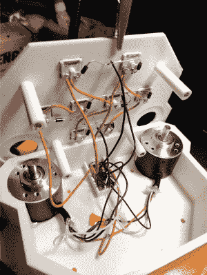

# 节奏游戏手柄打不过

> 原文：<https://hackaday.com/2021/01/07/rhythm-game-controller-cant-be-beat/>

 有一整类垂直滚动的节奏游戏，需要双手，玩起来看起来真的很有趣，尽管对关节来说很难。你可以为它们购买专门的控制器，但它们贵得离谱——只有几个开关和两个旋钮。[这正是那种你应该用少得多的钱打造出符合你品味的东西](https://relivesight.com/projects/portavoltex/)。

受同样非常昂贵的袖珍 Voltex 控制器的启发，[OmniSaiRen]开始通过构建一个比专用控制器更小、更容易使用的令人敬畏的小宏键盘来制造自己的廉价键盘。内部有一个 Arduino Pro Micro 从八个 Cherry MX 开关和两个光学编码器接收输入。该游戏将编码器视为垂直和水平的鼠标移动，因此[OmniSaiRen]的代码扫描编码器的位置。

[OmniSaiRen]写了他们自己的矩阵代码，并说它很丑，但它足够好，可以玩这个游戏。你还能要求什么？一个很酷的贴纸放在上面？完成了。反正外面太冷了，没法画画。如果你需要一个单手游戏手柄，[看看这个可爱的小东西](https://hackaday.com/2020/02/17/sherbet-custom-game-pad-is-smooth-and-sweet/)。

通过 [r/duino](https://www.reddit.com/r/arduino/comments/km1z5f/made_a_rythym_game_controller_using_mechanical/)