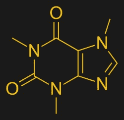
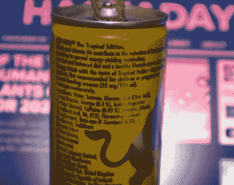

# 我们与咖啡因的奇妙关系

> 原文：<https://hackaday.com/2021/03/10/our-curious-relationship-with-caffeine/>

如果你要描绘一些围绕我们社区的刻板印象，你会从哪里开始？也许是穿着习惯:科技会议上的 t 恤，或者无处不在的帽衫。或者休闲活动怎么样:游戏，甚至 D&D？我能想到的一件事让我们大多数人团结起来，我们对咖啡因有一种奇怪的亲和力。这是因为我们倾向于在深夜工作，还是因为我们这些患有多动症的人觉得保持警觉很有帮助，但不管是什么原因，我们都喜欢喝咖啡和能量饮料。很少有黑客空间没有咖啡机和装满能量饮料的冰箱，我已经记不清有多少次因为满足于一杯速溶咖啡而被同行中的咖啡行家嘲笑。疫情剥夺了我在节日期间通常的社交活动，我一边喝着最后一瓶鸡尾酒，一边思考着我们与这种化学物质的关系。

The plant we most associate with caffeine, Coffea Arabica. Francisco Manuel Blanco (O.S.A.), [Public domain](https://commons.wikimedia.org/wiki/File:Coffea_arabica_Blanco1.53.png).

在美洲、非洲和亚洲的热带和亚热带地区的多种原生植物中，可以发现咖啡因是一种成分，在这些植物中，咖啡因是作为一种化学防御手段来抵御害虫的。显然，在进化过程中，我们并没有像一些昆虫或其他植物那样被认为是害虫，因为对我们来说，它是一种精神兴奋剂，但不是极端剂量。因此，最先咀嚼咖啡豆、可乐果或马黛叶的我们的祖先让我们人类与它们产生了可能会持续千年的爱情。

## 咖啡因对我们有什么影响？

在化学术语中，它是一种甲基化的黄嘌呤，在它的中心是一个 8 字形，由一个六元环和一个五元环连接在一起组成，每个环的结构中都有两个氮原子..六元环上暴露的碳原子各自与氧原子形成酮基，并且六元环上的两个氮原子和五元环上的一个氮原子各自连接有甲基。

The chemical structure of a caffeine molecule. Vaccinationist, [Public domain](https://commons.wikimedia.org/wiki/File:Caffeine_structure.svg).

咖啡因与腺嘌呤-一种放松血管的物质-的结构相似，这使它与我们大脑中的腺嘌呤受体结合。腺苷作为疲劳的一部分参与抑制大脑的活动，咖啡因具有引起警觉的效果。阅读关于其对大脑影响的研究论文会让人觉得这只是化学效应的一个散弹枪，促进了多巴胺的产生，也增加了大脑的电活动。我们对咖啡因的任何东西都有感觉，不仅因为我们更警觉，还因为在它的影响下，我们的大脑变得更有能力。

就我而言，我意识到我对咖啡因的喜爱在某种程度上具有自我治疗 ADHD 的功能。我很难集中注意力，这会严重影响我完成工作的能力，早上摄入大量咖啡因会改变我的工作效率。可能会有很多读者分享这一点，似乎这种情况使我们天生多巴胺水平低，而咖啡因可以提高多巴胺水平。如果我问我的医生，我可以得到[一系列更强的药物，包括安非他明化合物家族的成员](https://www.nhs.uk/conditions/attention-deficit-hyperactivity-disorder-adhd/treatment/)，但现在几杯咖啡或一个俱乐部队友，当我能得到它的时候就起作用了。

## 一天一杯，还是太多了？

作为一个实际上使用咖啡因进行药物治疗的人，我对含有咖啡因的不同混合物的相对强度有着敏锐的感觉。我知道一杯速溶咖啡不如一杯煮好的咖啡有效，而哪种能量饮料比其他饮料更有效。但是它们到底含有多少咖啡因，又有多少是咖啡因过量呢？最后一个问题很容易回答，尽管因人而异。超过一克的这种东西可能会让你感觉很不舒服，超过十倍的量可能会要你的命。但我们很少有人会仔细称量纯咖啡因粉末，所以最好从天平的另一端开始。

This British-market Red Bull can even carries a health advisory warning over its caffeine content.

没有标准的一杯咖啡，但我的速溶咖啡可能会给我带来大约 50 毫克的咖啡因，我可以预期一杯等量的普通煮咖啡会带来大约两倍的咖啡因。与此同时，一罐可口可乐含有 34 毫克，而其咖啡因强化的同类产品每罐约含 80 毫克，英国版红牛的略小罐也是如此。我们最喜欢的 Club-Mate 不像其他能量饮料那样含有 20 毫克/100 毫升的咖啡因，但其较大的 500 毫升瓶含有 100 毫克咖啡因。

所以为了伤害我自己，我必须喝十杯俱乐部伙伴或十杯浓咖啡，但事实是，即使是在黑客营或最时尚的咖啡吧的最有激光色彩的晚上，我也不会做到这一点。令人惊讶的是，一杯浓咖啡比能量饮料含有更多的咖啡因，但显然这是营销的胜利，我不这么认为。我每天喝三、四杯速溶咖啡，但不到 200 毫克，这让我在咖啡因的风险中相对较轻，而不是我担心自己可能成为的连环虐待者。

在我对我的文化中最被社会接受的精神活性成瘾性化学物质的调查中，我发现了一些我不知道的事情，并对我如何使用它进行了批判性的审视。我对它上瘾，多动症意味着没有它我可能无法工作，这是毫无疑问的，但像我们社区的许多人一样，我认为好处大于任何其他担忧。现在我最大的烦恼是，由于疫情，我再也不能在我的黑客空间里囤积进口能量饮料了。

咖啡豆头部图片:MarkSweep，[公共域](https://commons.wikimedia.org/wiki/File:Roasted_coffee_beans.jpg)。