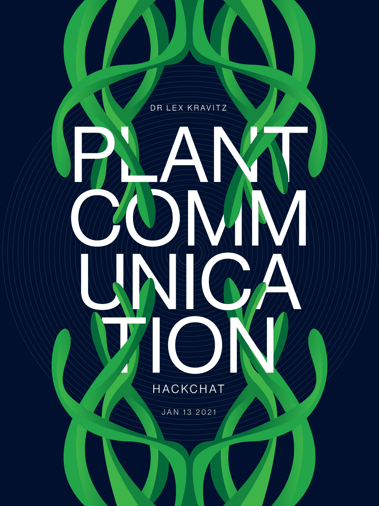

# 工厂通信黑客聊天

> 原文：<https://hackaday.com/2021/01/11/plant-communication-hack-chat/>

加入我们太平洋时间 1 月 13 日星期三中午与[莱克斯·克拉维茨](https://hackaday.io/hacker/294140-lex-kravitz)的[工厂通讯黑客聊天](https://hackaday.io/event/175509-plant-communication-hack-chat)！

就谈话而言，植物通常是很糟糕的伴侣选择。当然，我们都听说过和你的室内植物交谈应该对它们有好处，但是期望它们以任何有意义的方式回应可能会以失望告终。

或者是？因为尽管植物看起来简单而无生命，但它们实际上有丰富的行为。植物可以对刺激做出反应，向光线和营养等吸引物移动，远离驱虫剂。一些树木可以分泌物质，通过阻止它们的幼苗生根来阻止竞争对手聚集在它们周围。我们早就知道植物可以通过化学信号相互交流。

很明显，植物的能力远不止是呆在那里，但是故事还有别的吗？神经科学家 Lex Kravitz 认为是这样的，这就是为什么他一直将他的室内植物连接到敏感的放大器上，并寻找电信号。虽然我们对植物交流的大部分了解都集中在它们发出的化学信号上，但它们的行为也可能有电子成分。请加入我们，Lex 将在 Hack Chat 上讲述他的植物交流实验，看看是否有一天有可能听到你的植物在谈论你。

 我们的黑客聊天是 [Hackaday.io 黑客聊天群发消息](https://hackaday.io/messages/room/2369)中的社区直播活动。本周，我们将于太平洋时间 1 月 13 日星期三中午 12:00 坐下来讨论。如果时区束缚了你，我们有[一个方便的时区转换器](https://www.timeanddate.com/countdown/generic?iso=20210113T12&p0=224&msg=Plant+Communication+Hack+Chat&font=cursive)。

点击右边的那个发言气泡，你会被直接带到 Hackaday.io 上的黑客聊天群，不用等到周三；随时加入，你可以看到社区在谈论什么。

