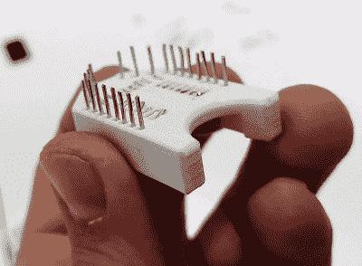

# ESP8266 插座是一个搭扣配合、试验板友好的奇迹

> 原文：<https://hackaday.com/2021/01/10/esp8266-socket-is-a-snap-fit-breadboard-friendly-wonder/>

这一切都始于想要在不涉及任何焊料的情况下对 ESP8266 模块的 ESP-12 变体进行编程。对 Thingiverse 上的所有插座产品感到不满， [[tweeto]开始设计他们自己的试验板友好的卡扣式插座](https://www.instructables.com/DIY-ESP8266-ESP-12-Socket-Snap-Fit-Breadboard-Frie/)。

 这看起来的确是一个方便的解决方案。你所要做的就是打印出来，加上所有的电线，然后把你的静电感应装置放进去。甚至电线也很容易找到；[tweeto]使用 0.8 毫米的回形针，这种回形针坚固、导电，并且经常出现在每个书桌抽屉的最黑暗的角落。它们也有点厚，所以[tweeto]计划在未来测试 0.6 毫米的铜线。

这种印刷的挑战在于设计出一种能够经得起反复试验而不掉腿或散架的东西。[tweeto]的优雅解决方案是在插座底部为每根电线设置一个微小的凹槽——它通过抵消将电线插入试验板和从试验板中拔出所造成的间隙来保持电线的位置。看看[tweeto]在休息之后是怎么把短视频里的回形针弄弯的。

有不止一种方法可以利用 3D 打印来实现电路构建优势，即使是在永久性电路中— [看看这个无 PCB 的 Arduboy](https://hackaday.com/2020/02/08/3d-printing-for-wire-paths-yields-an-arduboy-minus-the-pcb/) 。

 [https://www.youtube.com/embed/b_H9WKpFGBU?version=3&rel=1&showsearch=0&showinfo=1&iv_load_policy=1&fs=1&hl=en-US&autohide=2&wmode=transparent](https://www.youtube.com/embed/b_H9WKpFGBU?version=3&rel=1&showsearch=0&showinfo=1&iv_load_policy=1&fs=1&hl=en-US&autohide=2&wmode=transparent)

