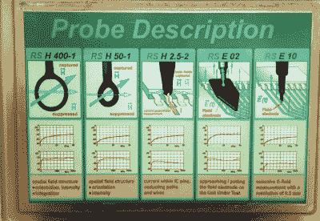
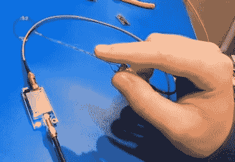

# 远程视频:射频发射调试研讨会基础

> 原文：<https://hackaday.com/2021/01/08/remoticon-video-basics-of-rf-emissions-debugging-workshop/>

如今，我们被高速电子设备所包围，它们能够在彼此靠近的情况下很好地发挥作用，这可不是一个小壮举。我们要感谢射频发射标准，它确保新产品不会发出错误的信号，干扰通过以太网传输的数据信号。这一直是超级昂贵的排放测试实验室的东西，未能通过会让你挠头。但正如 Alex Whittimore 在 2020 Hackaday Remoticon 研讨会上所展示的那样，[你可以用简单廉价的工具进行大量的射频发射调试](https://youtu.be/8G7GeY28ygY)。

Professionally-made probes in several sizes

Build your own probes from magnet wire

通过在自己的工作台上进行探测，你可以非常清楚地了解产品可能产生的射频。考虑到实验室执行 FCC 和其他认证的成本，这对于任何设计产品走向市场的人来说都是一项必要的技能——但对其他人来说仍然非常有趣。在这里，您可以看到该过程中使用的两个探针示例。虽然一个是一包专业工具，另一个是一点漆包线(电磁线)，但两者本质上是一样的:一个线圈，磁场会在其上感应出非常小的电流。添加一个低噪声放大器(LNA ),您就可以立即开始测量了。

我真的很喜欢 Alex 如何以“正确的方式 ^(TM) 做事”开始他的演示——使用合适的频谱分析仪来可视化来自探针的数据。但真正有趣的部分是“黑客之路 ^(TM) ”，它利用 RTL-SDR 加密狗和一些开源软件来完成同样的工作。这主要意味着使用 [SDRAngel](https://github.com/f4exb/sdrangel) 和 [QSpectrumAnalyzer](https://github.com/xmikos/qspectrumanalyzer) ，它们都包含在可以在虚拟机内部运行的 [DragonOS_LTS](https://sourceforge.net/projects/dragonos-lts/) 中。

 [https://www.youtube.com/embed/8G7GeY28ygY?version=3&rel=1&showsearch=0&showinfo=1&iv_load_policy=1&fs=1&hl=en-US&autohide=2&wmode=transparent](https://www.youtube.com/embed/8G7GeY28ygY?version=3&rel=1&showsearch=0&showinfo=1&iv_load_policy=1&fs=1&hl=en-US&autohide=2&wmode=transparent)

一旦一切都连接好并运行，你就像魔杖一样在测试板上挥动探针。峰值将出现在软件可视化中，对应于该波长的发射。Alex 演示了如何从一个大环路探针开始进入邻域，然后将探针换成越来越小的环路，直到信号来自芯片上的引脚。

工具便宜，软件免费，我们都应该尝试一下。那些足够幸运的工具包中有 HackRF 的人会特别喜欢研讨会结束时的并排比较。看到它击败 RTL-SDR 并不奇怪，但是对于基本的调试，简单的工具足以让您看到通常看不到的东西。