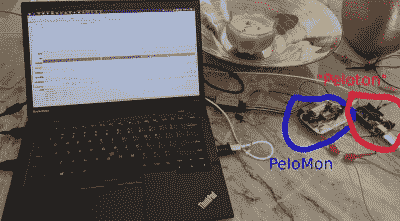

# 学习讲佩洛东语

> 原文：<https://hackaday.com/2021/01/08/learning-to-speak-peloton/>

最近[Imran Haque]的家人买了非常受欢迎的 Peloton 自行车。在他最初的怀疑融化成平静的热情后，[Imran]感到他的黑客好奇心开始探查自行车上的主机。尽管这是一款轻薄的 android 平板电脑，但它以相当封闭而闻名。Peloton 自行车将很乐意从其他设备收集心率等数据，但却不愿公布它生成的任何数据，如节奏和功率。[Imran]着手通过创造一个他称之为 pelo mon 的装置来解码和释放 Peleton 的数据。他将自己旅程的灵感归功于另一名黑客[在他们的砖砌健身车](https://hackaday.com/2020/08/04/unbricking-a-2000-exercise-bike-with-a-raspberry-pi-zero-and-bluetooth-hacks/)上连接了一个树莓派。

作为第一步，[Imran]首先解码连接自行车和车头单元的 TRRS 连接器。在万用表和逻辑分析仪的帮助下，确定了两个 19200bps 8N1 RS-232 通道(TX 和 RX)。一旦基本的传输层建立起来，他下一步就开始解码数据包。通过绘制数据包中的字节并应用演绎推理，定义了一个粗略的规范。主机请求每 100 毫秒更新一次，自行车根据请求类型以节奏、功率和阻力数据做出响应(主机通过三种数据类型进行循环)。

一旦协议被解码，[Imran]的下一步就是编写一个仿真器。为具有简单协议的设备编写仿真器似乎是一个奇怪的决定，但是推理是相当合理的。它避免了每次需要测试代码变更时要骑 20 分钟的自行车。[Imran]编写了一个事件驱动和定时精确的仿真器。前者与 PeloMon 运行在同一块板上，后者运行在单独的板上(Arduino)。

PeloMon 选用的硬件是 Adafruit Feather 32u4 Bluefruit LE。选择它是因为支持蓝牙 LE 以及具有板载 EEPROM。电平转换器允许微控制器直接与自行车上的 RS-323 通信。经过几次对 Adafruit 蓝牙库的拉取请求和一番激烈的争论后，[Imran]有了宣传两种蓝牙服务的代码，一种是速度，另一种是功率。还包括一个蓝牙串行控制台，无需拔出电路即可进行调试。

代码、原理图、仿真器和研究笔记[都可以在 GitHub](https://github.com/ihaque/pelomon) 上获得。