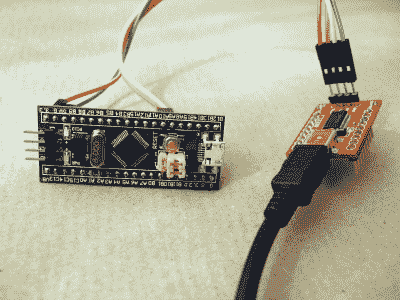

# 外壳和微控制器

> 原文：<https://hackaday.com/2021/01/09/the-shell-and-the-microcontroller/>

解释编程语言的最大好处之一是，您可以在 shell 中测试您正在开发的代码，一次一行，并立即看到结果。无论你选择的微控制器上的写-编译-闪存周期有多快，它仍然比编写`blink_led()`并让它在此时此地这样做更没有乐趣。为什么我们还没有这样的经历呢？

如果您在大型计算机上使用过任何现代脚本语言，它会附带一个 shell，一个读取-评估-打印循环(REPL ),在这个循环中，您可以像键入代码一样快地交互式尝试您的代码。它非常适合交互式或探索性编程，非常适合能够一步一步测试和学习东西的新手。一个好的 REPL 可以让你一行一行地测试你的想法，实质上就是每次按回车键时对你的代码进行一点测试。

This is your development environment

开发简易性的明显代价是速度。编译语言几乎总是更快，这在微控制器的受限世界中尤其重要。或者曾经是。我学会了用一种解释型语言——BASIC——在计算机上编程，这些计算机的功能比一个 5 美元的微控制器强不了多少，而且几乎所有的微处理器都有 BASIC。我[在第四](https://hackaday.com/2017/04/19/moving-forth-with-mecrisp-stellaris-and-embello/)中写道，它比 BASIC 更快，占用的资源更少，并且具有非常全面的 REPL，但不可否认的是，这是一种后天养成的习惯。MicroPython 已经被移植到许多 micros 上，并且可能更加熟悉。

但是，为你的微控制器开发 MicroPython *并不是在*你的微控制器上开发*，如果你遵循那里的任何指南，你将最终在你的计算机上编辑一个文件，将它上传到微控制器，并从 REPL 内运行它。这就产生了一个流程，就像 c 语言的写-编译-刷新循环一样笨拙。*

少了什么？一个好的编辑器(或者 IDE？)运行在微控制器上，这将允许您进行探索性编码，并将其历史记录为更永久的形式。例如，想象一下，一个基于 web 的 MicroPython IDE 服务于一个 ESP32，它既提供了一个用于实验的外壳，又提供了一种将您刚刚在外壳中键入的行复制到您正在处理的文件中的方法。我们非常接近这是一个可行的想法，它将把新手的入门障碍降低到几乎为零，同时让有经验的程序员来玩。

还是已经有人这么做了？为什么微控制器的解释性介绍不是标准？

This article is part of the Hackaday.com newsletter, delivered every seven days for each of the last 200+ weeks. It also includes our favorite articles from the last seven days that you can see on [the web version of the newsletter](https://mailchi.mp/hackaday.com/hackaday-newsletter-649368). Want this type of article to hit your inbox every Friday morning? [You should sign up](http://eepurl.com/gTMxQf)!