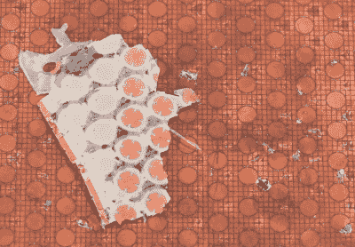

# Starlink 圆盘式卫星电视天线经过 x 光检查，可开启内部的射频魔法

> 原文：<https://hackaday.com/2021/01/11/starlink-satellite-dish-x-rayed-to-unlock-rf-magic-inside/>

当(肯尼斯·凯特尔)在 11 月份拆开他的 Starlink dish 时，他在他的 YouTube 频道上发布的视频中尽力解释了这个极其复杂的设备的高级功能。这是一个迷人的设备外观，但他自己承认，他不是合适的人来尝试和解释相控阵实际上如何运作的细微差别。但是他知道谁能公正地处理技术问题，这就是为什么[把被肢解的碟形天线运送到信号路径的【沙里亚·沙赫拉米安】](https://thesignalpath.com/blogs/2021/01/10/starlink-dish-phased-array-design-architecture-rf-in-depth-analysis/)。

如果你第一次看完之后还不能完全理解他的详细分析，不要感到惊讶。第二次重新观看后，你可能会有一些挥之不去的问题。不过没关系，因为[Shahriar]自己也有一些。即使在切下一部分盘子并将其置于 X 射线下，仍然不完全清楚 SpaceX 的工程师如何设法将所有东西塞进如此整洁的包装中。尽管毫无疑问，早期硬件 500 美元的价格绝对便宜，但从各方面考虑。

The layered antenna works on multiple frequencies.

视频的大部分时间都在研究相控天线阵列的堆叠蜂窝结构，正如预期的那样，如果你知道要寻找什么，它拥有许多射频秘密。简单地说，对于受过训练的人来说，没有不重要的细节。从仔细确定尺寸的注射成型间隔片(使上部阵列与 RF4 型天线罩保持特定距离)，到在每个浮动贴片上钻的几乎微小的孔，以保持叠层中的气压均衡，[Shahriar]发现了一些有趣的细节，否则这些细节可能看起来像是任意的设计决策。

但是目测只能帮到你这么多。最终[Shahriar]不得不切下一片 PCB，这样他就可以把它放进 x 光机，但不要觉得太糟糕，在他得到它之前，这个盘子早就死了。虽然他尚未完成全部分析，但初步检查表明，每个大型 IC 及其周围的八个芯片构成了一个 16 通道波束形成模块。每个通道进一步分为两个 RX 和 TX 对，提供必要的右旋和左旋极化。也就是说，他承认有一些解释的空间，在做出任何艰难的结论之前，进一步的工作是必要的。

从这次 RF 分析到[Kenneth] 提供的[初步概述，我们已经对这款设备有了更多的了解，考虑到硬件的稀有和昂贵，这可能超出了许多人的预期。虽然我们承认，一旦这种设备被完全理解，现在还不清楚硬件黑客会进入什么样的 hijinks，但我们当然渴望找到答案。](https://hackaday.com/2020/11/25/literally-tearing-apart-a-spacex-starlink-antenna/)

 [https://www.youtube.com/embed/h6MfM8EFkGg?version=3&rel=1&showsearch=0&showinfo=1&iv_load_policy=1&fs=1&hl=en-US&autohide=2&wmode=transparent](https://www.youtube.com/embed/h6MfM8EFkGg?version=3&rel=1&showsearch=0&showinfo=1&iv_load_policy=1&fs=1&hl=en-US&autohide=2&wmode=transparent)

