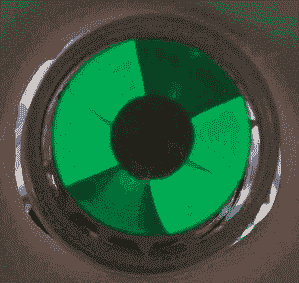

# 认识一下魔眼真空管

> 原文：<https://hackaday.com/2021/01/22/meet-the-magic-eye-vacuum-tube/>

真空管统治了电子学几十年，虽然你可能会认为它们是类似于晶体管或场效应晶体管的简单器件，但还有许多特殊类型。我们都熟悉作为数字显示器的谢妮管，还有其他特殊的电子管作为光电倍增管，用来检测辐射，甚至产生微波。但其中一种最奇特、最与众不同的特殊电子管有一个有趣的名字:魔眼管。从顶部看，你会看到一个围绕中心点旋转的视觉指示，外环发光，内环黑暗，就像虹膜和瞳孔。

By [Quark48] – CC BY-SA 2.0

这些电子管可以追溯到 1935 年的 RCA 6E5。当时，使用针头的测试设备制造成本很高，所以总有人想用更便宜的东西来取代它们。它们有点像发育不良的阴极射线管。事实上，发明家艾伦·杜蒙因在电视方面的创新而闻名。阳极上有一层被电子击中时会发光的涂层——通常是绿色，但有时是其他颜色。后来的电子管会显示出一条沿管子上下延伸的条纹，而不是一个圆形，但你仍然称它们为魔眼。

这个虚拟仪表的指示器部分采用了阴影的形式。根据所施加的信号，阴影会变大或变小。许多电子管还包含一个三极管，由信号驱动电子管。

有一个很棒的网站，上面有很多关于这些古老的电子管的信息，并且有这些电子管出现在很多事物中的例子。它们经常出现在服务设备、收音机和录音机中。它们甚至出现在专业音频设备中，如[宾森回声延迟单元](https://www.effectrode.com/knowledge-base/binson-echorec-pages/)。

## **在魔眼之前**

事实上，电眼取代了一项更古老的技术:霓虹灯。20 世纪 30 年代初，一家名为 Duovac 的公司生产了一种改进型霓虹灯。你可以在[无线电博物馆](https://www.radiomuseum.org/tubes/tube_tune-a-lite.html)读到更多关于它们的信息。有趣的是，其中一些有静音输出，可以在没有信号时关闭收音机的扬声器，就像现代的静噪电路一样。

灯泡的工作原理类似温度计，因为灯管又长又窄，当施加的电压增加时，灯管内的辉光会上升。

## 在你附近的显示器上看到一个

没有什么比亲眼看到这些古老的宝石更好的了，但下面的视频将让你了解 6E5C 的眼睛是如何出现的。绿光让你想起 20 世纪 50 年代的科幻电影，或者好莱坞认为核反应堆释放的物质。一些像 EM80 这样的魔眼有不同的形状，[仔细看看这个拆卸视频](https://www.youtube.com/watch?v=ShIjmKChoiQ)。

 [https://www.youtube.com/embed/YgnX7hbf75s?version=3&rel=1&showsearch=0&showinfo=1&iv_load_policy=1&fs=1&hl=en-US&autohide=2&wmode=transparent](https://www.youtube.com/embed/YgnX7hbf75s?version=3&rel=1&showsearch=0&showinfo=1&iv_load_policy=1&fs=1&hl=en-US&autohide=2&wmode=transparent)

## **得到一个**

像大多数旧东西一样，如果你知道去哪里找，这些是可以得到的。易贝和亚马逊都有很多不同价格的。甚至还有一些像前置放大器这样的套件，它们使用魔眼作为 VU 电度表。即使你有一只看起来已经烧坏的电眼，你也可以试着增加供电电压，就像[M . Caldira]在这个关于恢复微弱电眼管的视频中所做的那样。

如果你找不到真正的电子管，你可以试着用 led 和马达用[视觉暂留来伪装它。](https://www.youtube.com/watch?v=QFTDOZz-LlE)

我们过去只见过几个电眼项目。还有[频谱分析仪](https://hackaday.com/2013/01/14/magic-eye-spectrum-analyzer/)。还有一台[古董电容测试仪](https://hackaday.com/2017/07/26/eye-tube-tests-capacitors/)被拆。