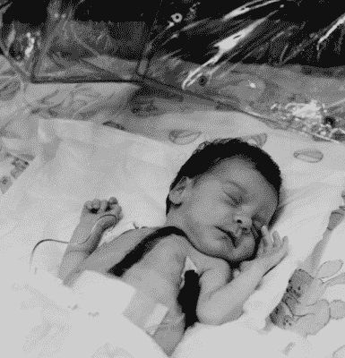
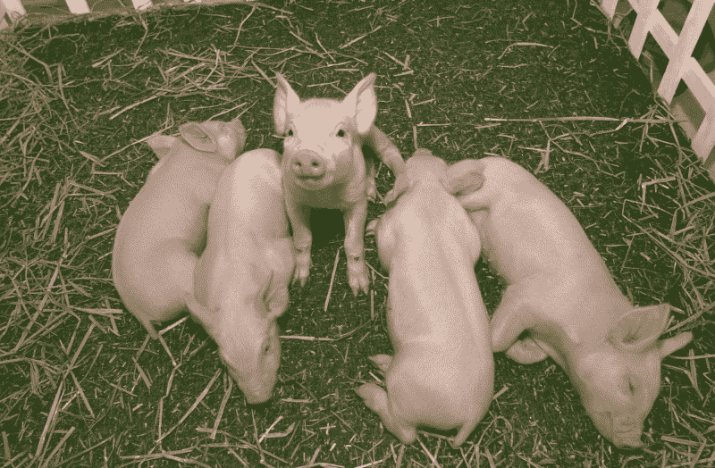

# 时代之猪:2021 年猪到人的器官移植步入正轨

> 原文：<https://hackaday.com/2021/01/28/swine-of-the-times-pig-to-human-organ-transplants-on-track-for-2021/>

在美国，每天有 17 人因为不能及时获得器官移植而死亡。一家名为[联合治疗公司的美国生物技术公司正试图通过生产一系列转基因猪来挽救生命](https://futurehuman.medium.com/the-first-pig-to-human-organ-transplants-could-happen-this-year-a538ad0c5536),目的是获取它们的器官，以及其他治疗用途。联合治疗公司的养猪子公司[review cor](https://www.revivicor.com/about.html)是 PPL 治疗公司的一个分支，早在 1996 年，这家公司就给了我们克隆羊多莉。他们打算最早在今年开始将猪的器官移植到人体内。

Baby Fae after transplant surgery. Image by Duane Miller-AP via [Time Magazine](https://time.com./4086900/baby-fae-history/)

虽然这听起来像科幻小说，但将动物细胞、器官和组织移植到人体的想法已经存在了一百多年。异种移植的主要问题是，它通常会在受体体内引发严重的免疫系统反应。在一个更值得注意的案例中，[一名女婴在 1984 年接受了一颗狒狒心脏](https://news.llu.edu/patient-care/stephanie-s-heart-story-of-baby-fae)，但几周后死亡，因为她的身体排斥这一器官。

异种移植排斥的主要原因是一种叫做α-gal 的糖。这种糖出现在所有非灵长类哺乳动物的细胞表面。α-gal 也有其他原因:一种叫做[α-gal 综合征](https://www.cdc.gov/ticks/alpha-gal/index.html)的疾病通常始于孤星蜱叮咬人并从被叮咬动物的血液中传播α-gal 细胞。从那时起，这个人在吃牛肉、[猪肉](https://ask.usda.gov/s/article/Is-pork-white-meat)和羊肉等红肉时会出现过敏反应。

## 有目的的猪

A litter of lifesaving piglets. Image via [Revivicor](https://www.revivicor.com/body_xenotransplantation.htm)

[自 20 世纪 60 年代以来，猪心脏瓣膜一直被用作人类的替代物](https://www.sciencedirect.com/science/article/pii/S174391911500374X)，但在这些情况下，组织经过化学处理，以杀死包括α-半乳糖在内的细胞。据推测，这对肾脏、心脏和肝脏等器官不起作用，所以他们从基因开始。

根据《未来人类》的采访，Revivicor 的最新转基因猪[共有 10 处修改](https://futurehuman.medium.com/the-first-pig-to-human-organ-transplants-could-happen-this-year-a538ad0c5536)，旨在帮助接受移植。他们关闭了包括产生α-gal 基因在内的四种猪基因，并添加了六种人类基因。[添加的人类基因之一使猪产生一种免疫系统调节蛋白，称为 CD46](https://www.revivicor.com/body_xenotransplantation.htm) 。

## 弥合差距

比起任何其他器官，更多的人需要肾脏，因此该公司计划开始用肾脏进行人体试验，并在未来转向心脏移植。2020 年 12 月，食品药品监督管理局(FDA) [认证这些所谓的 GalSafe 猪适合人类食用和治疗用途](https://www.fda.gov/news-events/press-announcements/fda-approves-first-its-kind-intentional-genomic-alteration-line-domestic-pigs-both-human-food)。虽然 Revivicor 不打算生产 GalSafe 猪，作为α-gal 综合征患者的无过敏替代物，但大门肯定对其他公司敞开着。

2016 年，Revivicor 和美国国立卫生研究院的研究人员报告说，他们已经能够在狒狒体内保持猪的心脏存活两年半。然而，这些都不是直接移植的情况——狒狒保留了它们原来的心脏，并将猪的心脏放在它们的腹部。

转基因无α-gal 猪可以帮助解决器官移植危机，尽管目前还不清楚器官移植到人体后会持续多久。Revivicor 和 United Therapeutics 希望它们可以持续一个人的余生，或者至少持续足够长的时间，直到他们可以获得一个人体器官来替代它。即使这只是一个权宜之计，直到有更好的替代方案出现，它也能拯救许多生命。你怎么想呢?