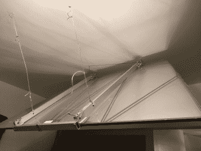

# 折叠式图案投影仪是个好主意

> 原文：<https://hackaday.com/2021/01/24/collapsible-pattern-projector-is-a-bright-idea/>

我们生活在可下载 PDF 模式的时代，这真是太棒了，真的。但是打印出一堆纸并把它们粘在一起是一个单调乏味的过程，从一开始就可能引入错误。这适用于任何类型的图案，从缝纫到遥控飞机。

 【奎因】的隔离项目旨在涵盖这两者以及介于两者之间的一切。[这是一个用现有材料制作的图案投影仪](https://hackaday.io/project/176637-patternplan-projector)——几个用来清理零件的偏置投影仪，和一个旧背投电视的大型梯形聚脂薄膜镜。在最大变焦时，它会在桌面上投影一个 4 ' x 3 '的图像，这听起来非常适合大量的缝纫图案。在最小变焦时，投影图像适合泡沫芯板上。

我们喜欢这个梦幻般的装置，它可以轻松地挂在天花板的挂钩上。[Quinn]不得不进行一些改装，使其一起工作，包括制作一个支架和一些可调节的拉杆，以将镜子保持在正确的角度。

需要小一点的吗？[看看这个 Pi 供电的袖珍投影仪](https://hackaday.com/2018/06/06/pocket-projector-uses-raspberry-pi/)。想要影院级的设置吗？[你只需要找到合适的拍卖会](https://hackaday.com/2020/06/22/a-true-4k-projector-from-scrap-ebay-components/)。