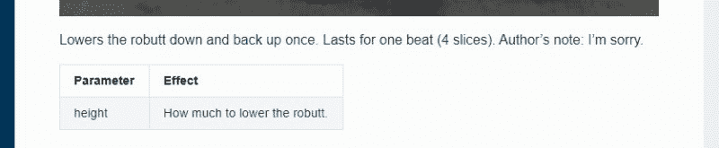

# 开始你的机器人舞蹈编导新事业

> 原文：<https://hackaday.com/2021/01/19/start-your-new-career-in-robot-dance-choreography/>

波士顿动力公司喜欢用舞蹈视频展示他们的机器人。每次他们推出一个，都会在机器人爱好者中引发一场讨论，辩论什么是真实的，什么仅仅是展览所暗示的。我们真的很想看到幕后的工具，幸运的是，我们看到了【亚当·沙维奇】的*测试*团队发布的[现场舞蹈编排环节](https://www.youtube.com/watch?v=2SpNjBI1lu0)。(YouTube 视频，下面也嵌入了。)

大约一年来，*测试团队一直在探索一个地点的潜力。我们看到的大多数东西都是从一个定制的平板电脑上控制的，它看起来像一个手持视频游戏机。相比之下，这个视频显示了一个计算机应用程序，用于在以音乐为中心的时间线上对现场动作进行排序。定时器周期以每分钟的节拍数为单位，八个一小节。高层次的任务与编排人类舞者没有什么不同:设计一些可以随着音乐表演的东西，取悦你的观众，同时保持在你的舞者可以用他们的身体做的范围内。然后，[相信你的舞者表演](https://hackaday.com/2020/07/13/softbank-robots-pinch-hit-for-baseball-cheerleaders/)！*

那个计算机应用是波士顿动力编舞，是 [Spot 编舞 SDK](https://dev.bostondynamics.com/docs/concepts/choreography/readme) 的一部分。即使我们没有自己的位置，任何愿意阅读这本精美手册的人都可以参考。在撰写本文时，编舞 SDK 涵盖了我们在早期的 [*UpTown Funk* 舞蹈视频](https://www.youtube.com/watch?v=kHBcVlqpvZ8)中看到的所有内容，但看起来它还没有接受最近的*中一些更高级的 Spot 舞蹈[？](https://hackaday.com/2020/12/30/boston-dynamics-dancing-bots-beg-for-your-love-a-la-napoleon-dynamite/)*视频。有一个参考图表，用动画 GIF 说明了[的移动，记录了可定制的参数以及其他重要注释。](https://dev.bostondynamics.com/docs/concepts/choreography/move_reference)

在这些页面上，我们已经看到许多黑客接受了构建他们自己的四足机器人的挑战。每个都充满了巧妙的机械设计解决方案，可以匹配 Spot 的运动学。虽然不是所有的都可以与 Spot 的控制系统相匹配，但我们确信 GitHub 上出现相应的编排应用程序只是时间问题。(如果它们已经存在，请在评论中链接。)一旦机器人都会跳舞，我们还会爱它们吗？陪审团还没有出来。

 [https://www.youtube.com/embed/2SpNjBI1lu0?version=3&rel=1&showsearch=0&showinfo=1&iv_load_policy=1&fs=1&hl=en-US&autohide=2&wmode=transparent](https://www.youtube.com/embed/2SpNjBI1lu0?version=3&rel=1&showsearch=0&showinfo=1&iv_load_policy=1&fs=1&hl=en-US&autohide=2&wmode=transparent)

