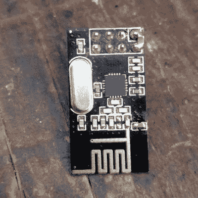

# 修复 NRF24L01+模块而不(太)疯狂

> 原文：<https://hackaday.com/2021/01/22/fixing-nrf24l01-modules-without-going-too-insane/>

好的旧 nRF24L01+无线模块价格便宜且有效。嗯，反正只要工作正常，它们就是。这些设备本身是成熟的，也是众所周知的，但这并不意味着供应商的劣质批次不能直接从工厂引发令人毛骨悚然的问题。

[nekromant]最近收到了一整批设备，它们完全拒绝执行它们应该执行的操作，但不是因为它们是仿冒品。问题是天线和 PCB 设计已经被供应商“优化”到设备根本无法正常工作的程度。幸运的是，[【nekromant】将对问题的理解转化为解决问题的方法，而不会在过程中变得疯狂。测试设置如上图所示，过程如下所述。](https://ncrmnt.org/2021/01/11/nrf24l01-manually-calibrating-the-antenna-with-mysensors-and-homeassistant/)

nRF24L01+ module fixed about as well as it can be, by adding an appropriate capacitor on the PCB antenna, and a 1.0 uF capacitor across the power pins for good measure.

这个问题对[nekromant]来说并不新鲜，因为以前的批次都遭受过“神奇手指问题”，其中[糟糕的性能通过将手指放在天线](https://ncrmnt.org/2021/01/03/nrf24l01-fixing-the-magic-finger-problem/)上而神奇地解决。过去通过焊接缺失的 1.0 pF 电容已经解决了这一问题，但最新一批 nRF24L01+单元非常糟糕，需要采取更多措施。仅仅增加一个 1.0 pF 电容已经不够了，具体原因尚不清楚。

由于可能与 PCB 天线有关的原因，每个无线电都需要增加一个电容，电容值通常在 1.0 pF 至 2.2 pF 之间。但是没有办法知道任何特定的董事会需要什么样的价值。为了解决这个问题，[nekromant]制作了一个小型测试设备，通过发送数据包和测量记录的故障数量来依次分析每个设备。在对每个设备进行分析之后，修复它们是一个有见识的试错过程。一旦将手指放在 PCB 天线上开始*恶化*设备的性能，而不是改善它，该模块(以及最后焊接到其上的任何电容值)可以被放入“OK”箱，并且重复该过程，直到堆消失。

[nekromant]指出，这里显而易见的教训是要小心选择供应商，但对于这样的模块，这越来越难做到。对于一个小的业余爱好项目来说，令人讨厌的手工电路板返工过程是一回事，但如果涉及几百或几千个单元，那就完全是另一回事了。

假冒硅不是这次的问题，但也许[在识别假货](https://hackaday.com/2018/01/15/is-that-part-a-counterfeit-here-are-a-few-pointers/)上还是要稍微温习一下。