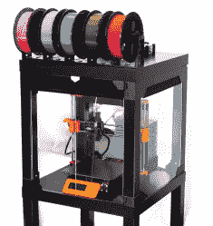
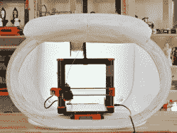

# 3D 打印:为什么围栏不容易？

> 原文：<https://hackaday.com/2021/02/02/3d-printering-why-arent-enclosures-easier/>

对于尚未封装的 3D 打印机来说，为什么轻松添加一个便宜而有效的外壳仍然没有完全解决问题？原因很简单:除非一个人的需求非常基本，否则圈地不仅仅是盒子。

不同的人需要不同的功能，打印机有不同的形状和大小，创造一种既能制造又能便宜运输的东西本身就是一个挑战。在这篇文章中，我将解释这些东西是如何让你的打印机变得更加棘手的。

## 外壳有不同的工作

人们对机箱的工作有不同的期望，这决定了哪些功能对他们来说重要，哪些不重要。以下是 3D 打印机外壳的重要功能列表；并不是清单上的每件事对每个人都重要，但是清单上的每件事对 T2 和某人都重要。

#### 提高打印质量

外壳可以提供更好的打印环境，防止通风并部分保温，创造一个温度比其所在房间更稳定的环境。虽然保持过多的热量可能会导致自身的问题，但稳定和无气流的环境是一个有利因素。

#### 降低噪音

有些打印机比其他打印机更吵，而且不是每个打印机都有在工作台上愉快地聊天而不打扰任何人的奢侈。虽然它很少是噪音控制的唯一因素，但在噪音成为问题的环境中，外壳有助于降低噪音。

#### 保护运动部件

在某些环境中，松散的物体或好奇的手指(或爪子)比其他更常见。外壳有助于使打印机的活动部件远离任何可能干扰或损坏它们的东西。

#### 保持清洁

外壳有助于防尘，但也可以执行类似[空气过滤](https://hackaday.com/2016/02/01/3d-printing-fumes-new-science/)的功能，并有助于湿度控制。

#### 设备安装和电缆管理

有了合适的外壳，网络摄像头、LED 灯或运行 [OctoPrint](https://octoprint.org/) 的 Raspberry Pi 等设备的安装和布线变得更加容易和整洁。

#### 改进的存储

在工作台空间有限或仅偶尔进行打印的车间中，允许机器更容易移动甚至堆叠的外壳具有很大的价值。我个人一直致力于将我的打印机封装在一个舒适的工作高度上，并放在轮式底座上，以便它们可以根据需要移动。

让一个机箱尝试做所有事情是不切实际的，这意味着需要仔细选择功能以满足需求。如果要将成本保持在最低水平，这一点尤其正确。然而，许多因素使这变得复杂。

## 并发症比比皆是

如果金钱和材料不是一个因素，任何人都可以做一个伟大的围栏。但是如果目标是实现一个既便宜又有效的设计，那么下面的问题就更具挑战性了。

*   **耐火**会排除一些材料，增加成本。例如，如果耐火性是一个优先事项，那么围绕木材或纸板的设计就不再是一个选择。
*   耐用性通常伴随着费用，要么是因为耐用材料成本更高，要么是因为耐用材料更难加工。两者都增加了生产成本。
*   **铝型材和丙烯酸板等普通材料的成本迅速增加**，如果大量使用这些材料来封装一台打印机。这些部件的尺寸和重量也使得它们的运输成本更高。
*   **外壳需要某种类型的窗户和门**,这样人们可以看到发生了什么，并且可以方便地移除印刷物、装载和卸载灯丝以及进行维护。添加窗户和门总是使设计变得复杂。
*   一种尺寸绝对不适合所有人。打印机的尺寸和形状，以及相关问题，如进纸位置和方向，都没有标准化，但对外壳设计有很大影响。

## 做每件事都不实际

Creality’s [soft-shell enclosure](https://www.creality3dofficial.com/products/3d-printer-enclosure-safe-quick-and-easy-installation) hits an attractive price point, but only serves some needs.

既经济又有效地满足每一种需求是不切实际的，也可能是不可能的。因此，外壳设计需要挑选它们的特性，结果是不是所有的东西都适合所有人。这在很大程度上解释了那些在网上寻找打印机外壳的人们所喜欢的看似无穷无尽的设计解决方案。

除了 DIY 解决方案之外，还努力创造可以作为产品提供的外壳。以下是组织为简化机箱而采取的几种截然不同的方法:

*   Prusa Research 有一个 DIY 选项，有一些变化。[在这篇讨论他们第一个版本](https://blog.prusaprinters.org/cheap-simple-3d-printer-enclosure_7785/)的博客文章中，Prusa 透露他们已经设计了一个外壳，但是在考虑了材料、运输和包装成本之后，价格还是不够低。相反，他们选择发布 DIY 设计，依靠人们使用当地材料，主要围绕宜家 LACK 拉克桌、亚克力板和 3D 打印零件。
*   [Creality 正在提供一种“软”外壳选项](https://www.creality3dofficial.com/products/3d-printer-enclosure-safe-quick-and-easy-installation)，它的尺寸适合特定的打印机型号。它们看起来类似于种植植物的帐篷，以低于 100 美元的价格提供一些有用的功能。
*   OpenBuilds 提供了一个[模块化外壳系统](https://openbuildspartstore.com/modular-enclosure-system/)，该系统坚固、耐用且可配置。然而，这是有价格的，面板不包括在内。

## 即使是 DIY 外壳也很容易变得昂贵

The [Prusa Printer Enclosure V2](https://blog.prusaprinters.org/mmu2s-printer-enclosure_30215/) uses readily-available materials.

我想简单地分享一下成本。当我建造自己的 [Prusa 打印机外壳 V2](https://blog.prusaprinters.org/mmu2s-printer-enclosure_30215/) 时，我第一手发现了外壳变贵的速度和容易程度。

我尽可能使用当地的材料，但是当我完成的时候，它出奇的贵。我需要两张拉克桌子、三卷 PETG 细丝(用于价值超过 2 公斤的打印零件)、一张来自当地供应商的丙烯酸板(他们以合理的价格将其切割成所需的面板)，外加磁铁和螺丝等其他硬件的成本。

根据我的电子表格，仅材料一项我就花了 200 多美元，这还不包括我添加的额外部件，如火警、脚轮和 LED 照明。如果我需要支付零件运费，而不是在当地提货，价格会更高。

## 设计必须精挑细选

A collapsible photo tent can cheaply meet some basic needs. (Photo: [Prusa Research](https://blog.prusaprinters.org/cheap-simple-3d-printer-enclosure_7785/))

除非使用弹出式照片帐篷作为围栏将满足所有人的需求，否则可以廉价制造和运输的有效解决方案仍然是一个相当大的挑战。圈地不只是盒子，不同的人有不同的需求。

在有人想出非常聪明的办法之前，廉价而有效的嵌入式解决方案仍将是很多人寻找的东西，但很少有人找到令人满意的解决方案。尽管如此，黑客就是黑客，[当涉及到打印机外壳](https://hackaday.com/tag/3d-printer-enclosure/)时，并不缺少解决自己的问题。

你有没有最喜欢的解决方案，或者聪明的想法，可以让封闭变得更容易？我们相信你会的，所以让我们在评论中了解一下吧。