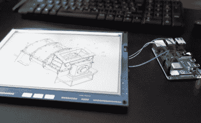

# ESP32 Inkplate 给了 Kindle 显示器第二次机会

> 原文：<https://hackaday.com/2021/01/22/esp32-inkplate-gives-kindle-displays-a-second-chance/>

多年来，我们已经看到许多黑客重新利用他们的 Kindle 或类似的电子阅读器来获得电子纸显示器的好处。通常这采取在阅读器本身上运行一些软件的形式，因为破解固件比拉出面板并弄清楚如何独立操作它要容易得多。但是如果有人已经为你做了那些艰苦的工作呢？

进入墨水瓶。克罗地亚电子公司 e-radionica 表示，通过将回收的 Kindle 显示器与 ESP32 配对，他们不仅创造了一个开放的硬件电子纸显示器，便于黑客和制造商使用，而且使电子废物远离垃圾填埋场。去年，售价 99 美元的 6 英寸版 Inkplate 以超过其最初目标 920%的价格结束了众筹活动。新的 9.7 英寸型号定价为 129 美元，到目前为止，在活动开始几个小时后，就成功超过了自己的筹资目标。显然，需求是存在的。

 新型号的电子纸显示屏不仅仅更大，它还具有更高的 1200 x 825 分辨率和更短的刷新时间。除了屏幕的改进，你还会发现更多的 GPIO 引脚，一个保持更准确时间的 RTC 模块，以及一个用于编程和电源的 USB Type-C 端口。您还可以选择要使用的语言，Arduino 和 MicroPython 库都可以用来与显示器接口。有趣的是，Inkplate 还具有所谓的“外围模式”，允许你使用通过 UART 发送的命令[在屏幕上绘制图形图元。](https://inkplate.readthedocs.io/en/latest/peripheral-mode.html#inkplate-peripheral-mode)

虽然我们最近看到一些[非常有前途的努力来重新利用旧的电子纸显示器](https://hackaday.com/2020/11/27/repurposing-large-electronic-price-tags/)，但 Inkplate 提供的交钥匙解决方案无疑非常引人注目。如果你正在寻找一种简单的方法来赶上开箱即用的电子纸潮流，这可能是你的机会。

【感谢 Krunoslav 的提示。]