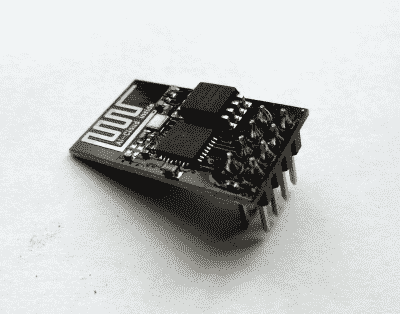
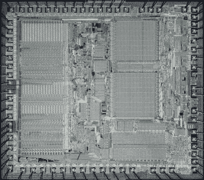
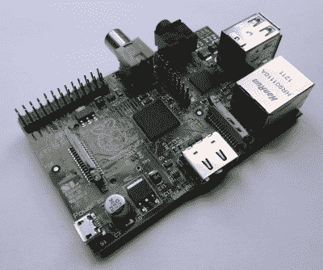

# 为什么 Blobs 很重要，为什么你应该关心它

> 原文：<https://hackaday.com/2021/01/29/why-blobs-are-important-and-why-you-should-care/>

我们非常幸运，生活在一个只需几美元就能买到性能惊人的硬件的时代。曾经需要花费大量昂贵的芯片和分立元件以及几个月的开发时间来组装的系统现在已经集成到了商用硅上。无论是支持 Linux 的片上系统还是微控制器，WiFi、GPU、蓝牙或 USB 堆栈等外设现在都是芯片的一部分，只是另一个软件库，而不是大量的额外硬件。

## 小心那团东西！

The cheapest of chips still comes with a blob.

如果这种便利是有代价的，那就是 blob 的形式。一个预编译的二进制软件，完成与硬件对话的艰苦工作，并为软件提供统一的 API。无论您是通过 Arduino 库与 ESP32 WiFi 对话，还是使用 Linux 发行版启动 Raspberry Pi，虽然您的代码可能是可用的，甚至可能是开源的，但它所依赖的 blob 是封闭源代码和专有的。这不仅对寻找真正开源计算机的软件爱好者提出了挑战，而且对我们其他人也提出了挑战，因为我们依赖于硬件制造商更新和修补他们的 blobs 的意愿。

开源倡导者会说解决方案很简单，制造商应该简单地将他们的 blobs 开源。这是真的，如果 blobs 都是开源的，那么软件自由人群会很高兴，他们的开源本质将简化这些更新和补丁的生成。那么为什么制造商不把他们的 blobs 作为开源软件发布呢？在某些情况下，这很可能是由于封闭源代码的思维模式，即从不向外界发布任何东西来保护公司的知识产权，但就此打住并不是一个完整的答案。为了充分理解为什么会这样，有必要看看我们的多功能芯片是如何制造的。

## 芯片不像以前那样制造了

You knew where you were, with a 68k. Pauli Rautakorpi, [CC BY 3.0](https://commons.wikimedia.org/wiki/File:Motorola_68000_die.JPG).

几十年前，一台新的微型计算机及其一系列外围芯片将由该公司雇佣的一组工程师在内部进行整体设计。英特尔的 8086 或摩托罗拉的 68000 等芯片就是用这种方式生产的，在许多情况下，它们甚至会由内部芯片制造厂放在硅片上。今天的半导体产业更加分散，运作方式也完全不同。虽然一些大公司可能仍然在内部完成全部工作，但更有可能的是，他们将购买新产品的组件作为知识产权，作为 VHDL 或类似硬件描述语言形式的软件。以这种方式设计一个完整的 SoC 而自己不拥有任何知识产权是完全可能的，ARM 等公司通过向芯片开发商出售其核心，使自己成为了行业的主导者。这种由现成知识产权组装的芯片可以送到第三方芯片厂进行生产，这意味着完整的芯片产品线可以在没有知识产权或工厂直接所有权的情况下上市。

由多个商业知识产权组合而成的芯片当然会受到其组成部分的所有单独许可协议的约束。个人知识产权所有者将有多种理由在他们的协议中加入限制性条款，但在最基本的层面上，他们不希望向竞争激烈的行业中的竞争对手透露任何商业秘密。因此，控制该芯片上外设的 blob 必然会受到许可协议中限制其硬件相关信息传播的条款的约束。blob 仍然是一个闭源预编译的二进制文件，无论芯片制造商如何指责开源都不会改变这一点。即使包含开源组件(如 RISC-V 内核)的芯片也无法避免包含封闭的外设 IP，例如 Bouffalo Labs BL602 WiFi SOC 的情况。

## 都在更新中

Even the earliest Raspberry Pi Model B from 2012 can run the latest Raspberry Pi OS, thanks to updated blobs.

因此，开源倡导者对 blobs 存在的原因以及它们不会很快消失的原因有了一个答案，虽然它可能不符合每个人的口味，但至少是一个有效的答案。但是 blobs 的问题不止于此，也许我们的社区也需要考虑一下。因为即使你的硬件要求 blob 没有问题，它的存在仍然会反过来伤害你。原因可能与开源世界有关，也可能与知识产权持有者或制造商有关。

如果你有一个 Raspberry Pi，你可能已经更新了你的 Raspbian 或者 Raspberry Pi 操作系统好几次，新版本包含了对 Linux 内核的主要更新。Raspberry Pi 的 Broadcom SoC 就像所有其他芯片一样，它带有一个 blob，当他们发布一个新的内核时，它将在一个为该 blob 定制的固件包中[，并且还将带有任何适当的 blob 更新。Raspberry Pi 人员将拥有闭源位的源代码，但他们与 Broadcom 达成协议，授予他们 blob 源代码访问权限，因此无法发布这些源代码。因此，Raspberry Pi 拥有最新的软件，但它是一个依赖闭源组件工作的开源操作系统的不稳定组合。](https://github.com/raspberrypi/firmware)

现在将 Raspberry Pi 与一台不太知名的单板计算机进行比较，比如一块 10 美元的主板，其名称遵循{SomeFruit}Pi 命名方案。Raspberry Pi 可能没有那么令人兴奋，但如果你检查非品牌主板附带的操作系统，你会发现它有一个非常相似的定制内核，依赖于 blob。随着您继续使用它，差异将会出现，随着时间的推移，可能不会有新的内核发布，过一段时间后，您将会使用一个没有升级前景的旧内核版本。

即使你没有无名板，如果你有一部安卓手机，你也会发现同样的问题。这是一台强大的支持 Linux 的计算机，运行定制的 Linux 发行版，但几年后，你获得新的 Android 版本的机会确实非常渺茫，你将几乎没有机会在其上安装另一个 Linux 发行版，而不需要涉及 userland `chroot`和它已经安装的任何陈旧的旧 Android 内核的技巧。

这两个例子的问题根源都是 blob，因为这两个例子都来自对为 blob 发布新的定制内核不感兴趣的制造商，所以这两个例子都慢慢地被淘汰了。

## 你认为开源是为了什么？

Yunsup Lee holding RISC V prototype chip. At UC Berkeley Par Lab Winter Retreat, January 2013\. Derrick Coetzee, [CC0](https://commons.wikimedia.org/wiki/File:Yunsup_Lee_holding_RISC_V_prototype_chip.jpg).

在询问可以做些什么来缓解这种情况时，值得考虑开源软件可以发挥什么作用。我们已经将半导体行业知识产权确立为制造商将 blob 代码开源的可能性为零的根源，但是开源世界将如何对此做出反应呢？这归结为一个开源哲学的问题，这可能反映在许可证的选择上；开源的存在是为了制造与闭源组件并行工作的软件，还是为了将开源扩展到计算的各个角落而排除闭源？在 Linux 的情况下，它倾向于后者，因为 blob 必须与之对话的接口随着内核的每个版本而变化，迫使 blob 开发人员更新或让他们的发行版变得无关紧要。Raspberry Pi 开发人员将他们的努力作为他们产品的一个关键特性，但这并不是许多硬件供应商的优先事项。如果微软 Windows 等其他操作系统可以保留一些跨版本的低级驱动程序兼容性，为什么他们的开源替代产品不能呢？

当然还有另一个潜在的结果。半导体制造商更喜欢成本更低的东西，从当前 RISC-V 内核的缓慢出现可以看出，当谈到开源硬件芯片组件时，他们正表现出愿意尝试的迹象。快速浏览一下 [OpenCores](https://opencores.org/) 或 [LibreCores](https://www.librecores.org/) 就会发现大量可以自由添加到设计中的部件，因此至少有一种可能是一个没有专有知识产权的 SoC 需要一个 blob。然而，要说服制造商放手一搏，需要的不仅仅是这些资源的存在，要让完全开源的芯片成为现实，不仅要有所有片上功能的组件，还必须对生产足够可靠。即使有最好的意图，这两件事可能需要一段时间才能发生。

我希望这篇文章能对 blob 在现代芯片上的作用及其与开源软件的关系提供一些思考。它超越了一个简单的论点，即制造商应该只发布他们的 blob 源代码，但是如果 blob 的情况不能改变，开源世界应该调整自己来处理这个问题吗？一如既往，我们希望在评论中听到你的观点。