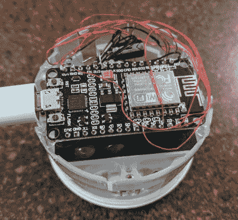

# 孤儿物联网睡眠追踪器作为空气质量监测器复活

> 原文：<https://hackaday.com/2021/04/10/orphaned-iot-sleep-tracker-resurrected-as-an-air-quality-monitor/>

如果你有一个 Hello Sense 睡眠跟踪设备，放在你丢弃的抽屉里，它可以在新的化身中复活。只需按照[Alexander Gee]的指示[将 Hello Sense 恢复为物联网空气质量数据记录器](https://dev-with-alex.blogspot.com/2020/11/hellotwo.html)。

2014 年，初创公司“Hello”推出了 [Sense，这是一款物联网睡眠跟踪设备](https://www.kickstarter.com/projects/hello/sense-know-more-sleep-better)，带有大量嵌入式传感器，全部包裹在一个光滑的注射成型球形外壳中。这个设备相当不错，到 2015 年，他们已经成功筹集了 2100 万美元的资金。但他们的商业模式似乎不可持续，2017 年，Hello shut shop。让所有的感觉设备成为孤儿，蛰伏在设计精美的外壳中，没有家可以拨回。

最初的 Sense 包括六个传感器:照明、湿度、温度、声音、主设备上的灰尘/颗粒物，以及通过一个名为 Pill 的独立蓝牙加密狗进行的运动感应。[Alexander]对空气质量测量感兴趣，所以只需要从湿度/温度和灰尘传感器获取数据。对[亚历山大]来说值得庆幸的是，[林赛·威廉姆斯]的一个详细的[Hello Sense 拆解](https://lyndsaywilliams.blogspot.com/2015/07/hello-sense-sleep-computer-under.html)对开始很有用。

硬件由四块独立的 PCB 组成——电源调理、LED 环、处理器和传感器板。这确保了所有的东西都可以放在圆形的外壳里。去掉 LED 环和处理器板为新的 NodeMCU ESP8266 大脑腾出了空间，该大脑可以连接到传感器上。将 NodeMCU 连接到湿度/温度传感器的 I2C 接口需要一些技巧。PM 传感器的接口更容易一些，因为它已经有一根专用电缆连接到原来的处理器板上，可以重新连接到新的处理器板上。NodeMCU 板运行一个简单的 Arduino 草图，[在他的 Git repo 上可用，](https://github.com/Bostwickenator/HelloTwo)收集数据并将其推送到网上。

Sensor board bodge

NodeMCU

对于在线数据显示仪表板，[Alexander]找到了一个由[Nilhcem]提供的很好的解决方案，使用 MQTT、InfluxDB 和 Grafana 实现了对[家庭的监控。它可以通过 docker compose 文件部署，并快速启动和运行。不幸的是，这样的项目通常不会成功而不引起一些心痛，所以[Alexander]为您提供了一系列故障排除技巧和建议，以防您陷入困境。](https://github.com/Nilhcem/home-monitoring-grafana)

如果你有一个旧的感知设备，那么这将是一个很好的方法来让它派上用场。但是如果你想从头开始制造一个空气质量监测器，那么试试“[制造一个全脂肪空气质量监测器](https://hackaday.com/2019/09/03/building-a-full-fat-air-quality-monitor/)”或者“[一个利用云的空气质量监测器](https://hackaday.com/2019/03/28/an-air-quality-monitor-that-leverages-the-cloud/)”。