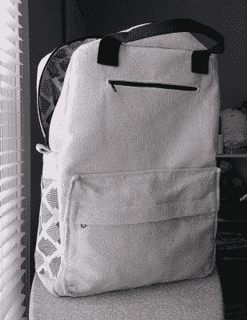
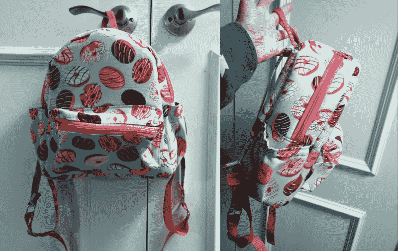
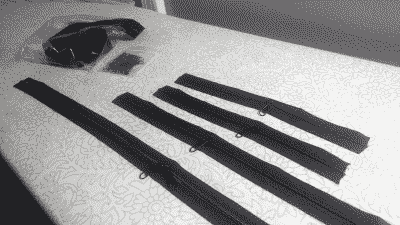
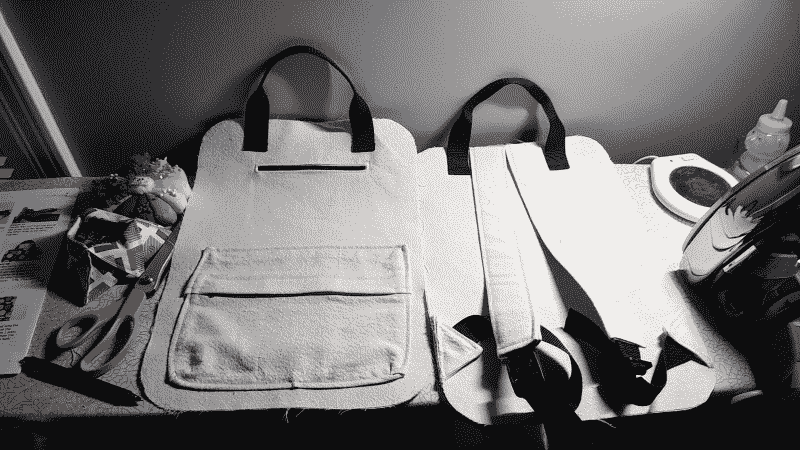

# 如果我永远做不出第二版怎么办？

> 原文：<https://hackaday.com/2021/02/25/what-if-i-never-make-version-two/>

当你做一个东西的时候，第一个版本是什么样子的？我的意思是，你在设计上花了多少心思？你是想让它看起来更好，还是只是做一些有用的东西，然后说去他妈的演示？你是试图预先解决所有问题，还是只是费力地完成它，并承诺在第二版中改正你的错误？如果你永远做不出第二版呢？

不管你喜欢做什么，凡事都有第一次。如果你需要你正在制作的东西，或者只是想把它放在身边，这似乎并不重要:众所周知，第一版可能会有点粗糙。事情就是这样。即使你精通一项技能，当你尝试一个新类型的项目或新模式时，这将是一种新的体验。例如，我已经缝制了十几个不同的钱包，但当我接受新的挑战时，我发现我只准备好做我的第一个背包。

伟大是优秀的敌人，完美是进步的敌人。在陡峭多石的道路上第一次拍摄原始原型，这永远不会导致完成构建。所以我们的目标是决定是什么让 rev1 足够好，以至于我们仍然喜欢它，即使 rev2 从来没有发生过。

## 想要还是需要

当然，所有开放性问题的答案在很大程度上取决于想要还是需要。当我在做一些有趣的事情时，我最开心的时候是我还在项目中。我希望它结束，这样我就能看到成品，但我也不希望制作它的过程结束，因为那是有趣的部分。就像在读一本真正的好书。对于缝纫项目，我总是很兴奋地看着他们如何走到一起。似乎不管我如何事先处理布料，并试图想象出某样东西会变成什么样，最终的结果总是有点令人惊讶。

如果我需要我正在制作的东西，我更有可能快速工作，抄近路把它投入使用。这样做的问题是，如果我在设计阶段没有花足够的时间，我可能最终会很恼火，或者在没有可行解决方案的情况下回到起点。无论是哪种情况，我都承认我有相当严重的完美主义。它影响了我所做的一切。我对自己的这一部分又爱又恨，因为我做了一些让我相当自豪的事情。但一路上我通常对自己太苛刻了。如果我对自己再严格一点，我可能永远不会开始或完成任何事情。试着在设计阶段设定期望，花大量的心思在如何实现每个需要的特性上。

##  例证:练习背包

今年年初，我决定做一个背包，[记录过程](https://hackaday.io/project/176666-practice-backpack)。在这之前我已经做了一个背包，但是设计差异很大，所以我决定先用现有的布料做一个练习背包。通过这种方式，我可以在购买花哨、昂贵的布料之前查看一遍[的图案](https://www.etsy.com/listing/527661844/vicky-backpack-pdf-sewing-pattern)并解决打结的问题——这是我在第一个背包中没有做的事情，有点后悔。[在女装制作中，这被称为制作平纹细布](https://www.craftsy.com/post/custom-fit-clothing/#)。这有点类似于在条形板上制作的电路:一个比试验电路板电路更持久的功能原型。它可能不漂亮，但它的工作。理想情况下。

这并不是说我需要一个背包，我只是想练习做包，因为我从尝试的每个新图案中学到了一些东西。尽管如此，我知道我不想做任何旧东西。这是我个人设计难题的开始。是的，这是我想做的事情，而不是我需要做的事情。但是我仍然不得不考虑我将投入多少时间和金钱来制作这个东西。这次我没有让时钟一直走，但我估计这至少花了我十到十五个小时的空闲时间。我不应该把它弄得越漂亮越好吗？

另一件要考虑的事情是，最终产品将是一个背包，一个真正的，功能性的背包。这不是装满安全别针和/或热胶水的背包的实验版。我将使用真正的织物，工作拉链，以及真正的把手和带子。当然，不一定要完美。但是它不应该倾向于让我感到骄傲而不是尴尬吗？我同意。因为我可能会想用它，或者如果结果足够好的话，甚至会把它卖给别人。所以这个练习背包需要预先做大量的决定，从面料到拉链到硬件。

## 决定，决定

首先也是最重要的是选择面料。布料一般都很贵，所以我没有买新的布料，而是花了很长时间仔细查看了我的存货——如果你愿意的话，我的零件箱。我做的包越多，所有东西对我来说就越像可用的布料，尤其是像桌布和装饰性浴帘这样的大件物品。几年前，我买了一块米白色的帆布桌布作为摄影背景。后来它被揉成一团，被人遗忘了，所以我把它扔进了洗衣机，想到用这种感觉像免费布料的东西来缝制一堆袋子，我兴奋不已。

这个项目是一个有衬里的背包，所以它需要一个外部面料和一个内部面料。我做的第一个面皮背包是一个很小的钱包大小的背包，里里外外都使用了相同的面料——一种薄的绗缝棉，就像标准的床单材料。为了使它适合一个包，它都必须接口。

衬布是一种用作任何需要更多面料的背衬的材料。我有点夸张，但是如果你有合适的接口，你可以用任何东西做任何东西。把它想象成一扇镶面的柜门:你想展示的面料是镶面，而衬布是下面的东西，给它提供了作为柜门所需的强度和结构。在甜甜圈背包的情况下，外部部件有两种类型的内衬——首先是编织，然后是泡沫。上图中背包是空的；泡沫衬里赋予了它所有的形状。

对于衬里，我又回到了布料仓库。我有几码西南/大地色调的几何图案绗缝棉，我认为在帆布旁边看起来真的很好。在项目早期的某个时候，我决定在外部侧袋上使用衬里布料来增加视觉趣味。

一般来说，面料越重，加强面料所需的衬布就越少。我使用的垂布是由轻质帆布制成的，所以它有足够的身体，我不必接口。(避免使用接口是我的新宠，因为那玩意儿贵得离谱。)另一方面，我使用的衬里材料就像床单一样——太软了，没有衬里就不能单独使用，即使在衬里里也是如此。

##  拉链与拉链带

对于这两个背包来说，第一步是在前面做拉链口袋，所以我知道我必须尽早做出拉链的决定。

这款背包总共有四条拉链:一条 24 英寸的拉链，主开口处有两个相吻的拉链头；一条 11 英寸的拉链，用于前贴袋；两条 8 英寸的拉链，一条用于贴袋上方的外袋，一条用于内袋。

关于拉链有这样一个问题:购买单根预制拉链很快就会变得昂贵。虽然这样做肯定不容易，但是买几码拉链带和一些拉头自己做就经济多了。此外，现在我有一些额外的黑色拉链带，拉下我的下一个包。

## 织带、把手和五金件 

这种模式需要梯子锁扣，这是你标准的背包带调节器。尽管它们可能是标准的，但我手头没有一个——只有金属硬件。就像拉链一样，散装的更便宜，所以现在我有 48 个梯子锁扣可以用在 24 个背包里。

组成手柄和肩带可调节部分的聚丙烯织带也是如此。如果我能找到一些有趣的颜色来搭配内部的布料，背包可能会更好看，但这是第一个版本。买几码的黑色织带更便宜也更实用，因为黑色几乎可以搭配任何东西。我已经有一些带子了，但是尺寸不适合这个图案。现在我有两种尺寸。

## 进入项目难题

制袋就像其他事情一样——需要材料、工具、时间和努力。我告诉自己，从长远来看，批量购买硬件和其他东西会更便宜，因为我会让他们来制作更多的包。我曾经认为我想做自己的衣服，但制作包更有趣和实用，尤其是在出售它们的时候。

问题是我现在有了一个功能齐全的背包，我只是因为我的材料决定而喜欢或不喜欢它。老实说，我不知道我是否能做出这个背包的第二个版本。如果我遇到合适的面料，我可能会，因为我没有其他方形背包。我很高兴我在第一版中投入了思想和精力，但有些事情我会做得不同，比如为笔记本电脑大小的口袋添加泡沫衬垫。现在我知道它是如何搭配的了，我可能会添加更多的口袋，或者甚至[修改图案并改变尺寸](https://hackaday.io/project/176510-bag-hacking)。

所以，如果我从一开始就做了这些不同的决定，我会背上我心爱的背包作为我的日常司机吗，或者我根本不会把它放在第一位？这条路很难走。

## 你呢？

那么，你呢？你在任何给定项目的第一个版本中投入了多少努力？这真的重要吗，只要你完成它并继续前进？这个问题可能值得思考一下。