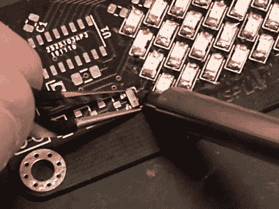

# 在电子工作台上用你的手机做显微镜

> 原文：<https://hackaday.com/2021/02/05/using-your-phone-as-a-microscope-on-the-electronics-workbench/>

为 Hackaday 工作的一个方面是我们经常需要为出版物拍摄高质量的照片。我有一个还算不错的相机，可以把我笨拙的指向和拍摄变成还过得去的好图像，但是有时候最简单快捷的抓拍方式就是拿出我的手机。

这是一个有风险的步骤，因为与质量更高的同类产品相比，手机摄像头模块和镜头非常小，有时在手机屏幕上看起来不错的照片在网络浏览器上可能看起来很糟糕。你很快就学会了永远不要用手机相机变焦，因为这不可避免地是一种数码变焦，只会产生颗粒状的插值照片。

这并不是说缩放不能有用。最近，当我使用智能手机摄像头作为放大镜来阅读芯片上的文字时，我有了一些意想不到的灵感。我不需要图像的存档副本…我只需要一个快速放大工具。我是否多年来一直在口袋或手提包里放着一个用于焊接的放大镜，而没有意识到这一点？我决定试一试，除了一些注意事项之外，效果还不错。虽然我已经看到[光学器件将这些相机变成了非常好的显微镜](https://hackaday.com/2016/04/11/iphone-microscopy-and-other-adventures/)，但我的设置只增加了一个手机三脚架，可以让你在必要时使用。

## 你选择什么样的放大镜？

A pin-sharp image delivered by Elliot’s optical microscope.

我记得在我很年轻的时候，曾经能够在 SOT-23 晶体管上阅读文本，但遗憾的是，即使现在戴眼镜，那些日子也已经过去很久了。幸运的是，虽然我有很多焊接放大的选择。在不同的时候，我使用过桌面放大镜和头带放大镜，但我选择了一个 Anglepoise 风格的臂上的大镜头——你知道，就是那种[弹性灯](https://en.wikipedia.org/wiki/Anglepoise_lamp)。这些臂上透镜在美容治疗师和类似人员中非常常见，它们利用了一个强大的 LED 灯环，甚至为我的眼睛提供了足够的放大倍数。我也使用过朋友和黑客空间的各种不同的 LCD 放大镜，但尽管我对它们印象深刻，但迄今为止我一直被像样的价格所拖累([即使我在过去通过耳朵清洁相机这一意想不到的媒介给你带来了一个超级便宜的替代品](https://hackaday.com/2019/11/11/review-ear-wax-cleaning-cameras-as-cheap-microscopes-we-take-a-closer-look/))。与此同时，我的同事 Elliot 使用了一台非常高质量的 20 世纪 70 年代双目检查显微镜，它提供了卓越的质量，这是一台他非常信赖的仪器，你有时会在他的工作中看到它的使用，比如最近的[Raspberry Pi Pico review](https://hackaday.com/2021/01/20/raspberry-pi-enters-microcontroller-game-with-4-pico/)。

有了这些非常有用和强大的设备，很明显，如果要取代它们，手机将是一个非常好的选择。但是，作为一个快速的现场选择，坐在你已经拥有的东西旁边怎么样？是时候试一试了，用它来焊接一些东西。

## 有用的不止是猫图？我们试试我们的手机

Soldering in close-up, a phone camera view.

我手中的手机没什么特别的，中档的华为和摩托罗拉安卓设备是我商务和个人使用的忠实伴侣。这里没有高端旗舰相机，但目前一代像样的手机相机，他们给出了类似的结果。我猜，过去几年制造的几乎所有智能手机都可以在这里投入使用。我把它放在我用来拍摄特写镜头的迷你三脚架上，拿出一个半成品工具包进行焊接练习。

最大变焦的图像提供了足够的放大倍数，并提供了高质量的作品。在这种情况下，它比我的大放大镜要好，因为它可以提供更近的视野。好消息在工作开始时就结束了，因为随着焊接技术的适应，动作和屏幕之间微小但明显的延迟会导致某种学习曲线。也许更令人不安的是一种意想不到的迷失方向，我只能用透视的术语来描述，如果这在 2D 的展示中是可能的话。作为一个看不到立体 3D 的人，这些效果让我着迷，那么为什么真正的 2D 液晶显微镜没有这个问题呢？我这么说是在理论化，但我怀疑解决方案在于相机的景深。手机是为拍摄视野内的一切事物而设计的合理的照片，所以有特别宽的景深。与此同时，显微镜被设计成将特定距离处的物体清晰聚焦，因此凭借其狭窄的景深，它可以传递一些聚焦方面的深度信息。我们的大脑下意识地对此进行处理，使烙铁的深度放置成为一个更容易的过程。

因此，我能够通过手机的世界视图成功焊接一些组件。轻微的延迟和缺乏视角花了一点时间，我不能诚实地向任何人推荐这种技术。然而，对于现场的即席 SMD 焊接来说，它仍然是一个可行的解决方案，但是我建议你在做你感兴趣的事情之前先练习一下。也许一个更好的办法是把我在你的野外工具包中提到的一个耳用相机放在你的微型烙铁旁边，用手机代替它作为显示器。任何事情都值得尝试一次，但也许手机作为 SMD 焊接辅助工具不值得尝试两次。