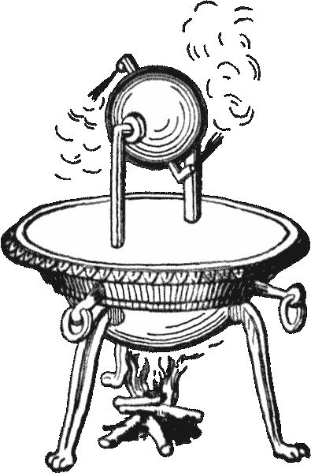

# 历史黑客:英雄建造自动售货机

> 原文：<https://hackaday.com/2021/03/12/historical-hackers-hero-builds-vending-machines/>

我们倾向于认为机械发明是工业革命的产物，真正的自动化是计算机处理的东西。然而，甚至在计算机出现之前，自动化就已经存在——使用定时马达、凸轮和其他机械装置。但你可能会惊讶地发现，其实早就有一些复杂的自动化技术了。很久以前，在一个没有计算机，CAD 软件，甚至没有电的世界发明的。例如，大约在公元 50 年，一位名叫 Hero 的发明家——有时被称为 Heron——建造了由蒸汽和风力驱动的机器。他的发明包括自动售货机和音乐播放器。

很难想象在公元 50 年，你能制造出什么样的音乐播放器或者自动售货机。希罗的一些发明被用于寺庙，例如，分发圣水。其他的在剧院里被用来做类似自动点火或制造雷电效果的事情。甚至有一个完全自动化的木偶戏，使用打结的绳子在没有人类帮助的情况下进行十分钟的制作。

## 关于英雄

英雄要么是希腊人，要么是希腊化的埃及人。我们所知道的他的大部分作品实际上是他在亚历山大图书馆所在地博物馆所教课程的课堂笔记。虽然归功于 Hero 的一些发明可能已经存在，但他应用这些发明取得了如此大的成功，以至于他的名字与这些发明以及他开发的设备和数学联系在一起。

鉴于希罗生活在多久以前，他工作的年代有一些不确定性，他的许多作品已经丢失或被稀释。希罗引用了阿基米德的话，帕普斯也引用了他的话，这样就缩小了可能的年份。然而，Hero 非常详细地描述了一次月蚀，这使得 Neugebauer 计算出这次观测发生在公元 62 年。

他最著名的作品《气动学》有许多现存的副本，但最古老的是 13 世纪的。另一个文本 *Mechanica* ，只有在公元 865 年左右通过阿拉伯语翻译才为人所知。

右边的图像显示了自动控制系统的一页，一个小雕像通过一系列隐藏的管道和罐子分发酒和牛奶。然而，Hero 不仅仅是一个发明家，他还是一个数学家。最著名的是，他设计了一个计算三角形面积的公式，展示了计算平方根的迭代方法，阐明了光学中的一个重要原理。

## 争论

鉴于希罗生活在多久以前，很难知道他是一个天才，还是仅仅是一个善于从别人那里吸收想法的人。很多年来，只有*气动*为人所知。这是一个非常实用的机器描述，其中一些材料来自其他来源。更糟糕的是，大多数机器都是无聊的娱乐或室内魔术。也有例外，比如用于灭火的工作泵，但大多数物品都是自动化乐器、动画动物木偶和其他不实用的设备。显然，这本书的结构也很糟糕。

正因为如此，许多学者认为希罗是一个轻浮的发明家。然而，后来发现的文本显示，Hero 受过良好的教育，并在当时从事严肃的技术工作。也许玩具就是例子，就像我们今天可能用软件编写一本教科书来让 LED 闪烁，或者玩俄罗斯方块来教学生如何编程一样。

今天，人们普遍认为希罗是一个超越时代的发明家。他知道如何利用风、蒸汽和重力。他还懂得机械优势和各种简单的机器。他不一定发明了所有这些，但在真正的工程时尚中，他很好地利用了它们。

## 木偶戏

*自动机*，或自动剧院，描述了两种不同的自动化木偶剧。其中一个是自动移动的，展示了一个在祭坛上点燃火的寺庙。酒神狄俄尼索斯斟酒，而人们随着喇叭和鼓声在他周围跳舞。

另一个木偶戏是固定的，但有门可以打开和关闭来衬托每个场景。表演讲述了儿子被阿贾克斯杀死的无节幼体的神话。一艘船被建造并下水。船穿过大海，经过跳跃的海豚。无节幼体点燃了一个虚假的灯塔，将船员引入歧途，船只失事。最后，雅典娜用雷电摧毁了阿贾克斯。你可以在下面的视频中看到该设备的电脑重现。

 [https://www.youtube.com/embed/5LBlusUD3Kg?version=3&rel=1&showsearch=0&showinfo=1&iv_load_policy=1&fs=1&hl=en-US&autohide=2&wmode=transparent](https://www.youtube.com/embed/5LBlusUD3Kg?version=3&rel=1&showsearch=0&showinfo=1&iv_load_policy=1&fs=1&hl=en-US&autohide=2&wmode=transparent)

木偶剧院在一堆谷物上使用一个沉重的铅块，通过一个洞慢慢逸出。重物拉着一根可以转动车轴的绳子。几乎所有的机械都使用由轴控制的绳子和鼓。没有弹簧或齿轮，所以这是一个非常简单的机器，却有着非常复杂的效果。在下面的视频中，你可以看到一个移动剧院的实体再现，展示了一些工作细节。

 [https://www.youtube.com/embed/JFrFi_Pq7vU?version=3&rel=1&showsearch=0&showinfo=1&iv_load_policy=1&fs=1&hl=en-US&autohide=2&wmode=transparent](https://www.youtube.com/embed/JFrFi_Pq7vU?version=3&rel=1&showsearch=0&showinfo=1&iv_load_policy=1&fs=1&hl=en-US&autohide=2&wmode=transparent)

绳子和挂钩让人想起了使用定时马达、凸轮和微型开关的前计算机自动化方案。

## 著名的发明

希罗最著名的发明之一是机械喷泉。这在今天听起来并不多，但是在没有电的情况下，抽水是一项大任务。喷泉是应用水力学的一课。有三个容器，一个叠在另一个上面，由管道连接。顶部的盆最初是空的。中间的盆盛水，底部的容器盛空气。底部的两个容器必须密封。从中间容器落到底部的水产生压力，一根管子将压力带到中间容器的顶部，迫使水沿着另一根管子流到顶部容器。

 [https://www.youtube.com/embed/K49QOM_B8dA?version=3&rel=1&showsearch=0&showinfo=1&iv_load_policy=1&fs=1&hl=en-US&autohide=2&wmode=transparent](https://www.youtube.com/embed/K49QOM_B8dA?version=3&rel=1&showsearch=0&showinfo=1&iv_load_policy=1&fs=1&hl=en-US&autohide=2&wmode=transparent)

迷茫？带上一些瓶子和吸管以及一些常用工具，观看下面的视频。大约在 5:20，[Dave]非常清楚地解释了操作。虽然看起来喷泉永远不会停止，但一旦水位达到某一点，它就会停止，所以这里没有古老的永动机。

 然而，希罗最著名的发明之一可能并不是他真正发明的。风力发电机是蒸汽机的原始形式。一个盛水的容器有两个指向相反方向的 L 形喷口。容器可以自由旋转，下面的火将水烧开。当蒸汽从喷嘴中喷出时，容器就会旋转。

你可以很容易地从一个汽水罐中制作出一个这样的东西，正如 T2 在他的 RimstarOrg 频道上展示的那样。如果罐子有合适的喷嘴，它可能会工作得更好，但它显然已经足够好了。

Hero 使用了这些，尽管它们在之前已经被写过了。然而，他似乎没有用它做任何非常实际的事情。凭借他对蒸汽和液压的了解，他非常接近于发明一台真正的蒸汽机。

还有其他的发明，包括用硬币的重量倾倒一盆圣水的发明。倾斜最终会导致硬币滑落，阻止水流。这可能是第一台投币自动售货机。虽然风力风琴可能比他的一些发明更实用，但它仍然不是一种革命性的省力装置。然而，有人认为这是第一台风力发电机。

## 奇怪的是…

看起来很奇怪的是，尽管 Hero 使用了蒸汽、风和重力，但直到很久以后，这项技术才出现了很多实际用途。例如，虽然中国人可能早在公元 400 年就有风车，但直到 9 世纪波斯人才使用一种水平风车来磨谷物和打水。想象一下 2000 年前希腊领导的工业革命。

我们不得不思考，今天我们眼皮底下有哪些技术是我们没有利用的。与此同时，制作 Hero 设备的复制品是一项伟大的运动。我们已经看到发动机使用的[比汽水罐](https://hackaday.com/2020/10/06/making-a-modern-version-of-a-steam-engine-from-antiquity/)多得多。