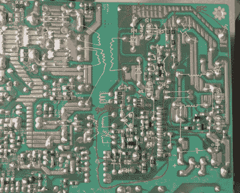

# 追逐坏帽子拯救陷入困境的 PSU

> 原文：<https://hackaday.com/2021/01/26/chasing-down-bad-caps-to-save-a-troubled-psu/>

我们知道你在想什么。这是一个糟糕的电源，当然这是电容器的责任。但是，即使我们都凭直觉知道在这一点上，坏帽子几乎总是 PSU 断气时的罪魁祸首，也不总是很容易找出哪一个是罪魁祸首。这就是为什么[eigma]对失败的 ETK450AWT 的深入研究值得一看。

问题的第一个迹象是，当计算机意外重启时，系统日志中没有任何指示问题的信息。最终，[eigma]注意到在操作系统加载之前就重启了，这证实了是硬件的问题。用伏特计快速查看 PSU 的输出显示，事情并没有超出规格太多，但是将示波器放在 12 V 线上发现了一个令人讨厌的波形，需要进一步调查。

Connecting all the dots.

通过仔细跟踪并与常见的 PSU 图进行比较，[eigma]能够识别 SG5616 IC，该 IC 检查 PSU 产生的各种电压，并生成`PWR_OK`信号，告诉主板一切正常。像以前一样，该芯片上的所有 DC 电压似乎都足够合理，但测量变压器交流电压的引脚在 12 VDC 线路上显示出相同的纹波。

甚至进一步挖掘发现，变压器本身有一个控制 IC 隐藏着。该芯片运行所需的 13 伏直流电通过一个齐纳二极管和几个电容器从备用变压器中取出，但[eigma]很快发现，该电路产生了另一个令人讨厌的纹波。在混合电路中加入一些新的电容使事情变得平稳，并启动了 PSU，但这还不是故事的全部。

从电路板上取下电容器并用电表检查它们的值，[eigma]发现它们似乎也在合理的范围内。他们甚至看起来身体状况良好。但是在信号发生器的帮助下，他能够确定它们的等效串联电阻(ESR)太高了。结案了。

虽然对于硬件黑客来说，更换旧电子设备中熔断的电容器是一种仪式，但这个案例是一个很好的例子，说明即使是最简单的修复也很难解决。