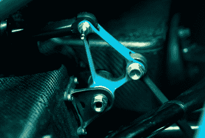

# 布加迪概念车展现 3D 打印实力

> 原文：<https://hackaday.com/2021/01/31/bugatti-concept-car-shows-3d-printed-strength/>

我们怀疑你会很快驾驶布加迪火流星。这是一辆有点炫耀的概念车，它确实对你可以在汽车上 3D 打印的东西施加了一些限制。你可以想象，他们不是用 ABS 或 PLA 打印汽车零件。根据驱动器的说法，[打印使用选择性激光熔化钛](https://www.thedrive.com/tech/38868/bugattis-3d-printed-suspension-pushrods-weigh-3-5-ounces-but-can-withstand-3-5-tons-of-force)来制造一些令人印象深刻的坚固和轻便的部件。

 让 3D 打印变得强大的不仅仅是材料。布加迪实际上申请了一些几乎像骨头一样的内部结构的专利。由于零件大部分是中空的，重量减轻了。但是精细的内部结构创造了非常坚固的零件。有多强？一个 3.52 盎司的推杆可以处理高达 3.85 吨。印刷的钛显然经过热处理，以增加其抗断裂应变的能力。

除了钛之外，概念车的一些部件是印刷陶瓷，可以使一些部件隔热。打印过程显然可以获得 0.1 毫米的分辨率。许多部件都很轻，包括一个 0.48 毫米的轮子，带支架重约 100 克。

如果你想拥有一辆工程车，[我们建议你买一辆更普通的](https://hackaday.com/2019/12/02/how-to-get-into-cars-choosing-your-first-project-car/)。即使你想为你的坐骑 3D 打印一个钛部件，我们仍然[开始一个小一点的](https://hackaday.com/2018/06/16/titanium-knob-doesnt-grind-our-gears/)。