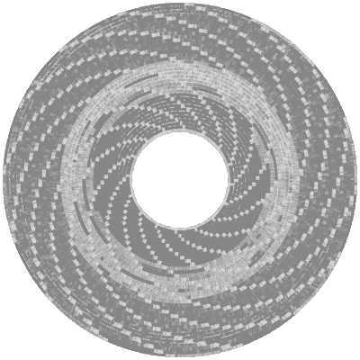
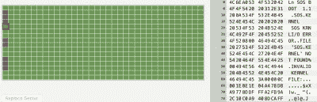

# 从损坏的苹果[软盘]重建数据

> 原文：<https://hackaday.com/2021/01/27/reconstructing-data-from-a-corrupt-apple-floppy-disk/>

早在 1990 年，本杰明·佐托(Benjamin Zotto)还在上小学的时候就写了一款名为*仙境 2* 的赛狗游戏。游戏的基本源代码和图像存储在一张 ProDOS 格式化的软扇区 5.25 英寸软盘上。三十年后的今天，[本杰明]沮丧地发现 ProDOS 再也不能读软盘了，给出了一个 I/O 错误。正如[在这条 Twitter 帖子](https://twitter.com/bzotto/status/1353797383201558531)中记录的那样，他没有被吓倒，开始恢复数据。

Applesauce visualization of the patterns on the corrupted disk, with soft-sectoring spiral arms.

故事的要点是，在名副其实的[苹果酱软盘驱动器控制器](https://applesaucefdc.com/)的帮助下，软盘表面仍然可以被扫描，该控制器获得了磁盘表面磁性图案的以下可视化:

然后，可以对这些数据进行逐扇区分析，坏扇区和 ProDOS 剥落的原因在这里用红色标记。

检查到目前为止恢复的数据证实，这是一个 ProDOS 磁盘。它还确认了包含目录列表的扇区被拍摄。这需要深入研究 ProDOS 及其文件系统的技术参考手册，找出如何重建目录布局。这需要弄清楚文件的偏移量和大小，同时知道磁盘上可能有什么，并让原始卷列表的一些部分保持完整。这允许一次一个字节地重建目录卷。

Sectors on the disk, with bad sectors in red.

在那段艰苦而富有教育意义的旅程结束时，成功等来了，[Benjamin]再次能够重温他对 20 世纪 90 年代基础和手绘位图图形的记忆。